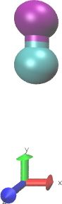
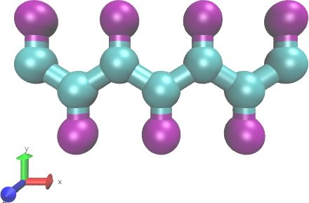
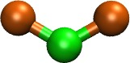
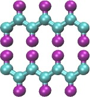
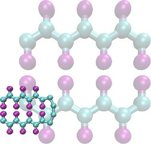

.. moltemplate documentation master file, created by
   sphinx-quickstart on Fri May  1 02:30:33 2020.
   You can adapt this file completely to your liking, but it should at least
   contain the root `toctree` directive.

Welcome to moltemplate's documentation!
=======================================

Warning: This manual does not explain how build molecules that use all-atom force fields, or how to to run reactive (a.k.a. “active-matter”) simulations.

However numerous examples and README files are available to demonstrate
how to run these kinds of simulations. Downloading these examples is
highly recommended. (See section `2 <#sec:installation>`__.)

.. toctree::
   :maxdepth: 2
   :caption: Contents:

   introduction
   main/installation
   main/quick_reference
   main/tutorial
   main/overview
   main/coordinates
   main/arrays
   main/custom_xform
   appendix/spce_example_robust
   main/limitations

   appendix/nbody_by_type
   appendix/ltemplify
   appendix/vmd_advanced
   appendix/ttree_man_page
   appendix/ttree
   appendix/nbody_by_type_utility
   appendix/adv_variable_syntax

Indices and tables
==================

* :ref:`genindex`
* :ref:`modindex`
* :ref:`search`

.. |image| image:: _static/author_email.png
   :height: 0.3cm
.. |[fig:spce_x_1000] A box of 1000 water molecules (before and after pressure equilibration), generated by moltemplate and visualized by VMD with the topotools plugin. (The VMD console commands used for visualization were: “topo readlammpsdata system.data full”, “animate write psf system.psf”, “pbc wrap -compound res -all”, and “pbc box”. See sections| image:: _static/waterSPCEx1000_LR.jpg
   :width: 5cm
.. |, and| image:: _static/waterSPCEx1000_LR.jpg
   :width: 5cm
.. |for details.| image:: _static/waterSPCEx1000_LR.jpg
   :width: 5cm
.. |[fig:spce_x_1000] A box of 1000 water molecules (before and after pressure equilibration), generated by moltemplate and visualized by VMD with the topotools plugin. (The VMD console commands used for visualization were: “topo readlammpsdata system.data full”, “animate write psf system.psf”, “pbc wrap -compound res -all”, and “pbc box”. See sections| image:: _static/waterSPCEx1000_t=25_LR.jpg
   :width: 5cm
.. |, and| image:: _static/waterSPCEx1000_t=25_LR.jpg
   :width: 5cm
.. |for details.| image:: _static/waterSPCEx1000_t=25_LR.jpg
   :width: 5cm
.. |[fig:2bead_polymer] a)-b) Building a complex system from small pieces: Construction of a polymer (b) out of smaller (2-atom) subunits (a) using composition and rigid-body transformations. Bonds connecting different monomer together (blue) must be declared explicitly, but angle and dihedral interactions will be generated automatically. See section| image:: _static/2bead_monomer.jpg
   :height: 3cm

.. |.) d) The same system after 100000 time steps using Langevin dynamics. (The VMD console commands used for visualization were: “topo readlammpsdata system.data full”, “animate write psf system.psf”, “pbc wrap -compound res -all”, and “pbc box”. See sections| image:: _static/2bead_monomer.jpg
   :height: 3cm

.. |[fig:2bead_polymer] a)-b) Building a complex system from small pieces: Construction of a polymer (b) out of smaller (2-atom) subunits (a) using composition and rigid-body transformations. Bonds connecting different monomer together (blue) must be declared explicitly, but angle and dihedral interactions will be generated automatically. See section| image:: _static/2bead_polymer.jpg
   :height: 3cm

.. |.) d) The same system after 100000 time steps using Langevin dynamics. (The VMD console commands used for visualization were: “topo readlammpsdata system.data full”, “animate write psf system.psf”, “pbc wrap -compound res -all”, and “pbc box”. See sections| image:: _static/2bead_polymer.jpg
   :height: 3cm

.. |[fig:2bead_polymer] a)-b) Building a complex system from small pieces: Construction of a polymer (b) out of smaller (2-atom) subunits (a) using composition and rigid-body transformations. Bonds connecting different monomer together (blue) must be declared explicitly, but angle and dihedral interactions will be generated automatically. See section| image:: _static/2bead_polymers_nopbc_t=0_LR.jpg
   :width: 4cm
.. |for details. c) An irregular lattice of short polymers. (See section| image:: _static/2bead_polymers_nopbc_t=0_LR.jpg
   :width: 4cm
.. |.) d) The same system after 100000 time steps using Langevin dynamics. (The VMD console commands used for visualization were: “topo readlammpsdata system.data full”, “animate write psf system.psf”, “pbc wrap -compound res -all”, and “pbc box”. See sections| image:: _static/2bead_polymers_nopbc_t=0_LR.jpg
   :width: 4cm
.. |, and| image:: _static/2bead_polymers_nopbc_t=0_LR.jpg
   :width: 4cm
.. |for details.| image:: _static/2bead_polymers_nopbc_t=0_LR.jpg
   :width: 4cm
.. |[fig:2bead_polymer] a)-b) Building a complex system from small pieces: Construction of a polymer (b) out of smaller (2-atom) subunits (a) using composition and rigid-body transformations. Bonds connecting different monomer together (blue) must be declared explicitly, but angle and dihedral interactions will be generated automatically. See section| image:: _static/2bead_polymers_t=100ps_LR.jpg
   :width: 4cm
.. |for details. c) An irregular lattice of short polymers. (See section| image:: _static/2bead_polymers_t=100ps_LR.jpg
   :width: 4cm
.. |.) d) The same system after 100000 time steps using Langevin dynamics. (The VMD console commands used for visualization were: “topo readlammpsdata system.data full”, “animate write psf system.psf”, “pbc wrap -compound res -all”, and “pbc box”. See sections| image:: _static/2bead_polymers_t=100ps_LR.jpg
   :width: 4cm
.. |, and| image:: _static/2bead_polymers_t=100ps_LR.jpg
   :width: 4cm
.. |for details.| image:: _static/2bead_polymers_t=100ps_LR.jpg
   :width: 4cm
.. |[fig:random_heteropolymer] A random heteropolymer (c), composed of of Monomer and Monomer3 monomer subunits (a and b) with (target) probabilities 0.6 and 0.4. (However, due to random fluctuations, the actual ratio in this case was 68% and 32%. To avoid this problem, see section| image:: _static/random_2bead.jpg
   :height: 1.2cm
.. |.)| image:: _static/random_2bead.jpg
   :height: 1.2cm
.. |[fig:random_heteropolymer] A random heteropolymer (c), composed of of Monomer and Monomer3 monomer subunits (a and b) with (target) probabilities 0.6 and 0.4. (However, due to random fluctuations, the actual ratio in this case was 68% and 32%. To avoid this problem, see section| image:: _static/random_3bead.jpg
   :height: 0.75cm

.. |[fig:random_heteropolymer] A random heteropolymer (c), composed of of Monomer and Monomer3 monomer subunits (a and b) with (target) probabilities 0.6 and 0.4. (However, due to random fluctuations, the actual ratio in this case was 68% and 32%. To avoid this problem, see section| image:: _static/random_heteropolymer.jpg
   :width: 8cm
.. |.)| image:: _static/random_heteropolymer.jpg
   :width: 8cm
.. |[fig:random_bilayer] A lipid bilayer membrane composed of a random equal mixture of two different lipid types in a 1:1 ratio. (See section| image:: _static/lipid_bilayer_mixture.jpg
   :width: 5cm
.. |.) In b) one of the molecule types was left blank leaving vacancies behind. (See section| image:: _static/lipid_bilayer_mixture.jpg
   :width: 5cm
.. |.)| image:: _static/lipid_bilayer_mixture.jpg
   :width: 5cm
.. |[fig:random_bilayer] A lipid bilayer membrane composed of a random equal mixture of two different lipid types in a 1:1 ratio. (See section| image:: _static/lipid_bilayer_vacancies.jpg
   :width: 5cm
.. |.) In b) one of the molecule types was left blank leaving vacancies behind. (See section| image:: _static/lipid_bilayer_vacancies.jpg
   :width: 5cm
.. |.)| image:: _static/lipid_bilayer_vacancies.jpg
   :width: 5cm

.. |b) A customized version of the “MolecularComplex” molecule. (The original “MolecularComplex” is shown faded in the background for comparison.)| image:: _static/mol_complex_LR.jpg
   :height: 3cm

.. |b) A customized version of the “MolecularComplex” molecule. (The original “MolecularComplex” is shown faded in the background for comparison.)| image:: _static/mol_complex+mol_complex0_transparent_LR.jpg
   :height: 3cm
