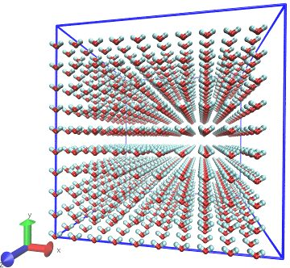
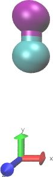
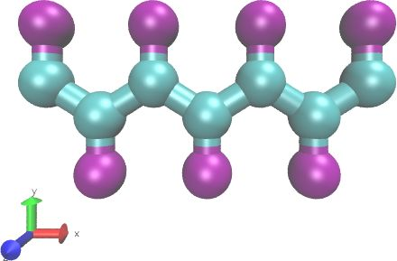
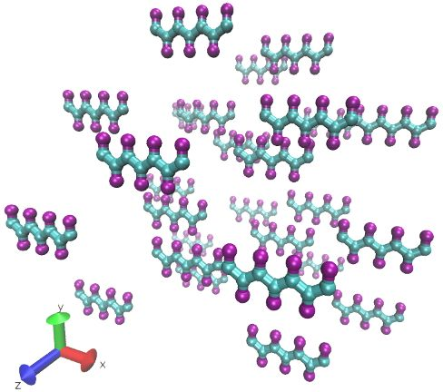
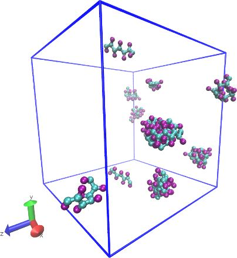
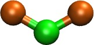
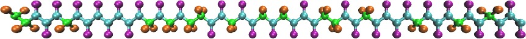
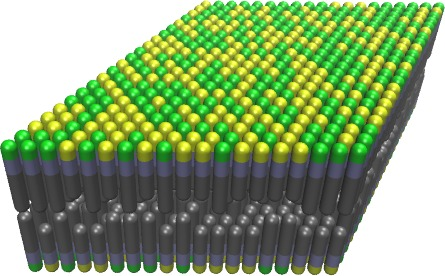
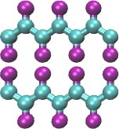
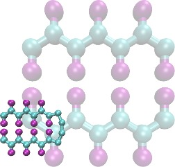

==================
Moltemplate Manual
==================

:Author: Andrew Jewett
|image|

.. role:: raw-latex(raw)
   :format: latex
..

.. raw:: latex

   \maketitle

.. raw:: latex

   \tableofcontents

Warning: This manual does not explain how build molecules that use all-atom force fields, or how to to run reactive (a.k.a. “active-matter”) simulations.
=========================================================================================================================================================

However numerous examples and README files are available to demonstrate
how to run these kinds of simulations. Downloading these examples is
highly recommended. (See section `2 <#sec:installation>`__.)

Introduction
============

Moltemplate is a general molecule builder and force-field database
system for LAMMPS. A simple file format has been created to store
molecule definitions and force-fields (the LAMMPS-template format,
“LT”). LT files are templates containing *all* of the text relevant to a
particular molecule (including coordinates, bond-topology, angles,
force-field parameters, constraints, groups and fixes). Moltemplate can
then duplicate the molecule, customize it, and use it as a
building-block for constructing larger, more complex molecules. (These
molecules can be used to build even larger molecules.) Once built,
individual molecules and subunits can be customized (atoms and bonds,
and subunits can be inserted, moved, deleted and/or replaced).

Moltemplate is extremely flexible. It supports all LAMMPS force-field
styles and nearly all atom-styles (now and in the future).

Moltemplate requires the Bourne-shell, and a recent version of python
(2.7 or 3.0 or higher), and can run on OS X, linux, or windows (if a
suitable shell environment has been installed). **A substantial amount
of memory is needed** to run moltemplate. For example, building a system
of 1000000 atoms typically requires between 3 and 12 GB of *available*
memory. (This depends on the number of bonds, molecules, and angular
interactions. See section `10 <#sec:limitations>`__ for details.)

Converting *LT files* to LAMMPS input/data files
------------------------------------------------

The moltemplate.sh program converts LT-files (which contain molecule
definitions) into complete LAMMPS input-scripts and data-files:

::

   moltemplate.sh -atomstyle "full" system.lt

or

::

   moltemplate.sh -xyz coords.xyz -atomstyle "full" -vmd system.lt

In the first example, the coordinates of the atoms in the system are
built from commands inside the "system.lt" file. In the second example
coordinates for the atoms are read from an XYZ-file, and then invokes
VMD to visualize the system just created. (PDB-files and other
coordinate formats are also supported. Note: The "full" atom style was
used in this example, but other LAMMPS atom styles are supported,
including hybrid styles.)

Either of these commands will construct a LAMMPS data file and a LAMMPS
input script (and possibly one or more auxiliary input files), which can
be directly run in LAMMPS with minimal editing.

Converting LAMMPS input/data files to *LT files*
------------------------------------------------

Existing LAMMPS input/data files can be converted into “.LT” files using
the “ltemplify.py” utility. (*Some additional manual editing may be
required. See appendix*\ `12 <#sec:ltemplify>`__\ *.*)

Warning: All-atom force fields
~~~~~~~~~~~~~~~~~~~~~~~~~~~~~~

Although moltemplate was designed for building coarse-grained molecules,
popular all-atom force-fields such as AMBER GAFF and OPLS-AA have been
converted into LT format, and more are planned. Moltemplate users can
build molecules, using these force-field rules to generate angles,
dihedrals, and impropers interactions for their molecules automatically
(and lookup their corresponding force field parameters). Unfortunately,
as of 2019-9-03, moltemplate does *not* assign partial charges, *or*
infer the atom-types which are needed to lookup this information.
*(Force-field-specific atom types are typically inferred from PDB files,
CIF files, SMILES strings, or read directly from PSF files or other
files.)* In practice, the lack of automatic atom-type determination can
be a huge limitation. Currently, users must carefully choose the name of
the atom type associated with every atom in their molecules. For small
molecules, this can sometimes be done by reading the force-field file
carefully and choosing from among the types in the list whose
description in the comments seems to match the context where the atom
appears in their molecule. However this is risky because the accuracy of
the simulation depends on selecting the correct atom type from this
list. For large, complex molecules, manually selecting atom types this
way is not feasible. In that case, users can try using an external tool
(like AmberTools or PSFGEN) to generate atom type names and partial
charges, and (manually) copy that information into the moltemplate file
(LT file). (Unfortunately, the atom type names in different versions of
the same force field do not always match, so this also must be done
carefully. For example, as of 2019-9-03, the OPLSAA atom types created
by PSFGEN *do not match* the OPLSAA atom types used by moltemplate.
Efforts are underway to make these various tools work better together.)

Fortunately, external web-servers such as ATB or LibParGen can be used
to generate files moltemplate or LAMMPS or format which internally
contain all of the force-field information (so that using an external
force field is unnecessary).

Additional tools
----------------

The VMD topotools plugin :raw-latex:`\cite{topotools}` is useful for
converting PDB files into LAMMPS format. These files can then be
converted to “LT” format using the “ltemplify.py” utility. VMD
:raw-latex:`\cite{VMD}` and topotools are also useful for visualizing
the data files created by moltemplate.sh (See section
`4.3 <#sec:vmd_topotools>`__.)

The PACKMOL :raw-latex:`\cite{packmol}` program is useful for generating
coordinates of dense heterogeneous mixtures of molecules, which can be
read by moltemplate. (The VMD “solvate” plugin may also be helpful.)

Examples
--------

This manual explains in detail how to use moltemplate.sh to build LAMMPS
files from scratch. You will also need to learn how to *run* LAMMPS and
visualize your results. Section `4 <#sec:tutorial>`__ contains a brief
tutorial which explains how to build a box of water using moltemplate
and visualize initial conformation, run LAMMPS, and then visualize the
trajectory. Several complete working examples (with images and readme
files) which can be downloaded and modified are available online at:
http://moltemplate.org/visual_examples.html A more comprehensive list of
examples is included in the “examples/” subdirectory distributed with
moltemplate. These examples are a good starting point for learning
LAMMPS and moltemplate.

License
-------

Moltemplate is open source and publicly available at
http://moltemplate.org. With the exception of one file (*ttree_lex.py*)
moltemplate is available under the terms of the *MIT license*. The
remaining file, (*ttree_lex.py*) is a modified version of (*shlex.py*)
which is available under the *PSF license*
(https://docs.python.org/3/license.html).

.. _sec:installation:

Installation
============

There are three ways to install moltemplate:

Installation Method 1 (pip)
---------------------------

*If you are familiar with pip*, you can install moltemplate by typing
following command in the terminal/shell:

::

   pip install moltemplate

If you receive an error regarding permissions, then run pip this way
instead:

::

   pip install moltemplate --user

Make sure that your default pip install bin directory is in your *PATH*.
(This is usually something like /.local/bin/ or /anaconda3/bin/. If you
have installed anaconda, your PATH should have been updated for you
automatically.) Later, you can uninstall moltemplate using:

::

   pip uninstall moltemplate

*Note: There are a large variety of detailed moltemplate examples which
will be omitted if you install moltemplate this way.*\ **Downloading the
examples is strongly recommended.** You can do this either by using
*git*, or by downloading them from the web page. (See below.) (The
examples are located in the *examples/* subdirectory included with the
download.)

Installation Method 2 (git/webpage + pip)
-----------------------------------------

Obtaining Moltemplate
---------------------

The most up-to-date version of moltemplate can be downloaded using
**git**.

::

   git clone https://github.com/jewettaij/moltemplate ~/moltemplate

Later, you can update the download to the latest version of moltemplate
using:

::

   git pull

(This is the recommended way to download moltemplate.)

Alternatively, if you don’t have **git** installed, you can download
moltemplate as a .tar.gz archive from http://www.moltemplate.org and
then unpack it using:

::

   tar -xzvf moltemplate_2020-2-22.tar.gz

(The date will vary from version to version.)

Then move the unpacked moltemplate directory to your home directory (/)
and run:

::

   cd  ~/moltemplate
   pip install .  # (or "pip install --user", if that fails)

*If you run into difficulty with pip*, then try installing moltemplate
into a temporary virtual environment by installing “virtualenv”, and
running these commands:

::

   cd ~/moltemplate
   python -m venv venv     #(or "virtualenv venv" if using python2)
   source venv/bin/activate
   pip install .
   #(now do something useful with moltemplate...)

(You will have to enter “source /moltemplate/venv/bin/activate” into a
terminal beforehand every time you want to run moltemplate.) If all this
fails, then try installing moltemplate by manually updating your $PATH
environment variable. Instructions for doing that are included below.

Installation Method 3 (updating your PATH)
------------------------------------------

Alternatively, you can download the moltemplate files (as explained
above) and edit your *PATH* variable. The *PATH* variable helps the
shell (eg. *BASH*) find the programs you type into the terminal. You
must edit the PATH variable to include the subdirectory where the
moltemplate.sh script is located (eg.
“/moltemplate/moltemplate/scripts/”), as well as the directory
containing the most of the python scripts (eg.
“/moltemplate/moltemplate/”).

If you use the **BASH** shell, typically you would edit your file (or
your , or file) and append the following lines to that file:

::

   export PATH="$PATH:$HOME/moltemplate/moltemplate"
   export PATH="$PATH:$HOME/moltemplate/moltemplate/scripts"

If instead you use the **TCSH** shell, typically you would edit your , ,
or files and append the following lines:

::

   setenv PATH "$PATH:$HOME/moltemplate/moltemplate"
   setenv PATH "$PATH:$HOME/moltemplate/moltemplate/scripts"

*Note: You may need to log out and then log back in again for the
changes to take effect.*

*Warning: Do not install moltemplate this way if you you plan to invoke
moltemplate from within the python environment,*\ **or**\ *if you are
using “vipster”, “cellpack2moltemplate” or other software that has a
moltemplate python dependency. In order to be able to be able to run
"import moltemplate", as these programs do, moltemplate must be
installed using pip (or setuptools).*

WINDOWS installation suggestions
--------------------------------

You can install both moltemplate and LAMMPS in windows, but you will
first need to install the *BASH* shell environment on your computer. I
recommend installing **virtualbox**\ (https://www.virtualbox.org) in
windows together with a (debian-based) linux distribution with a
lightweight desktop such as **xubuntu**\ (https://xubuntu.org).
Alternatively, if you are using Windows 10 or later, you can try
installing the **Windows Subsystem for Linux (WSL)** (*which is text
only*, https://docs.microsoft.com/en-us/windows/wsl) or **Hyper-V**
(https://www.nakivo.com/blog/run-linux-hyper-v/). Otherwise, if you are
using an older version of windows, try installing **CYGWIN**
(https://www.cygwin.com/) instead.

To use LAMMPS and moltemplate, you will also need to install (and learn
how to use) a text editor. (Word, Wordpad, and Notepad will not work.)
If you are *NOT using WSL*, then you can use popular graphical text
editors such as *Atom*, *Sublime*, *Notepad++*, *VSCode*, and the
graphical versions of *emacs* and *vim*. (*Note:* Don’t use these
editors if you are using the WSL environment. Under WSL, these editors
may cause file system corruption. Avoid them for now.
(https://www.reddit.com/r/bashonubuntuonwindows/comments/6bu1d1/since_we_shouldnt_edit_files_stored_in_wsl_with/)
If you *ARE using WSL* then you are restricted to using non-graphical
text editors which you can safely install and run from within the WSL
terminal. These include: *nano*, *ne*, *emacs* (text version), *vim*
(text version), and *jove*.

.. raw:: latex

   \pagebreak

Quick reference *(skip on first reading)*
=========================================

.. _note-new-users-should-skip-to-section-sectutorial:

 *Note: New users should skip to section*\ `4 <#sec:tutorial>`__ 
=================================================================

Moltemplate commands
--------------------

+-----------------------------------+-----------------------------------+
| **command**                       | **meaning**                       |
+===================================+===================================+
|                                   |                                   |
+-----------------------------------+-----------------------------------+
| *MolType* **{**                   |                                   |
+-----------------------------------+-----------------------------------+
|                                   |                                   |
+-----------------------------------+-----------------------------------+
| .. raw:: latex                    |                                   |
|                                   |                                   |
|    \hspace{0.35cm}                |                                   |
|                                   |                                   |
| *content* ...                     |                                   |
+-----------------------------------+-----------------------------------+
|                                   |                                   |
+-----------------------------------+-----------------------------------+
| **}**                             |                                   |
+-----------------------------------+-----------------------------------+
|                                   | Define a new type of molecule (or |
|                                   | namespace) named *MolType*. The   |
|                                   | text enclosed in curly brackets   |
|                                   | (*content*) typically contains    |
|                                   | multiple write(), write_once()    |
|                                   | commands to define Atoms, Bonds,  |
|                                   | Angles, Coeffs, etc... *(If that  |
|                                   | molecule type exists already,     |
|                                   | then this will append             |
|                                   | additional*\ **content**\ *to its |
|                                   | definition.)* **new** and         |
|                                   | **delete** commands can be used   |
|                                   | to create or delete molecular     |
|                                   | subunits *within* this molecule.  |
|                                   | (See the *SPCE*, *Monomer*, and   |
|                                   | *Butane* molecules, and the       |
|                                   | *TraPPE* namespace defined in     |
|                                   | sections                          |
|                                   | `4.1 <#sec:spce_example>`__,      |
|                                   | `6.1 <#sec:2bead>`__,             |
|                                   | `9.8 <#sec:inheritance>`__, &     |
|                                   | `9.4.1 <#sec:trappe>`__.          |
+-----------------------------------+-----------------------------------+
| *mol_name* = **new** *MolType*    | Create (instantiate) a copy of a  |
|                                   | molecule of type *MolType* and    |
|                                   | name it *mol_name*. (See section  |
|                                   | `4.1 <#sec:spce_example>`__.)     |
+-----------------------------------+-----------------------------------+
| *mol_name* = **new**              | Create a copy of a molecule and   |
| *MolType*.\ *xform()*             | apply coordinate transformation   |
|                                   | *xform()* to its coordinates.     |
|                                   | (See sections                     |
|                                   | `4.2 <#sec:coords_intro>`__ and   |
|                                   | `3.3 <#sec:xforms_table>`__.)     |
+-----------------------------------+-----------------------------------+
| *molecules* = **new** *MolType*   | Create *N* copies of a molecule   |
| [*N*].\ *xform()*                 | of type *MolType* and name them   |
|                                   | *molecules[0]*, *molecules[1]*,   |
|                                   | *molecules[2]*... Coordinates in  |
|                                   | each successive copy are          |
|                                   | cumulatively transformed          |
|                                   | according to *xform()*. (See      |
|                                   | sections                          |
|                                   | `4.2 <#sec:coords_intro>`__,      |
|                                   | `7.1 <#sec:arrays+xform>`__ and   |
|                                   | `3.3 <#sec:xforms_table>`__.)     |
|                                   | Multidimensional arrays are also  |
|                                   | allowed. (See section             |
|                                   | `7.6 <#sec:multidimensional_array |
|                                   | s>`__.)                           |
+-----------------------------------+-----------------------------------+
|                                   |                                   |
+-----------------------------------+-----------------------------------+
| .. raw:: latex                    |                                   |
|                                   |                                   |
|    \hspace{3.7cm}                 |                                   |
|                                   |                                   |
| **[N]**.\ *xform2()*              |                                   |
+-----------------------------------+-----------------------------------+
|                                   | Apply coordinate transformations  |
|                                   | ( to , before making *N* copies   |
|                                   | of it while cumulatively applying |
|                                   | . (See section                    |
|                                   | `[sec:xform+arrays+xform] <#sec:x |
|                                   | form+arrays+xform>`__             |
|                                   | and `7.3 <#sec:xform_order>`__.)  |
+-----------------------------------+-----------------------------------+
|                                   |                                   |
+-----------------------------------+-----------------------------------+
| .. raw:: latex                    |                                   |
|                                   |                                   |
|    \hspace{0.6cm}                 |                                   |
|                                   |                                   |
| **random**\ ([*M1.xf1()*,         |                                   |
+-----------------------------------+-----------------------------------+
| .. raw:: latex                    |                                   |
|                                   |                                   |
|    \hspace{2.3cm}                 |                                   |
|                                   |                                   |
| *M2.xf2()*,                       |                                   |
+-----------------------------------+-----------------------------------+
| .. raw:: latex                    |                                   |
|                                   |                                   |
|    \hspace{2.3cm}                 |                                   |
|                                   |                                   |
| *M3.xf2()*,...],                  |                                   |
+-----------------------------------+-----------------------------------+
| .. raw:: latex                    |                                   |
|                                   |                                   |
|    \hspace{2.25cm}                |                                   |
|                                   |                                   |
| [:math:`p_1`, :math:`p_2`,        |                                   |
| :math:`p_3`,...],                 |                                   |
+-----------------------------------+-----------------------------------+
| .. raw:: latex                    |                                   |
|                                   |                                   |
|    \hspace{2.25cm}                |                                   |
|                                   |                                   |
| *seed*)                           |                                   |
+-----------------------------------+-----------------------------------+
| .. raw:: latex                    | Generate an array of *N*          |
|                                   | molecules randomly selected from  |
|    \hspace{0.6cm}                 | with probabilities , using        |
|                                   | (optional) initial coordinate     |
| **[N]**.\ *xform()*               | transformations *xf1(), xf2(),    |
|                                   | xf3, ...*, and applying           |
|                                   | transformation *xform()*          |
|                                   | cumulatively thereafter. This     |
|                                   | also works with multidimensional  |
|                                   | arrays. **You can directly        |
|                                   | specify the number of each type   |
|                                   | of molecule** by replacing the    |
|                                   | list of probabilities , with a    |
|                                   | list of integers . (See sections  |
|                                   | `7.4 <#sec:random_arrays>`__ and  |
|                                   | `7.8 <#sec:random_advanced>`__.)  |
+-----------------------------------+-----------------------------------+
| *NewMol* = *OldMol*               | Create a new molecule **type**    |
|                                   | based on an existing molecule     |
|                                   | type. Additional atoms (or bonds, |
|                                   | etc...) can be added later to the |
|                                   | new molecule using . (See section |
|                                   | `8.4 <#sec:molecule_customization |
|                                   | >`__.)                            |
+-----------------------------------+-----------------------------------+
| *NewMol* = *OldMol*.\ *xform()*   | Create a new molecule **type**    |
|                                   | based on an existing molecule     |
|                                   | type, and apply coordinate        |
|                                   | transformation *xform()* to it.   |
|                                   | (See section                      |
|                                   | `8.4 <#sec:molecule_customization |
|                                   | >`__.)                            |
+-----------------------------------+-----------------------------------+
|                                   |                                   |
+-----------------------------------+-----------------------------------+
|                                   |                                   |
+-----------------------------------+-----------------------------------+
| .. raw:: latex                    |                                   |
|                                   |                                   |
|    \hspace{0.35cm}                |                                   |
|                                   |                                   |
| *additional content* ...          |                                   |
+-----------------------------------+-----------------------------------+
|                                   |                                   |
+-----------------------------------+-----------------------------------+
| }                                 |                                   |
+-----------------------------------+-----------------------------------+
|                                   | Create a new molecule **type**    |
|                                   | based on multiple existing        |
|                                   | molecule types. Atom types, bond  |
|                                   | types, angle types (etc) which    |
|                                   | are defined in *Mol1*, or *Mol2*, |
|                                   | ... are available inside the new  |
|                                   | molecule. *Additional content*    |
|                                   | (including more *write()* or      |
|                                   | *write_once()* or *new* commands) |
|                                   | follows within the curly          |
|                                   | brackets. (See sections           |
|                                   | `[sec:inheritance_intro] <#sec:in |
|                                   | heritance_intro>`__,              |
|                                   | `9.8 <#sec:inheritance>`__, and   |
|                                   | `9.8.1 <#sec:multiple_inheritance |
|                                   | >`__)                             |
+-----------------------------------+-----------------------------------+
| *MolType*.\ *xform()*             | Apply the coordinate transform    |
|                                   | *xform()* to the coordinates of   |
|                                   | the atoms in all molecules of     |
|                                   | type *MolType*. (See section      |
|                                   | `8.4 <#sec:molecule_customization |
|                                   | >`__.)                            |
+-----------------------------------+-----------------------------------+
| *molecule*.\ *xform()*            | Apply the coordinate transform    |
|                                   | *xform()* to the coordinates in   |
|                                   | *molecule*. (Here *molecule*      |
|                                   | refers to a specific instance or  |
|                                   | copy of a particular molecule     |
|                                   | type. See sections                |
|                                   | `8 <#sec:custom_xform>`__ and     |
|                                   | `4.2 <#sec:coords_intro>`__.)     |
+-----------------------------------+-----------------------------------+
| *molecules*\ [*range*].\ *xform() | Apply the coordinate transform    |
| *                                 | *xform()* to the coordinates of   |
|                                   | molecules specified by . (This    |
|                                   | also works for multidimensional   |
|                                   | arrays. See sections              |
|                                   | `7.5 <#sec:array_wildcards_intro> |
|                                   | `__                               |
|                                   | and `8 <#sec:custom_xform>`__.)   |
+-----------------------------------+-----------------------------------+
| **delete** *molecule*             | Delete the *molecule* instance.   |
|                                   | (This command can appear inside a |
|                                   | molecule’s definition to delete a |
|                                   | specific molecular subunit within |
|                                   | a molecule. In that case, it will |
|                                   | be carried out in every copy of   |
|                                   | that molecule type. **delete**    |
|                                   | can also be used to delete        |
|                                   | specific atoms, bonds, angles,    |
|                                   | dihedrals, and improper           |
|                                   | interactions.) See section        |
|                                   | `8.3 <#sec:delete>`__.            |
+-----------------------------------+-----------------------------------+
| **delete** *molecules*\ [*range*] | Delete a range of molecules       |
|                                   | specified by . (This also works   |
|                                   | for multidimensional arrays. See  |
|                                   | sections `8.3 <#sec:delete>`__    |
|                                   | and                               |
|                                   | `7.10 <#sec:delete_holes>`__.)    |
+-----------------------------------+-----------------------------------+
|                                   |                                   |
+-----------------------------------+-----------------------------------+
| .. raw:: latex                    |                                   |
|                                   |                                   |
|    \hspace{0.35cm}                |                                   |
|                                   |                                   |
| *text* ...                        |                                   |
+-----------------------------------+-----------------------------------+
| }                                 |                                   |
+-----------------------------------+-----------------------------------+
|                                   | Write the text enclosed in curly  |
|                                   | brackets to file . The *text* can |
|                                   | contain @variables which are      |
|                                   | replaced by integers. (See        |
|                                   | sections `5.1 <#sec:write>`__ and |
|                                   | `5.2 <#sec:variables>`__.)        |
+-----------------------------------+-----------------------------------+
|                                   |                                   |
+-----------------------------------+-----------------------------------+
| .. raw:: latex                    |                                   |
|                                   |                                   |
|    \hspace{0.35cm}                |                                   |
|                                   |                                   |
| *text* ...                        |                                   |
+-----------------------------------+-----------------------------------+
| :math:`\}`                        |                                   |
+-----------------------------------+-----------------------------------+
|                                   | Write the text enclosed in curly  |
|                                   | brackets to file *file*. *This is |
|                                   | done every time a new copy of     |
|                                   | this molecule is created using    |
|                                   | the “new” command.* The *text*    |
|                                   | can contain either @variables or  |
|                                   | $variables which will be replaced |
|                                   | by integers. (See sections        |
|                                   | `5.1 <#sec:write>`__ and          |
|                                   | `5.2 <#sec:variables>`__.)        |
+-----------------------------------+-----------------------------------+
| .. raw:: latex                    |                                   |
|                                   |                                   |
|    \multicolumn{2}{p{16.5cm}} {   |                                   |
|    Note: \textit{file} names begi |                                   |
| nning with ``Data '' or ``In ''   |                                   |
|    (such as ``Data Atoms'' or ``I |                                   |
| n Settings'') are inserted        |                                   |
|    into the relevant section of t |                                   |
| he LAMMPS data file or input scri |                                   |
| pt.                               |                                   |
|    (See section \ref{sec:DataIn}. |                                   |
| )                                 |                                   |
|    }                              |                                   |
+-----------------------------------+-----------------------------------+
| **include** *file*                | Insert the contents of file       |
|                                   | *file* here. (Quotes optional.)   |
+-----------------------------------+-----------------------------------+
| **import** *file*                 | Insert the contents of file       |
|                                   | *file* here, preventing circular  |
|                                   | inclusions. *(recommended)*       |
+-----------------------------------+-----------------------------------+
| **using namespace** *X*           | This enables you to refer to any  |
|                                   | of the molecule types, defined    |
|                                   | within a **namespace** object     |
|                                   | (*X* in this example), *without*  |
|                                   | needing to refer to these objects |
|                                   | by their full path. (This does    |
|                                   | not work for atom types. See      |
|                                   | section                           |
|                                   | `9.7 <#sec:using_namespaces>`__.) |
+-----------------------------------+-----------------------------------+
|                                   |                                   |
+-----------------------------------+-----------------------------------+
| *or*                              |                                   |
+-----------------------------------+-----------------------------------+
| **category**                      |                                   |
| *@catname*\ (:math:`i_0`,         |                                   |
| :math:`\Delta`)                   |                                   |
+-----------------------------------+-----------------------------------+
|                                   | Create a new variable category.   |
|                                   | See section                       |
|                                   | `14.2 <#sec:custom_categories>`__ |
|                                   | for details.                      |
+-----------------------------------+-----------------------------------+
|                                   |                                   |
+-----------------------------------+-----------------------------------+
| *or*                              |                                   |
+-----------------------------------+-----------------------------------+
| **create_static_var** {           |                                   |
| *@variable* }                     |                                   |
+-----------------------------------+-----------------------------------+
|                                   | Create a variable specific to     |
|                                   | this molecule object.             |
|                                   | (**create_var** is typically used |
|                                   | to create molecule-ID numbers     |
|                                   | that are shared between subunits  |
|                                   | of a larger molecule. See section |
|                                   | `[sec:2beadPolymer] <#sec:2beadPo |
|                                   | lymer>`__.                        |
|                                   | **create_static_var** is          |
|                                   | typically used to define shared   |
|                                   | @atom types. )                    |
+-----------------------------------+-----------------------------------+
| **replace** { *oldvariable*       | Allow alternate names for the     |
| *newvariable* }                   | same variable. This replaces all  |
|                                   | instances of *oldvariable* with   |
|                                   | *newvariable*. Both variable      |
|                                   | names must have a “@” prefix.     |
|                                   | This is typically used to reduce  |
|                                   | the length of long variables, for |
|                                   | example to allow the shorthand    |
|                                   | “@atom:C2” to refer to            |
|                                   | “@atom:C2_bC2_aC_dC_iC”           |
+-----------------------------------+-----------------------------------+
| **#**\ *commented text*           | All text following a “#”          |
|                                   | character is treated as a comment |
|                                   | and ignored.                      |
+-----------------------------------+-----------------------------------+

.. raw:: latex

   \pagebreak

Common $ and @ variables
------------------------

| (See section `5.2 <#sec:variables>`__ for details.)

+-----------------------------------+-----------------------------------+
| **variable type**                 | **meaning**                       |
+===================================+===================================+
| $atom:\ *name*                    | A unique ID number assigned to    |
|                                   | atom *name* in this molecule.     |
|                                   | (Note: The *:name* suffix can be  |
|                                   | omitted if the molecule in which  |
|                                   | this variable appears only        |
|                                   | contains a single atom.)          |
+-----------------------------------+-----------------------------------+
| @atom:\ *type*                    | A number which indicates an       |
|                                   | atom’s *type* (typically used to  |
|                                   | lookup pair interactions.)        |
+-----------------------------------+-----------------------------------+
| $bond:\ *name*                    | A unique ID number assigned to    |
|                                   | bond *name* (Note: The *:name*    |
|                                   | suffix can be omitted if the      |
|                                   | molecule in which this variable   |
|                                   | appears only contains a single    |
|                                   | bond.)                            |
+-----------------------------------+-----------------------------------+
| @bond:\ *type*                    | A number which indicates a bond’s |
|                                   | *type*                            |
+-----------------------------------+-----------------------------------+
| $angle:\ *name*                   | A unique ID number assigned to    |
|                                   | angle *name* (Note: The *:name*   |
|                                   | suffix can be omitted if the      |
|                                   | molecule in which this variable   |
|                                   | appears only contains a single    |
|                                   | angle interaction.)               |
+-----------------------------------+-----------------------------------+
| @angle:\ *type*                   | A number which indicates an       |
|                                   | angle’s *type*                    |
+-----------------------------------+-----------------------------------+
| $dihedral:\ *name*                | A unique ID number assigned to    |
|                                   | dihedral *name* (Note: The        |
|                                   | *:name* suffix can be omitted if  |
|                                   | the molecule in which this        |
|                                   | variable appears only contains a  |
|                                   | single dihedral-angle             |
|                                   | interaction.)                     |
+-----------------------------------+-----------------------------------+
| @dihedral:\ *type*                | A number which indicates a        |
|                                   | dihedral’s *type*                 |
+-----------------------------------+-----------------------------------+
| $improper:\ *name*                | A unique ID number assigned to    |
|                                   | improper *name* (Note: The        |
|                                   | *:name* suffix can be omitted if  |
|                                   | the molecule in which this        |
|                                   | variable appears only contains a  |
|                                   | single improper interaction.)     |
+-----------------------------------+-----------------------------------+
| @improper:\ *type*                | A number which indicates an       |
|                                   | improper’s *type*                 |
+-----------------------------------+-----------------------------------+
| $\ *mol* or $\ *mol:.*            | This variable refers to the ID    |
|                                   | number of *this* molecule object. |
|                                   | (See section                      |
|                                   | `4.1 <#sec:spce_example>`__.      |
|                                   | Note: is shorthand for )          |
+-----------------------------------+-----------------------------------+
| $\ *mol:*...                      | The ID number assigned to the     |
|                                   | molecule to which this object     |
|                                   | belongs (if applicable). See      |
|                                   | sections                          |
|                                   | `[sec:2beadPolymer] <#sec:2beadPo |
|                                   | lymer>`__,                        |
|                                   | `9.6.2 <#sec:ellipsis_mol>`__,    |
|                                   | and appendix                      |
|                                   | `17 <#sec:adv_variable_syntax>`__ |
|                                   | .                                 |
+-----------------------------------+-----------------------------------+
| .. raw:: latex                    |                                   |
|                                   |                                   |
|    \multicolumn{2}{p{16.5cm}} {   |                                   |
|    %Variable operations           |                                   |
|    \textit{The numbers assigned t |                                   |
| o each variable are saved in the  |                                   |
| \textbf{output\_ttree/ttree\_assi |                                   |
| gnments.txt} file}                |                                   |
|    %See section \ref{sec:output_t |                                   |
| tree}.                            |                                   |
|    }                              |                                   |
+-----------------------------------+-----------------------------------+
| .. raw:: latex                    |                                   |
|                                   |                                   |
|    \multicolumn{2}{l} {           |                                   |
|    %Variable operations           |                                   |
|    \quad \textit{\textbf{Advanced |                                   |
|  variable usage}}                 |                                   |
|    }                              |                                   |
+-----------------------------------+-----------------------------------+
| *$category*:**query**\ ()         | Query the current value of the    |
|                                   | counter in this *$category*       |
|                                   | without incrementing it. (The     |
|                                   | “*$category*” is usually either   |
|                                   | *$atom*, *$bond*, *$angle*,       |
|                                   | *$dihedral*, *$improper*, or      |
|                                   | *$mol*.) This is useful for       |
|                                   | counting the number of atoms,     |
|                                   | bonds, angles, molecules, etc...  |
|                                   | created so far.                   |
+-----------------------------------+-----------------------------------+
| *@category*:**query**\ ()         | Query the current value of the    |
|                                   | counter in this *@category*       |
|                                   | without incrementing it. (The     |
|                                   | “*@category*” is usually either   |
|                                   | *@atom*, *@bond*, *@angle*,       |
|                                   | *@dihedral*, or *@improper*.)     |
|                                   | This is useful for counting the   |
|                                   | number of atom types, bond types, |
|                                   | angle types, etc... declared so   |
|                                   | far.)                             |
+-----------------------------------+-----------------------------------+
|                                   |                                   |
+-----------------------------------+-----------------------------------+
| *$\ *\ **{**\ *\ category:variabl |                                   |
| e\ *\ **}**                       |                                   |
+-----------------------------------+-----------------------------------+
|                                   | Curly-brackets, **{}**, are used  |
|                                   | to refer to variables with        |
|                                   | non-standard delimiters or        |
|                                   | whitespace characters. (See       |
|                                   | section                           |
|                                   | `[sec:vardetails] <#sec:vardetail |
|                                   | s>`__.)                           |
+-----------------------------------+-----------------------------------+
|                                   |                                   |
+-----------------------------------+-----------------------------------+
| @{category:\ *type*.ljust(n)}  or |                                   |
+-----------------------------------+-----------------------------------+
| ${category:\ *name*.rjust(n)}  or |                                   |
+-----------------------------------+-----------------------------------+
| ${category:\ *name*.ljust(n)}     | Print the counter variable in a   |
|                                   | right-justified or a              |
|                                   | left-justified text-field of      |
|                                   | fixed width :math:`n` characters. |
|                                   | (This is useful for generating    |
|                                   | text files which require          |
|                                   | fixed-width columns.)             |
+-----------------------------------+-----------------------------------+

.. raw:: latex

   \pagebreak

.. _sec:xforms_table:

Coordinate transformations
--------------------------

| (See sections `4.2 <#sec:coords_intro>`__) and
  `7.1 <#sec:arrays+xform>`__) for details.)

| l|p10cm **suffix** & **meaning**
| *.move(x,y,z)* & Add numbers to the coordinates of every atom
| *.rot(\ :math:`\theta,x,y,z`)* & Rotate atom coordinates by angle
  :math:`\theta` around axis passing through the origin. (Dipole
  directions are also rotated.)
| *.rot(\ :math:`\theta,x,y,z,x_0,y_0,z_0`)* & Rotate atom coordinates
  by angle :math:`\theta` around axis pointing in the direction ,
  passing through the point . (This point will be a *fixed point*.)
| *.rotvv(\ :math:`v_{1x},v_{1y},v_{1z},v_{2x},v_{2y},v_{2z}`)* & Rotate
  atom coordinates with an angle which rotates the vector
  :math:`\mathbf{v}_1` to :math:`\mathbf{v}_2` (around an axis
  perpendicular to both :math:`\mathbf{v}_1` and :math:`\mathbf{v}_2`).
  If you supply 3 additional numbers :math:`x_0,y_0,z_0`, the axis of
  rotation will pass through this location.
| *.scale(ratio)* & Multiply all atomic coordinates by *ratio*.
  *(*\ **Important:**\ *The scale() command does not update force-field
  parameters such as atomic radii or bond-lengths. Dipole magnitudes are
  affected.)*
| *.scale(\ :math:`x_r,y_r,z_r`)* & Multiply coordinates by ,
  respectively

+---------------------------------------------+
| *.scale(ratio,\ :math:`x_0,y_0,z_0`)*  or   |
+---------------------------------------------+
| *.scale(\ :math:`x_r,y_r,z_r,x_0,y_0,z_0`)* |
+---------------------------------------------+

| & You can supply 3 optional additional arguments which specify the
  point around which you want the scaling to occur. (This point will be
  a *fixed point*. Of omitted, the origin is used.)

+----------------------------------------+
| *.quat(\ :math:`a,b,c,d`)*             |
+----------------------------------------+
| *.quat(\ :math:`a,b,c,d,x_0,y_0,z_0`)* |
+----------------------------------------+

| & Rotate atom coordinates by the rotation corresponding to quaternion
  :math:`a+b\mathbf{i}+c\mathbf{j}+b\mathbf{k}` (around , if specified).
| *.matrix(\ :math:`M_{1,1}`,\ :math:`M_{1,2}`,\ :math:`M_{1,3}`,\ :math:`M_{2,1}`,*
| *:math:`M_{2,2}`,\ :math:`M_{2,3}`,\ :math:`M_{3,1}`,\ :math:`M_{3,2}`,\ :math:`M_{3,3}`)*
  & Apply a general linear coordinate transformation.

  .. math::

     \begin{aligned}
     \left(\begin{array}{c}
            x' \\
            y' \\
            z'
     \end{array}\right)
     =
     \left(\begin{array}{ccc}
            M_{1,1} & M_{1,2} & M_{1,3} \\
            M_{2,1} & M_{2,2} & M_{2,3} \\
            M_{3,1} & M_{3,2} & M_{3,3}
     \end{array}\right)
     \left(\begin{array}{c}
            x \\
            y \\
            z
     \end{array}\right)\end{aligned}

+--------------------------------------+
| *push*\ (rot(152.3,0.79,0.43,-0.52)) |
+--------------------------------------+
| monomer1 = new Monomer               |
+--------------------------------------+
| *push*\ (move(0.01,35.3,-10.1))      |
+--------------------------------------+
| monomer2 = new Monomer               |
+--------------------------------------+
| *pop*\ ()                            |
+--------------------------------------+
| *pop*\ ()                            |
+--------------------------------------+

| & Coordinate transformations introduced using the *push()* command are
  applied to molecules instantiated later (using the *new*) command, and
  remain in effect until they are removed using the *pop()* command.
  (And transformations appearing in arrays accumulate as well, but do
  not need to be removed with *pop()*.) In this example, the first
  transformation, “rot()”, is applied to both “monomer1” and “monomer2”.
  The last transformation, “move()”, is applied after “rot()” and only
  acts on “monomer2”.

.. raw:: latex

   \pagebreak

.. _sec:args_table:

moltemplate.sh command line arguments:
--------------------------------------

+-----------------------------------+-----------------------------------+
| **argument**                      | **meaning**                       |
+===================================+===================================+
| -atomstyle *style*                | Inform moltemplate which          |
|                                   | atom_style you are using.         |
|                                   | (*style* is "full" by default).   |
|                                   | Other styles like "molecular" or  |
|                                   | "hybrid full dipole" are          |
|                                   | supported. For custom atom        |
|                                   | styles, you can also specify the  |
|                                   | list of column names manually.    |
|                                   | For example: **-atomstyle "molid  |
|                                   | x y z atomid atomtype mux muy     |
|                                   | muz"** Atom styles should be      |
|                                   | enclosed in quotes (").           |
+-----------------------------------+-----------------------------------+
| -raw coords.raw                   | Read all of the atomic            |
|                                   | coordinates from an external RAW  |
|                                   | file. (RAW files are simple       |
|                                   | 3-column ASCII files contain X Y  |
|                                   | Z coordinates for every atom,     |
|                                   | separated by spaces.)             |
+-----------------------------------+-----------------------------------+
| -xyz coords.xyz                   | Read all of the atomic            |
|                                   | coordinates from an external XYZ  |
|                                   | file (XYZ files are 4-column      |
|                                   | ascii files in ATOMTYPE X Y Z     |
|                                   | format. The first column,         |
|                                   | ATOMTYPE, is skipped. The first   |
|                                   | line should contain the number of |
|                                   | atoms. The second line is         |
|                                   | skipped. See section              |
|                                   | `4.2 <#sec:coords_intro>`__.)     |
+-----------------------------------+-----------------------------------+
| -pdb coords.pdb                   | Read all of the atomic            |
|                                   | coordinates from an external PDB  |
|                                   | file (Periodic boundary           |
|                                   | conditions are also read, if      |
|                                   | present. Atoms are sorted by the  |
|                                   | chainID, resID, insertCode, and   |
|                                   | atomID fields on every line       |
|                                   | beginning with “ATOM” or          |
|                                   | “HETATM”. This order must match   |
|                                   | the order that the atoms appear   |
|                                   | in the data file. See section     |
|                                   | `4.2 <#sec:coords_intro>`__.)     |
+-----------------------------------+-----------------------------------+
| -a ’\ *variable* *value*\ ’       | Assign *variable* to *value*.     |
|                                   | (The *variable* should begin with |
|                                   | either a @ character or a $       |
|                                   | character. Single-quotes and a    |
|                                   | space separator are required. See |
|                                   | appendix                          |
|                                   | `14.1 <#sec:manual_assignment>`__ |
|                                   | .)                                |
+-----------------------------------+-----------------------------------+
| -a bindings_file’                 | The variables in column 1 of      |
|                                   | *bindings_file* (which is a text  |
|                                   | file) will be assigned to the     |
|                                   | values in column 2 of that file.  |
|                                   | (This is useful when there are    |
|                                   | many variable assignments to      |
|                                   | make. See appendix                |
|                                   | `14.1 <#sec:manual_assignment>`__ |
|                                   | .)                                |
+-----------------------------------+-----------------------------------+
|                                   |                                   |
+-----------------------------------+-----------------------------------+
| .. raw:: latex                    |                                   |
|                                   |                                   |
|    \hspace{0.35cm}                |                                   |
|                                   |                                   |
| *or*                              |                                   |
+-----------------------------------+-----------------------------------+
| -b *bindings_file*                |                                   |
+-----------------------------------+-----------------------------------+
|                                   | Assign variables to values.       |
|                                   | Unlike assignments made with      |
|                                   | “-a”, assignments made using “-b” |
|                                   | are non-exclusive. (They may      |
|                                   | overlap with other variables in   |
|                                   | the same category. See appendix   |
|                                   | `14.1 <#sec:manual_assignment>`__ |
|                                   | .)                                |
+-----------------------------------+-----------------------------------+
|                                   |                                   |
+-----------------------------------+-----------------------------------+
| -overlay-angles                   |                                   |
+-----------------------------------+-----------------------------------+
| -overlay-dihedrals                |                                   |
+-----------------------------------+-----------------------------------+
| -overlay-impropers                |                                   |
+-----------------------------------+-----------------------------------+
|                                   | By default moltemplate overwrites |
|                                   | duplicate bonded interactions     |
|                                   | which involve the same set of     |
|                                   | atoms. These flags disable that   |
|                                   | behavior. This can be useful when |
|                                   | you want to superimpose multiple  |
|                                   | angular or dihedral forces on the |
|                                   | same set of atoms (eg. to enable  |
|                                   | more complex force fields). Note: |
|                                   | Each duplicate must still be      |
|                                   | given an unique $bond, $angle,    |
|                                   | $dihedral, $improper style        |
|                                   | variable name.                    |
+-----------------------------------+-----------------------------------+
| -nocheck                          | Do *not* check for common         |
|                                   | LAMMPS/moltemplate syntax errors. |
|                                   | (This might be useful when using  |
|                                   | moltemplate with simulation       |
|                                   | software other than LAMMPS, *or*  |
|                                   | to build systems which need new   |
|                                   | non-standard LAMMPS features.)    |
+-----------------------------------+-----------------------------------+
| -checkff                          | This forces moltemplate.sh to     |
|                                   | check that there are valid angle  |
|                                   | and dihedral interactions defined |
|                                   | for every 3 or 4 consecutively    |
|                                   | bonded atoms in the system        |
|                                   | (defined in “Data Angles By Type” |
|                                   | and “Data Dihedrals By Type”      |
|                                   | sections).                        |
+-----------------------------------+-----------------------------------+
| -vmd                              | Invoke VMD after running          |
|                                   | moltemplate to view the system    |
|                                   | you have just created. (VMD must  |
|                                   | be installed. See sections        |
|                                   | `4.3 <#sec:vmd_topotools>`__,     |
|                                   | `13 <#sec:vmd_advanced>`__ for    |
|                                   | details.)                         |
+-----------------------------------+-----------------------------------+
|                                   |                                   |
+-----------------------------------+-----------------------------------+
| -improper-sym file.py             |                                   |
+-----------------------------------+-----------------------------------+
| -bond-symmetry file.py            |                                   |
+-----------------------------------+-----------------------------------+
| -angle-symmetry file.py           |                                   |
+-----------------------------------+-----------------------------------+
|                                   | Normally moltemplate.sh reorders  |
|                                   | the atoms in each bond, angle,    |
|                                   | dihedral, and improper            |
|                                   | interaction before writing them   |
|                                   | to the DATA file in order to help |
|                                   | avoid duplicate interactions      |
|                                   | between the same atoms if listed  |
|                                   | in different but equivalent       |
|                                   | orders. Sometimes this is         |
|                                   | undesirable. **To disable this    |
|                                   | behavior, set “file.py” to        |
|                                   | “None”.** You can also manually   |
|                                   | choose alternate symmetry rules   |
|                                   | for unusual force fields. (Such   |
|                                   | as class2 force fields,           |
|                                   | dihedral_style spherical, etc...  |
|                                   | For an example of the file format |
|                                   | for “file.py”, see the            |
|                                   | “nbody_Impropers.py” file.)       |
+-----------------------------------+-----------------------------------+
| -molc                             | Helpful additional                |
|                                   | post-processing for users of the  |
|                                   | **MOLC** coarse-grained model.    |
+-----------------------------------+-----------------------------------+
|                                   |                                   |
+-----------------------------------+-----------------------------------+
| -full-comment-names               | Moltemplate writes atom type      |
|                                   | names in the comments following   |
|                                   | the “Masses” section of a LAMMPS  |
|                                   | data file. These two arguments    |
|                                   | control whether or not the        |
|                                   | *short* or *full* versions of the |
|                                   | atom type names are printed       |
|                                   | there. (Default: short. See       |
|                                   | section                           |
|                                   | `5.2.3 <#sec:full_names>`__ for   |
|                                   | details.)                         |
+-----------------------------------+-----------------------------------+
| -forbid-wildcards                 | Forbid the use of “\*” and “?”    |
|                                   | characters in “pair_coeff”,       |
|                                   | “bond_coeff”, “angle_coeff”,      |
|                                   | “dihedral_coeff”, and             |
|                                   | “improper_coeff” commands. (eg:   |
|                                   | “bond_coeff @bond:CH?? ...”,      |
|                                   | “pair_coeff @atom:C\* @atom:C\*   |
|                                   | ...”. These are allowed by        |
|                                   | default.)                         |
+-----------------------------------+-----------------------------------+

.. raw:: latex

   \pagebreak

.. _sec:tutorial:

Introductory tutorial
=====================

*Summary*
---------

*Moltemplate is based on a very simple text generator (wrapper) which
repetitively copies short text fragments into one (or more) files and
keeps track of various kinds of counters.*

LAMMPS is a powerful but complex program with many contributors.
Moltemplate is a front-end for LAMMPS. Moltemplate users will have to
tackle the same steep learning-curve (and occasional bugs) that other
LAMMPS users must face. Moltemplate files (LT files) share the same file
format and syntax structure as LAMMPS DATA files and INPUT scripts.
Moltemplate will attempt to correct user mistakes, however users must
still learn LAMMPS syntax and write LT files which obey it. For users
who are new to LAMMPS, the easiest way to do this is to modify an
existing example (such as the water box example in this section). (The
official LAMMPS documentation http://lammps.sandia.gov/doc/Manual.html
is an excellent reference to look up LAMMPS commands you see in these
examples that you are not familiar with.)

.. _sec:spce_example:

Simulating a box of water using moltemplate and LAMMPS
------------------------------------------------------

.. raw:: latex

   \centering

.. figure:: _static/single_water_LR.jpg
   :alt:  [fig:single_water] Coordinates of a single water molecule in our example. (Atomic radii not to scale.)
   :width: 2.4cm

    [fig:single_water] Coordinates of a single water molecule in our
   example. (Atomic radii not to scale.) 

Here we show an example of a lammps-template file for water. (The
settings shown here are borrowed from the simple-point-charge
:raw-latex:`\cite{Berendsen++StraatsmaJPhysChem1987}` SPC/E model.) In
addition to coordinates, topology and force-field settings, “LT” files
can optionally include any other kind of LAMMPS settings including SHAKE
constraints, k-space settings, and even group definitions.

::

   # (NOTE: Text following '#' characters are comments)
   #
   # file "spce_simple.lt" 
   #
   #    H1     H2
   #      \   /
   #        O
   #

   SPCE {

     ## Atom properties and molecular topology go in the various "Data ..." sections

     # We selected "atom_style full".  That means we use this column format:
     # atomID      molID         atomType  charge  coordX    coordY    coordZ

     write("Data Atoms") {
       $atom:o      $mol:.       @atom:O  -0.8476  0.0000000 0.000000  0.00000
       $atom:h1     $mol:.       @atom:H   0.4238  0.8164904 0.5773590 0.00000
       $atom:h2     $mol:.       @atom:H   0.4238  -0.8164904 0.5773590 0.00000
     }

     # Variables beginning with $ or @ will be replaced by numbers LAMMPS will
     # eventually read.  Each of the three atoms" will be assigned unique
     # atomIDs (denoted here by "$atom:o", "$atom:h1", "$atom:h2"), even if
     # they belong to different molecules.  However, the atom types
     # (denoted "@atom:O", "@atom:H") are shared for atoms in all molecules.
     # All 3 atoms share same molID number (represeted here by "$mol:.")
     # however that number is different for different water molecules.

     write_once("Data Masses") {
       # atomType  mass
       @atom:O    15.9994
       @atom:H    1.008
     }

     write("Data Bonds") {
       #  bondID  bondType  atomID1  atomID2
       $bond:oh1  @bond:OH  $atom:o  $atom:h1
       $bond:oh2  @bond:OH  $atom:o  $atom:h2
     }

     write("Data Angles") {
       # angleID  angleType  atomID1  atomID2 atomID3
       $angle:hoh @angle:HOH $atom:h1 $atom:o $atom:h2
     }

     # --- Force-field parameters go in the "In Settings" section: ---

     write_once("In Settings") {
       # -- Non-bonded (Pair) interactions --
       #          atomType1 atomType2  parameter-list (epsilon, sigma)
       pair_coeff  @atom:O  @atom:O    0.1553 3.166 
       pair_coeff  @atom:H  @atom:H    0.0    2.058
       # (mixing rules determine interactions between types @atom:O and @atom:H)

       # -- Bonded interactions --
       #             bondType   parameter list (k_bond, r0)
       bond_coeff   @bond:OH    1000.00 1.0 
       #             angleType  parameter-list (k_theta, theta0)
       angle_coeff  @angle:HOH  1000.0   109.47

       # Group definitions and constraints can also go in the "In Settings" section
       group spce type  @atom:O  @atom:H
       fix fSHAKE spce shake 0.0001 10 100 b @bond:OH a @angle:HOH
       # (lammps quirk: Remember to "unfix fSHAKE" during minimization.)
     }

     # LAMMPS supports a large number of force-field styles. We must select
     # which ones we need. This information belongs in the "In Init" section.

     write_once("In Init") {
       units        real                 # angstroms, kCal/mole, Daltons, Kelvin
       atom_style   full                 # select column format for Atoms section
       pair_style   lj/charmm/coul/long 9.0 10.0 10  # params needed: epsilon sigma
       bond_style   harmonic             # parameters needed: k_bond, r0
       angle_style  harmonic             # parameters needed: k_theta, theta0
       kspace_style pppm 0.0001          # long-range electrostatics sum method
       pair_modify  mix arithmetic       # using Lorenz-Berthelot mixing rules
     }

   } # SPCE

Words which are preceded by “$” or “@” characters are counter variables
and will be replaced by integers. (See section `5.2 <#sec:variables>`__
for details.) Users can include SPCE water in their simulations using
commands like these:

::

   # -- file "system.lt" --
   import "spce_simple.lt"
   wat = new SPCE [1000]

You can now use “moltemplate.sh” to create simulation input files for
LAMMPS

::

   moltemplate.sh -pdb coords.pdb -atomstyle "full" system.lt

This command will create lammps input files for the molecular system
described in “system.lt”, using the desired atom style (“full” by
default). In this example, moltemplate is relying on an external file
(“coords.pdb”) to supply the atomic coordinates of the water molecules,
as well as the periodic boundary conditions. Coordinates in XYZ format
are also supported using “-xyz coords.xyz”.

*Details*
~~~~~~~~~

*Note that since XYZ files lack boundary information, you must also
include a “Boundary” section in your “.lt” file, as demonstrated in
section*\ `[sec:pbc] <#sec:pbc>`__\ *. In both cases, the order of the
atom types in a PDB or XYZ file (after sorting) should match the order
they are created by moltemplate (which is determined by the order of the
“new” commands in the LT file). Unfortunately this may require careful
manual editing of the PDB or XYZ file.*

.. _sec:coords_intro:

Coordinate generation
---------------------

It is not necessary to provide a separate file with atomic coordinates.
It is more common to manually specify the location (and orientation) of
the molecules in your system using the “.move()” and “.rot()” commands
in the LT file itself (discussed in section `6 <#sec:coordinates>`__).
For example you can replace the line:

::

   wat = new SPCE [1000]

from the example above with 1000 lines:

::

   wat1    = new SPCE
   wat2    = new SPCE.move(3.1034, 0.00, 0.00)
   wat3    = new SPCE.move(6.2068, 0.00, 0.00)
   wat4    = new SPCE.move(9.3102, 0.00, 0.00)
     :           :
   wat1000 = new SPCE.move(31.034, 31.034, 31.034)

Specifying geometry this way is tedious. Alternatively, moltemplate has
simple commands for arranging multiple copies of a molecule in periodic,
crystalline, toroidal, and helical 1-D, 2-D, and 3-D lattices. For
example, you can generate a simple cubic lattice of
10\ :math:`\times`\ 10\ :math:`\times`\ 10 water molecules (with a
3.1034 Angstrom spacing) using a single command (which in this example
we split into multiple lines)

::

   wat  = new SPCE [10].move(0.0, 0.0, 3.1034) 
                   [10].move(0.0, 3.1034, 0.0) 
                   [10].move(3.1034, 0.0, 0.0)

(See section `6 <#sec:coordinates>`__ for more details and examples.)
This will create 1000 molecules with names like “wat[0][0][0]”,
“wat[0][0][1]”,\ :math:`\ldots`, “wat[9][9][9]”. You can always access
individual atomIDs, molIDs, bondIDs, angleIDs, and dihedralIDs (if
present), for any molecule elsewhere in your LT files using this
notation: “$atom:wat[2][3][4]/h1”, “$bond:wat[0][5][1]/oh1”,
“$angle:wat[2][8][3]/hoh”, “$mol:wat[0][1][2]”. This allows you to
define interactions which link different molecules together (see section
`6 <#sec:coordinates>`__).

A list of available coordinate transformations is provided in section
`3.3 <#sec:xforms_table>`__.

.. _sec:pbc:

Boundary Conditions:
~~~~~~~~~~~~~~~~~~~~

LAMMPS simulations have finite volume and are usually periodic. We must
specify the dimensions of the simulation boundary using the
“write_once(“Data Boundary”)” command.

::

   write_once("Data Boundary") {
      0.0  31.034  xlo xhi
      0.0  31.034  ylo yhi
      0.0  31.034  zlo zhi
   }

This is usually specified in the outermost LT file (“system.lt” in this
example). *(Note: Boundary conditions do not have to be rectangular or
even periodic. For triclinic cells, additional “xy”, “xz”, and “yz” tilt
parameters can be added. For details, lookup the “read_data” and
“boundary” commands in the official LAMMPS documentation.)*

This system is shown in figure
`[fig:spce_x_1000] <#fig:spce_x_1000>`__\ a). After you have specified
the geometry, then you can run moltemplate.sh this way:

::

   moltemplate.sh -atomstyle "full" system.lt

.. raw:: latex

   \centering

**a)** |[fig:spce_x_1000] A box of 1000 water molecules (before and
after pressure equilibration), generated by moltemplate and visualized
by VMD with the topotools plugin. (The VMD console commands used for
visualization were: “topo readlammpsdata system.data full”, “animate
write psf system.psf”, “pbc wrap -compound res -all”, and “pbc box”. See
sections|\ `4.3 <#sec:vmd_topotools>`__\ |,
and|\ `13 <#sec:vmd_advanced>`__\ |for details.| **b)**
|[fig:spce_x_1000] A box of 1000 water molecules (before and after
pressure equilibration), generated by moltemplate and visualized by VMD
with the topotools plugin. (The VMD console commands used for
visualization were: “topo readlammpsdata system.data full”, “animate
write psf system.psf”, “pbc wrap -compound res -all”, and “pbc box”. See
sections|\ `4.3 <#sec:vmd_topotools>`__\ |,
and|\ `13 <#sec:vmd_advanced>`__\ |for details.|

.. _sec:vmd_topotools:

Visualization using VMD & topotools
-----------------------------------

When you run moltemplate, it generates a LAMMPS *data* file. This file
is usually called “system.data”. Geometric information, and bonded
topology are stored in this file. After you have run moltemplate, you
should look at your system to check it for mistakes. Problems can easily
occur with overlapping atoms (missing molecules), periodic boundaries,
incorrectly bonded atoms, incorrect rotation and movement. Sometimes
many iterations of running moltemplate and visualization are necessary.

*Optional:* If you have VMD installed, you can automatically visualize
the system you have just created automatically by invoking moltemplate
with the **-vmd** command line argument. (In other words invoke
moltemplate.sh using *moltemplate.sh -vmd* instead of *moltemplate.sh*.
VMD must be installed.) If you don’t use the -vmd command line argument,
you can always view the system in VMD later manually. For instructions
how to do that, keep reading...

Some very basic instructions how to use VMD are provided below: *(Note:
These instructions were written for VMD 1.9 and topotools 1.2)*

To view a *data* file:

a) start VMD

b) from the menu, select **Extensions**\ :math:`\rightarrow`

c) enter:

::

           topo readlammpsdata system.data full
           animate write psf system.psf

The first command will display all of the atoms and bonds in your system
in VMD’s 3-D window. (We use “**full**” because we are using the “full”
atom_style in this particular example. If you are using a different
atom_style, then change the command above accordingly.)

The second command will create a PSF file (“system.psf”) which will be
useful later for viewing a trajectory file created during a LAMMPS
simulation. (See section `4.5 <#sec:vmd_trajectory>`__.)

Most likely, atoms and bonds will be represented by ugly dots and lines
by default. To change the way molecules are displayed, control their
color, display periodic boundaries, and wrap atomic coordinates, read
the short VMD tutorial in appendix `13 <#sec:vmd_advanced>`__.

*(Note: As of 2019-9-03, VMD does not have built-in support for exotic
atom_styles such as ellipsoids and dipoles, but their are 3rd-party
scripts, plugins and settings you can use. Search the VMD and LAMMPS
mailing lists for help.*)

.. _sec:run:

Running a LAMMPS simulation (after using moltemplate)
-----------------------------------------------------

To run a simulation of one or more molecules, LAMMPS requires an *input
script* and a *data file*. Input scripts typically contain force field
styles, parameters and run settings. (They sometimes also contain atom
coordinates.) Data files typically contain atom coordinates and bonded
topology data. (They sometimes also contain force-field parameters.)

Moltemplate will create the following files: “system.data”, “system.in”,
“system.in.init”, “system.in.settings”, (and possibly other files
including “system.in.coords”). These are LAMMPS input/data files, and
they can be run in LAMMPS with minimal modification (see below). The
main input script file is named “system.in”, and it usually contains
just three lines:

::

   include   "system.in.init"
   read_data "system.data"
   include   "system.in.settings"

To *run* a simulation, you will have to edit this file in order to add a
couple of run commands. These commands tell LAMMPS about the simulation
conditions you want to use (temperature, pressure), how long to run the
simulation, how to integrate the equations of motion, and how to write
the results to a file (file format, frequency, etc). Moltemplate.sh can
not do this for you. Some simple examples (which you can paste into your
input script) are provided in the *online examples* which can be
downloaded from http://moltemplate.org. (These example input scripts
typically have names like “run.in.nvt” and “run.in.npt”.)

In addition to the examples, an introduction to LAMMP input scripts is
provided at these links:
http://lammps.sandia.gov/doc/Section_commands.html#cmd_1.
http://lammps.sandia.gov/doc/Section_howto.html and
http://lammps.sandia.gov/doc/Section_howto.html#howto_15

Here is a list of basic input script commands used in the moltemplate
examples (and links to their documentation):

**run**  http://lammps.sandia.gov/doc/run.html

**timestep**  http://lammps.sandia.gov/doc/timestep.html

**thermo**  http://lammps.sandia.gov/doc/thermo.html

**dump**  http://lammps.sandia.gov/doc/dump.html

**read_data**  http://lammps.sandia.gov/doc/read_data.html

**restart**  http://lammps.sandia.gov/doc/restart.html

**include**  http://lammps.sandia.gov/doc/include.html

**fix nve**  http://lammps.sandia.gov/doc/fix_nve.html

**fix nvt**  http://lammps.sandia.gov/doc/fix_nh.html

**fix npt**  http://lammps.sandia.gov/doc/fix_nh.html

**fix langevin**  http://lammps.sandia.gov/doc/fix_langevin.html

**fix**  http://lammps.sandia.gov/doc/fix.html

**group**  http://lammps.sandia.gov/doc/group.html

**compute**  http://lammps.sandia.gov/doc/compute.html

**print**  http://lammps.sandia.gov/doc/print.html

**variable**  http://lammps.sandia.gov/doc/variable.html

**rerun**  http://lammps.sandia.gov/doc/rerun.html

**fix shake**  http://lammps.sandia.gov/doc/fix_shake.html

**fix rigid**  http://lammps.sandia.gov/doc/fix_rigid.html

In addition, all users should be familiar with the following commands:
(These appear in the “In Init” section of most LT files.)

**atom_style**  http://lammps.sandia.gov/doc/atom_style.html

**pair_style**  http://lammps.sandia.gov/doc/pair_style.html

**bond_style**  http://lammps.sandia.gov/doc/bond_style.html

**angle_style**  http://lammps.sandia.gov/doc/angle_style.html

.. _sec:vmd_trajectory:

Visualizing Trajectories
------------------------

After you have run a simulation in LAMMPS, there are several programs
which can visualize the system. If you have saved your trajectory in
LAMMPS “dump” format, later you can view it in VMD
:raw-latex:`\cite{VMD}`. For the purpose of viewing trajectories in
LAMMPS, I recommend using the following style of “dump” commands in the
LAMMPS input-script that you use when you run LAMMPS:

::

   dump 1 all custom 1000 DUMP_FILE.lammpstrj id mol type x y z ix iy iz

(The “all” and “1000”, refer to the atom selection and save interval,
which may differ depending on the kind of simulation you are running.
See http://lammps.sandia.gov/doc/dump.html for details.)

Once you have a dump file, you can view it in VMD using:

a) Start VMD From the menu in the upper-left, select
**File**\ :math:`\rightarrow`

b) Browse to select the PSF file you created above, and load it. (Don’t
close the window yet.)

c) Browse to select the trajectory file. If necessary, for "file type"
select: "LAMMPS Trajectory". Click on **OK**.

d) Click on the **Load** button.

Again, to customize molecule appearance, display periodic boundary
conditions and wrap molecule coordinates, see the commands discussed in
appendix `13 <#sec:vmd_advanced>`__.

*(Note: VMD may not be able to correctly visualize simulations which do
not preserve the number of atoms and bonds over time, such as those run
using*\ **fix bond/create**\ *,*\ **fix bond/break**\ *, or*\ **fix
gcmc**\ *.)*

Overview
========

.. _sec:write:

Basics: The *write()* and *write_once()* commands
-------------------------------------------------

Each LT file typically contains one or more “write” or “write_once”
commands. These commands have the following syntax

::

   write_once(filename) {text_block}

This creates a new file with the desired file name and fills it with the
text enclosed in curly brackets {}. Text blocks usually span multiple
lines and contain counter variables (beginning with “@” or “$”). which
are replaced with numbers. However the “write()” command will repeatedly
append the same block of text to the file every time the molecule (in
which the write command appears) is generated or copied (using the “new”
command, after incrementing the appropriate counters, as explained in
`5.2.2 <#sec:instance_variables>`__).

.. _sec:variables:

Basics: counter variables
-------------------------

Words following a “@” or a “$” character are *counter variables*. (These
are not to be confused with *LAMMPS variables*
http://lammps.sandia.gov/doc/variable.html). By default, *all counter
variables are substituted with a numeric counter* before they are
written to a file. These counters begin at 1 (by default), and are
incremented as the system size and complexity grows (see below).

These words typically contain a colon (:) followed by more text. The
text preceding this colon is the *category name*. (For example:
“$atom:”, “$bond:”, “$angle:”, “@atom:”, “@bond:”, “@angle:”) Variables
belonging to different categories are counted independently.

Users can override these assignment rules and create custom categories.
(See appendices `14.1 <#sec:manual_assignment>`__ and
`14.2 <#sec:custom_categories>`__ for details.)

.. _sec:static_variables:

Static counters begin with “@”
~~~~~~~~~~~~~~~~~~~~~~~~~~~~~~

“@” variables generally correspond to *types*: such as atom types, bond
types, angle types, dihedral types, improper types. These are simple
variables and they assigned to unique integers in the order they are
read from your LT files. Each uniquely named variable in each category
is assigned to a different integer. For example, “@bond:” type variables
are numbered from “1” to the number of *bond types*. (Pairs of bonded
atoms are assigned a *bond type*. Later, LAMMPS will use this integer to
lookup the bond-length and Hooke’s-law elastic constant describing the
force between these two atoms.)

.. _sec:instance_variables:

Instance counters begin with “$”
~~~~~~~~~~~~~~~~~~~~~~~~~~~~~~~~

On the other hand, “$” variables correspond to unique ID numbers:
atom-IDs, bond-IDs, angle-IDs, dihedral-IDs, improper-IDs, and
molecule-IDs. These variables are created whenever a copy of a molecule
is created (using the “new” command). If you create 1000 copies of a
water molecule using a command like

::

   wat = new SPCE[10][10][10]

then moltemplate creates 3000 “$atom” variables with names like

::

   $atom:wat[0][0][0]/o
   $atom:wat[0][0][0]/h1
   $atom:wat[0][0][0]/h2
   $atom:wat[0][0][1]/o
   $atom:wat[0][0][1]/h1
   $atom:wat[0][0][1]/h2

:math:`\quad \vdots`

::

   $atom:wat[9][9][9]/o
   $atom:wat[9][9][9]/h1
   $atom:wat[9][9][9]/h2

.. _sec:full_names:

Variable names: short-names *vs.* full-names
~~~~~~~~~~~~~~~~~~~~~~~~~~~~~~~~~~~~~~~~~~~~

In the example above, the $ variables have full-names like
“$atom:wat[8][3][7]/h1”, not “$atom:h1”. However inside the definition
of the water molecule, you don’t specify the full name. You can refer to
this atom as “$atom:h1”. Likewise, the full-name for the @atom variables
is actually “@atom:SPCE/H”, not “@atom:H”. However inside the definition
of the water molecule, you typically use the shorthand notation
“@atom:H”.

Numeric substitution
~~~~~~~~~~~~~~~~~~~~

Before being written to a file, every variable (either $ or @) with a
unique *full-name* will be assigned to a unique integer, starting at 1
by default.

The various $atom variables in the water example will be substituted
with integers from 1 to 3000 (assuming no other molecules are present).
But the “@atom:O” and “@atom:H” variables (which are shorthand for
“@atom:SPCE/O” and “@atom:SPCE/H”) will be assigned to to “1” and “2”
(again, assuming no other molecule types are present).

So, in summary, @ variables increase with the *complexity* of your
system (IE the number of molecule types or force-field parameters), but
$ variables increase with the *size* of your system.

.. _sec:variable_scope:

Variable scope
~~~~~~~~~~~~~~

This effectively means that all variables are specific to local
molecules they were defined in. In other words, an atom type named
“@atom:H” inside the “SPCE” molecule, will be assigned to a different
number than an atom named “@atom:H” in an “Arginine” molecule. This is
because the two variables will have different *full* names
(“@atom:SPCE/H”, and “@atom:Arginine/H”).

Sharing atom types or other variables between molecules
~~~~~~~~~~~~~~~~~~~~~~~~~~~~~~~~~~~~~~~~~~~~~~~~~~~~~~~

There are several ways to share atom types between two molecules. The
*recommended way* is to define them in a separate file and refer to them
when needed. This approach is demonstrated in section
`6.1 <#sec:2bead>`__.

*(Alternately, you can define them outside the current molecule
definition, and use file-system-path-like syntax (“../”, or “../../” or
“/”) to access atoms (or molecules) outside of the current molecule. For
example, two different molecule types can share the same type of
hydrogen atom by referring to it using this syntax: “@atom:../H”. For
details, see section*\ `9.6 <#sec:paths>`__\ *. and
appendix*\ `17 <#sec:adv_variable_syntax>`__\ *.)*

.. _sec:output_ttree:

Troubleshooting using the *output_ttree* directory
--------------------------------------------------

Users can see what numbers were assigned to each variable by inspecting
the contents of the “output_ttree” subdirectory created by moltemplate.
Unfortunately, it not unusual for LAMMPS to crash the first time you
attempt to run it on a DATA file created by moltemplate. This often
occurs if you failed to spell atom types and other variables
consistently. The LAMMPS error message (located at the end of the
“log.lammps” file created by LAMMPS) will help you determine what type
of mistake you made. (For example, what type of variable was misspelled
or placed in the wrong place?)

To help you, the “output_ttree” directory contains a file named
“ttree_assignments.txt”. This is a simple 2-column text file containing
a list of *all* of the variables you have created in one column, and the
numbers they were assigned to in the second column. (There is also a
comment on each line beginning with a “#” character which indicates the
file and line number where this variable is first used.)

The “output_ttree” directory also contains all of the files that you
created. The versions with a “.template” extension contain text
interspersed with *full* variable names (before numeric substitution).
(A spelling mistake, like using “$atom:h” when you meant to say
“$atom:h1” or “@atom:H” will show up in these files if you inspect them
carefully.) This can help you identify where the mistake occurred in
your LT files.

Once a molecular system is debugged and working, users can ignore or
discard the contents of this directory.

.. _sec:DataIn:

“Data” and “In”
---------------

Again, LAMMPS requires an *input script* and a *data file* to run.
*Moltemplate’s job is to generate these files.* *Input scripts*
typically contain force-field styles, parameters and run settings *Data
files* typically contain atom coordinates and bonded topology data.

If you are familiar with LAMMPS, you may have noticed the file names
above (in the example from section `4.1 <#sec:spce_example>`__) sound
suspiciously like sections from LAMMPS data files or input scripts, such
as “Data Boundary”, “Data Atoms”, “Data Bonds”, “Data Masses”, “Data
Angles”, “Data Dihedrals”, “Data Impropers”, “In Init”, “In Settings”).
All files whose names begin with “In” or “Data” are special. For the
user’s convenience, the moltemplate.sh script copies the contents of
these files into the corresponding section (“Atoms”, “Bonds”, “Angles”,
etc.) of the DATA file or INPUT scripts generated by moltemplate
(“system.data”, “system.in.settings”, etc). (Then the original files are
moved to the “output_ttree/” directory, in an effort to clean things up
and hide them from view.) Users can create their own custom sections to
a LAMMPS data file. (See section `5.6 <#sec:custom_data>`__.

More generally, the “write()” and “write_once()” commands can be used to
create any other files you may need to run your simulations, which refer
to the same *@atom* and *@bond* types. (See section
`5.5 <#sec:aux_files>`__ for an example.)

.. _sec:aux_files:

*(Advanced)* Using moltemplate to generate auxiliary files
----------------------------------------------------------

The following excerpt from an LT file creates a file named
“system.in.sw”. (It contains parameters for the “sw” pair style. This
exotic many-body pair style requires a large number of parameters, which
are read from a separate file.) This “system.in.sw” file file will be
read later when you run the simulation. (The pair_coeff command below
tells LAMPS to read that file.)

::

   write_once("system.in.sw") {
     mW mW mW 6.189 2.3925 1.8 23.15 1.2 -0.33333 7.04956 0.602224 4 0 0
   }
   write_once("In Settings") {
     pair_coeff * * sw system.in.sw mW NULL NULL NULL
   }

As new force-field styles and/or fixes are added to LAMMPS, the files
they depend on can be embedded in an LT file in this way.

.. _sec:custom_data:

*(Advanced)* Making custom DATA sections
----------------------------------------

Suppose that in the future, the format of the LAMMPS DATA file changes
so that it now becomes necessary to supply a new section named “Foo Fee
Fum”, for example. You could do that using this command:

::

   write_once("Data Foo Fee Fum") {
     File contents goes here. (These files can contain
     atom counters and/or other counter variables).
   }

This way moltemplate copy this text into the “Foo Fee Fum” section at
the end of the DATA file it is constructing. This allows users to adapt
to future changes in the LAMMPS data file format.

.. _sec:vardetails:

Does “@atom:H” conflict with “$atom:H”?
~~~~~~~~~~~~~~~~~~~~~~~~~~~~~~~~~~~~~~~

No. It is okay for static(@) and instance($) variables to share the same
names. (Moltemplate considers them distinct variables and they will be
assigned independently.)

Addional Details
~~~~~~~~~~~~~~~~

Variable and molecule names can include unicode characters. They can
also include some whitespace characters and other special characters by
using backslashes and curly-brackets, for example: “@{atom: CA }” and
“@atom:\ CA\ ”. Curly-brackets are useful to clarify when a variable
name begins and ends, such as in this example: “@{atom:C}@{atom:H}”.
This prevents the “\*” character from being appended to the end of the
“C” variable name. (Note that using the “\*” character in any of the
*coeff* commands within moltemplate is discouraged. See section
`[sec:wildcard_bug] <#sec:wildcard_bug>`__.)

*(Unicode is supported.)*

.. raw:: latex

   \pagebreak

.. _sec:coordinates:

 Object composition and coordinate generation 
==============================================

Objects can be connected together to form larger molecule objects. These
objects can be used to form still larger objects. As an example, we
define a small 2-atom molecule named “Monomer”, and use it to construct
a short polymer (“Polymer”).

.. raw:: latex

   \centering

**a)** |[fig:2bead_polymer] a)-b) Building a complex system from small
pieces: Construction of a polymer (b) out of smaller (2-atom) subunits
(a) using composition and rigid-body transformations. Bonds connecting
different monomer together (blue) must be declared explicitly, but angle
and dihedral interactions will be generated automatically. See
section|\ `6.1 <#sec:2bead>`__\ |for details. c) An irregular lattice of
short polymers. (See
section|\ `7.6 <#sec:multidimensional_arrays>`__\ |.) d) The same system
after 100000 time steps using Langevin dynamics. (The VMD console
commands used for visualization were: “topo readlammpsdata system.data
full”, “animate write psf system.psf”, “pbc wrap -compound res -all”,
and “pbc box”. See sections|\ `4.3 <#sec:vmd_topotools>`__\ |,
and|\ `13 <#sec:vmd_advanced>`__\ |for details.| **b)**
|[fig:2bead_polymer] a)-b) Building a complex system from small pieces:
Construction of a polymer (b) out of smaller (2-atom) subunits (a) using
composition and rigid-body transformations. Bonds connecting different
monomer together (blue) must be declared explicitly, but angle and
dihedral interactions will be generated automatically. See
section|\ `6.1 <#sec:2bead>`__\ |for details. c) An irregular lattice of
short polymers. (See
section|\ `7.6 <#sec:multidimensional_arrays>`__\ |.) d) The same system
after 100000 time steps using Langevin dynamics. (The VMD console
commands used for visualization were: “topo readlammpsdata system.data
full”, “animate write psf system.psf”, “pbc wrap -compound res -all”,
and “pbc box”. See sections|\ `4.3 <#sec:vmd_topotools>`__\ |,
and|\ `13 <#sec:vmd_advanced>`__\ |for details.| **c)**
|[fig:2bead_polymer] a)-b) Building a complex system from small pieces:
Construction of a polymer (b) out of smaller (2-atom) subunits (a) using
composition and rigid-body transformations. Bonds connecting different
monomer together (blue) must be declared explicitly, but angle and
dihedral interactions will be generated automatically. See
section|\ `6.1 <#sec:2bead>`__\ |for details. c) An irregular lattice of
short polymers. (See
section|\ `7.6 <#sec:multidimensional_arrays>`__\ |.) d) The same system
after 100000 time steps using Langevin dynamics. (The VMD console
commands used for visualization were: “topo readlammpsdata system.data
full”, “animate write psf system.psf”, “pbc wrap -compound res -all”,
and “pbc box”. See sections|\ `4.3 <#sec:vmd_topotools>`__\ |,
and|\ `13 <#sec:vmd_advanced>`__\ |for details.| **d)**
|[fig:2bead_polymer] a)-b) Building a complex system from small pieces:
Construction of a polymer (b) out of smaller (2-atom) subunits (a) using
composition and rigid-body transformations. Bonds connecting different
monomer together (blue) must be declared explicitly, but angle and
dihedral interactions will be generated automatically. See
section|\ `6.1 <#sec:2bead>`__\ |for details. c) An irregular lattice of
short polymers. (See
section|\ `7.6 <#sec:multidimensional_arrays>`__\ |.) d) The same system
after 100000 time steps using Langevin dynamics. (The VMD console
commands used for visualization were: “topo readlammpsdata system.data
full”, “animate write psf system.psf”, “pbc wrap -compound res -all”,
and “pbc box”. See sections|\ `4.3 <#sec:vmd_topotools>`__\ |,
and|\ `13 <#sec:vmd_advanced>`__\ |for details.|

.. raw:: latex

   \pagebreak

.. _sec:2bead:

Building a large molecule from smaller pieces
---------------------------------------------

Consider the following simple 2-atom dumbell-shaped molelule (“Monomer”)

::

   # -- file "monomer.lt" --

   import "forcefield.lt"   # contains force-field parameters

   Monomer inherits ForceField {

     write("Data Atoms") {
       # atomId molId   atomType   charge   x      y        z      
       $atom:ca $mol:... @atom:CA   0.0   0.000  1.0000   0.0000000
       $atom:r  $mol:... @atom:R    0.0   0.000  4.4000   0.0000000
     }
     write("Data Bonds") {
       # bond-id   bond-type        atom-id1  atom-id2
       $bond:cr    @bond:Sidechain  $atom:ca  $atom:r
     }
   }

Soon will use it to construct a polymer (“Polymer”) *Note: The ellipsis
notation used here “$mol:...”. warns moltemplate that the “Monomer”
molecule may be part of a larger molecule. (This is explained in more
detail in section*\ `9.6.2 <#sec:ellipsis_mol>`__\ *.) (Note: The
meaning of “inherits ForceField” will be explained below in
section*\ `6.2 <#sec:nbody_by_type_intro>`__\ *)*

In this example we will define two kinds of molecule objects: “Monomer”,
and “Polymer” (*defined later*).

Building a simple polymer
~~~~~~~~~~~~~~~~~~~~~~~~~

We construct a short polymer by making 7 copies of “Monomer”, rotating
and moving each copy: [sec:2beadPolymer]

::

   # -- file "polymer.lt" --

   import "monomer.lt"  #(defines "Monomer" and "ForceField")

   Polymer inherits ForceField {

     # The next line is optional:
     create_var {$mol}  #(force all monomers to share the same molecule-ID)

     # Now create some monomers

     mon1 = new Monomer     #(no need to move the first monomer)
     mon2 = new Monomer.rot(180.0, 1,0,0).move(3.2,0,0)
     mon3 = new Monomer.rot(360.0, 1,0,0).move(6.4,0,0)
     mon4 = new Monomer.rot(540.0, 1,0,0).move(9.6,0,0)
     mon5 = new Monomer.rot(720.0, 1,0,0).move(12.8,0,0)
     mon6 = new Monomer.rot(900.0, 1,0,0).move(16.0,0,0)
     mon7 = new Monomer.rot(1080.0, 1,0,0).move(19.2,0,0)

     # Now, link the monomers together this way:
     write("Data Bonds") {
       $bond:backbone1  @bond:Backbone  $atom:mon1/ca  $atom:mon2/ca
       $bond:backbone2  @bond:Backbone  $atom:mon2/ca  $atom:mon3/ca
       $bond:backbone3  @bond:Backbone  $atom:mon3/ca  $atom:mon4/ca
       $bond:backbone4  @bond:Backbone  $atom:mon4/ca  $atom:mon5/ca
       $bond:backbone5  @bond:Backbone  $atom:mon5/ca  $atom:mon6/ca
       $bond:backbone6  @bond:Backbone  $atom:mon6/ca  $atom:mon7/ca
     }
   }

The position and orientation of each copy of “Monomer” is specified
after the “new” statement. Each “new” statement is typically followed by
a chain of move/rotate/scale functions separated by dots, evaluated
left-to-right (optionally followed by square brackets and then more
dots). For example, “mon2” is a copy of “Monomer” which is first rotated
180 degrees around the X axis (denoted by “1,0,0”), and **then** moved
in the (3.2,0,0) direction. (The last three arguments to the “rot()”
command denote the axis of rotation, which does not have to be
normalized.) (A list of available coordinate transformations is provided
in section `3.3 <#sec:xforms_table>`__.)

*(Note: Although we did not do this here, it is sometimes convenient to
represent polymers as 1-dimensional arrays. See
sections*\ `7 <#sec:arrays>`__\ *and*\ `7.4 <#sec:random_arrays>`__\ *for
examples.)*

To bond atoms in different molecules or molecular subunits together, we
used the write(“Data Bonds”) command to append additional bonds to the
system.

.. _sec:nbody_by_type_intro:

Bonded interactions *by type*
-----------------------------

In this example we did *not* provide a list of all 3-body and 4-body
angle forces between bonded atoms in the polymer. Moltemplate allows you
to manually list all of these interactions (using the “write_once("Data
Angles")” command from section `4.1 <#sec:spce_example>`__, *or* the
“write_once("Data Dihedrals")”, or “write_once("Data Impropers")”
commands). However there are usually many of them. For this reason, it
is often more convenient to provide moltemplate with instructions to
help it automatically figure out which atoms participate in 3-body and
4-body angle interactions, and what force field parameters to assign to
them. We will do that below using the following commands:
“write_once("Data Angles By Type")”, “write_once("Data Dihedrals By
Type")”, and “write_once("Data Impropers By Type")”

Furthermoree, since many different kinds molecules often share the same
rules for creating 3-body and 4-body angle interactions, it is
convenient to organize all of this information together into one place
(eg an object named “ForceField”). A “ForceField” object will typically
include many “write_once("Data Angles By Type")” commands, as well as
force field parameters and related atom type properties. We also
typically store that information in a separate file (eg “forcefield.lt”,
“oplsaa.lt”, “gaff2.lt”, “compass.lt”, etc...).

::

   # -- file "forcefield.lt" --

   ForceField {

     # There are 2 atom types: "CA" and "R"
     write_once("Data Masses") {
       @atom:CA    13.0
       @atom:R     50.0
     }

     # Force-field parameters ("coeffs") go in the "In Settings" section:

     write_once("In Settings") {
       # Pairwise (non-bonded) interactions:
       #           atomType1 atomType2   epsilon sigma
       pair_coeff   @atom:CA @atom:CA       0.10 2.0
       pair_coeff   @atom:R  @atom:R        0.50 3.6
       # (Interactions between different atoms are determined by mixing rules.)
     }

     # 2-body (bonded) interactions:
     #
     #   Ubond(r) = k*(r-r0)^2
     #
     write_once("In Settings") {
       #             bond-type        k     r0
       bond_coeff  @bond:Sidechain   15.0   3.4
       bond_coeff  @bond:Backbone    15.0   3.7
     }

     # Although the simple "Monomer" object we defined above has only
     # two atoms, later on, we will create molecules with many bonds.
     # By convention, in this file we keep track of all of the possible
     # interactions which could exist between these atoms:

     # Rules for determining 3-body (angle) interactions by atom & bond type:
     # angle-type     atomType1 atomType2 atomType3  bondType1 bondType2

     write_once("Data Angles By Type") {
       @angle:Backbone  @atom:CA  @atom:CA  @atom:CA   @bond:*   @bond:*
       @angle:Sidechain @atom:CA  @atom:CA  @atom:R    @bond:*   @bond:*
     }

     # Force-field parameters for 3-body (angle) interactions:
     #
     #   Uangle(theta) = k*(theta-theta0)^2
     #
     write_once("In Settings") {
       #             angle-type       k    theta0
       angle_coeff @angle:Backbone   30.00  114
       angle_coeff @angle:Sidechain  30.00  132
     }

     # 4-body interactions in this example are listed by atomType
     # Rules for determining 4-body (dihedral) interactions by atom & bond type:
     write_once("Data Dihedrals By Type") {
       # dihedralType atmType1 atmType2 atmType3 atmType4 bondType1 bType2 bType3
       @dihedral:CCCC @atom:CA @atom:CA @atom:CA @atom:CA  @bond:* @bond:* @bond:*
       @dihedral:RCCR @atom:R  @atom:CA @atom:CA @atom:R   @bond:* @bond:* @bond:*
     }

     # The forumula used is:
     #
     # Udihedral(phi) = K * (1 + cos(n*phi - d))
     #
     #     The d parameter is in degrees, K is in kcal/mol/rad^2.
     #
     # The corresponding command is 
     # dihedral_coeff dihedralType       K  n   d  w(ignored)

     write_once("In Settings") {
       dihedral_coeff @dihedral:CCCC   -0.5 1 -180 0.0
       dihedral_coeff @dihedral:RCCR   -1.5 1 -180 0.0
     }

     write_once("In Init") {
       # -- Styles used in "ForceField" --
       # -- (Changing these styles will change the formulas above) --
       units           real
       atom_style      full
       bond_style      harmonic
       angle_style     harmonic
       dihedral_style  charmm
       pair_style      lj/cut 11.0
     }
   }

Any molecule that wants to access this information can use the “inherits
ForceField” keyword. *(...as we did in the “monomer.lt” and “polymer.lt”
files in theexample above. Note: the “import forcefield” statement was
also necessary because the information is located in a separate file:
“forcefield.lt”.* *You can customize these “By Type” rules further by
altering the bond topology search rules and atom type symmetry. See
appendix*\ `16.2 <#sec:nbody_by_type_custom>`__\ *for details.)*

.. _sec:arrays:

Arrays, slices, and coordinate transformations
==============================================

Moltemplate supports 1-dimensional, and multi-dimensional arrays. These
can be used to create straight (or helical) polymers sheets, tubes,
tori. They are also to fill solid 3-dimensional volumes with molecules
or atoms. (See sections `4.2 <#sec:coords_intro>`__ and
`7.6 <#sec:multidimensional_arrays>`__.)

Here we show an easier way to create the short polymer shown in section
`[sec:2beadPolymer] <#sec:2beadPolymer>`__. You can make 7 copies of the
*Monomer* molecule this way:

::

     monomers = new Monomer[7]

This creates 7 new *Monomer* molecules (named , , , , ... ). You can
connect them with bonds in the same way we did earlier:

::

     write("Data Bonds") {
       $bond:backbone1  @bond:Backbone  $atom:monomers[0]/ca  $atom:monomers[1]/ca
       $bond:backbone2  @bond:Backbone  $atom:monomers[1]/ca  $atom:monomers[2]/ca
       $bond:backbone3  @bond:Backbone  $atom:monomers[2]/ca  $atom:monomers[3]/ca
            :                :               :                     :
     }

Unfortunately, by default, the coordinates of each molecule are
identical. To prevent the atom coordinates from overlapping, you have
several choices:

.. _sec:arrays+xform:

Transformations following brackets [] in a new statement
--------------------------------------------------------

After every square-bracket [] in a new command, you can specify a list
of transformations to apply. For example, we could have generated atomic
coordinates for the the short polymer in section
`[sec:2beadPolymer] <#sec:2beadPolymer>`__ using this command:

::

     monomers = new Monomer [7].rot(180, 1,0,0).move(3.2,0,0)

This will create 7 molecules. The coordinates of the first molecule
*monomers[0]* are will be unmodified. However each successive molecule
will have its coordinates cumulatively modified by the commands
“rot(180, 1,0,0)” followed by “move(3.2,0,0)”.

.. _sec:xform+arrays+xform:

optional: initial customizations (preceding [] brackets)
~~~~~~~~~~~~~~~~~~~~~~~~~~~~~~~~~~~~~~~~~~~~~~~~~~~~~~~~

You can also make adjustments to the initial coordinates of the molecule
before it is copied, and before any of the array transformations are
applied. For example:

::

     monomers = new Monomer.scale(1.5) [7].rot(180, 1,0,0).move(3.2,0,0)

In this example, the “scale(1.5)” transformation is applied once to
enlarge every *Monomer* object initially. This will happen before any of
the rotation and move commands are applied to build the polymer (so the
3.2 Angstrom spacings between each monomer will not be effected).

.. _sec:xform_after_instance:

Transformations following instantiation
---------------------------------------

Alternately you apply transformations to a molecule after they have been
created (even if they are part of an array).

::

     monomers = new Monomer [7]

     # Again, the first line creates the molecules named 
     # "monomers[0]", "monomers[1]", "monomers[2]", ... "monomers[6]".
     # The following lines move them into position.
     monomers[1].rot(180.0, 1,0,0).move(3.2,0,0)
     monomers[2].rot(360.0, 1,0,0).move(6.4,0,0)
     monomers[3].rot(540.0, 1,0,0).move(9.6,0,0)
     monomers[4].rot(720.0, 1,0,0).move(12.8,0,0)
     monomers[5].rot(900.0, 1,0,0).move(16.0,0,0)
     monomers[6].rot(1080.0, 1,0,0).move(19.2,0,0)

.. _sec:xform_order:

Transformation order (general case)
-----------------------------------

A typical array of molecules might be instantiated this way:

::

   mols = new Molecule.XFORMS1() [N].XFORMS2()
   mols[*].XFORMS3()

The list of transformations denoted by “XFORMS1” in this example are
applied to the molecule first. Then the transformations in “XFORMS2” are
then applied to each copy of the molecule multiple times. (For the
molecule with index “:math:`i`”, named “Molecule[:math:`i`]”, XFORMS2
will be applied :math:`i` times.) Finally after all the molecules have
been created, the list of transformations in XFORMS3 will be applied.
For example, to create a ring of 10 polymers of radius 30.0, centered at
position (0,25,0), use this notation:

::

   polymer_ring = new Polymer.move(0,30,0) [10].rot(36,1,0,0)
     # After creating it, we can move the entire ring 
     # (These commands are applied last.)
   polymer_ring[*].move(0,25,0)

.. _sec:random_arrays:

Random arrays
-------------

.. raw:: latex

   \centering

**a)** |[fig:random_heteropolymer] A random heteropolymer (c), composed
of of Monomer and Monomer3 monomer subunits (a and b) with (target)
probabilities 0.6 and 0.4. (However, due to random fluctuations, the
actual ratio in this case was 68% and 32%. To avoid this problem, see
section|\ `7.4.1 <#sec:random_exact>`__\ |.)| **b)**
|[fig:random_heteropolymer] A random heteropolymer (c), composed of of
Monomer and Monomer3 monomer subunits (a and b) with (target)
probabilities 0.6 and 0.4. (However, due to random fluctuations, the
actual ratio in this case was 68% and 32%. To avoid this problem, see
section|\ `7.4.1 <#sec:random_exact>`__\ |.)| **c)**
|[fig:random_heteropolymer] A random heteropolymer (c), composed of of
Monomer and Monomer3 monomer subunits (a and b) with (target)
probabilities 0.6 and 0.4. (However, due to random fluctuations, the
actual ratio in this case was 68% and 32%. To avoid this problem, see
section|\ `7.4.1 <#sec:random_exact>`__\ |.)|

Arrays of random molecules can be generated using the syntax. For
example, below we define a random polymer composed of 50 *Monomer* and
*Monomer3* monomer subunits. (See figure
`[fig:random_heteropolymer] <#fig:random_heteropolymer>`__.)

::

   RandPoly50 inherits ForceField {
     # Make a chain of randomly chosen monomers:

     monomers = new random([Monomer, Monomer3], [0.6, 0.4], 123456)
                    [50].rot(180,1,0,0).move(2.95, 0, 0)

     # Now, link the monomers together this way:
     write("Data Bonds") {
       $bond:bb1 @bond:Backbone $atom:monomers[0]/ca $atom:monomers[1]/ca
       $bond:bb2 @bond:Backbone $atom:monomers[1]/ca $atom:monomers[2]/ca
       $bond:bb3 @bond:Backbone $atom:monomers[2]/ca $atom:monomers[3]/ca
       $bond:bb4 @bond:Backbone $atom:monomers[3]/ca $atom:monomers[4]/ca

:math:`\quad \quad \quad \vdots`

::

       $bond:bb50 @bond:Backbone $atom:monomers[48]/ca $atom:monomers[49]/ca
     }
     #(Note: Both the "Monomer" and "Monomer3" subunits contain atoms
     #       named "$atom:ca".
   } #RandPoly50

It is also possible to fill a 2 or 3-dimensional volume with molecules
randomly. This is discussed in section `7.8 <#sec:random_advanced>`__.

The function takes 2 or 3 arguments: a list of molecule types ( and in
this example), and a list of probabilities (*0.6* and *0.4*) both
enclosed in square-brackets [].

.. _sec:random_exact:

Random arrays with exact molecule type counts
~~~~~~~~~~~~~~~~~~~~~~~~~~~~~~~~~~~~~~~~~~~~~

Recall that we requested that 60% of the molecules be of type “Monomer”
and 40% type “Monomer3” (corresponding to 30 and 20, respectively).
However, the resulting polymer (shown in figure
`[fig:random_heteropolymer] <#fig:random_heteropolymer>`__) contains 34
“Monomer” and 16 “Monomer3” monomers (68% and 34%, respectively). This
is because each time a monomer is created, a random number is generated
to decide which type of monomer will be created. There is no guarantee
that the total final fraction of monomers will match the target
probabilities exactly (60% and 40%, respectively). To specify the number
of molecule types precisely, you can replace the list of probabilities
“[0.6,0.4]” with a list of integers “[30,20]”.

::

     monomers = new random([Monomer, Monomer3], [30, 20], 123456)
                    [50].rot(180,1,0,0).move(2.95, 0, 0)

This will create exactly 30 “Monomer” and 20 “Monomer3” monomers. (You
can do this with multidimensional arrays as well. See section
`7.9.1 <#sec:random_multidim_exact>`__.)

Details regarding the *new random* command:
~~~~~~~~~~~~~~~~~~~~~~~~~~~~~~~~~~~~~~~~~~~

*Note:* You can tell moltemplate to customize the bond-types and angles,
depending on the (types of) monomers are connected by each bond. The
“random_heteropolymer” example downloadable at
`www.moltemplate.org <www.moltemplate.org>`__ demonstrates how to do
this.

*Note:* Although this example, there are only two monomer types
(“Monomer” and “Monomer3”), there is no limit to the number of molecule
types which appear in these lists (eg “[Monomer, Monomer3,
4bead],[0.2,0.3,0.2]”)

*Note:* An optional random-seed argument can also be included. (For
example the shown above. If you omit this number, then you will get
different results each time you run moltemplate.)

*Note:* These lists can also contain vacancies/blanks. See section
`7.9 <#sec:random_vacancies>`__.)

*Note:* Once a molecule containing random monomers is defined, ( in this
example), each copy of that molecule (created using the *new* command)
is identical.

Optional: Customizing molecule positions in a *random()* array
~~~~~~~~~~~~~~~~~~~~~~~~~~~~~~~~~~~~~~~~~~~~~~~~~~~~~~~~~~~~~~

You can customize the position of each type of molecule in the array,
before the array is constructed. To do this, you can add additional
movement commands after each molecule’s type name in the list (eg
“Monomer” and “Monomer3”):

::

     monomers = new random([Monomer.move(0,0.01,0),
                            Monomer3.move(0,-0.01,0)], 
                           [30,20],
                           123456)
                    [50].rot(180,1,0,0).move(2.95, 0, 0) 

The and suffixes moves these monomers closer or further away from the
polymer axis (the x axis in this example). This is not restricted to
commands. (You can also use , and commands as well.) These moves will be
applied (in order from left to right), *before* any of the and commands
appearing later (following “[50]”) are carried out.

.. _sec:array_wildcards_intro:

[*] and [i-j] slice notation
----------------------------

You can move the entire array of molecules using “[*]” notation:

::

     monomers[*].move(0,0,40)

(Note that “monomers.move(0,0,40)” does not work. You must include the
“[*]”.) You can also use range limits to move only some of the monomers:

::

     monomers[2-4].move(0,0,40)

This will move only the third, fourth, and fifth monomers. If you are
more familiar with python’s slice notation, you can accomplish the same
thing using:

::

     monomers[2:5].move(0,0,40)

(In this case, the second integer (eg “5”) is interpreted as a strict
upper bound.)

(If these customizations are not enough for your needs, you can also
always load atom coordinates from an external PDB or XYZ file. Such
files can be generated by PACKMOL, or a variety of advanced graphical
molecular modeling programs. For complex systems, this may be the best
choice.)

Building arrays one interval at a time (using slice notation)
~~~~~~~~~~~~~~~~~~~~~~~~~~~~~~~~~~~~~~~~~~~~~~~~~~~~~~~~~~~~~

For a more complicated example, you can build polymers using slice
notation. The example below demonstrates how to build a polymer,
specifying which part is random, and and which part is not:

::

     monomers[0]    = new Monomer3
     monomers[1-48] = new random([Monomer, Monomer3], [30, 18], 123456)
                          [48].rot(180,1,0,0).move(2.95, 0, 0)
     monomers[49]   = new Monomer3
     # It's a good idea to move these monomers to keep them from overlapping
     monomers[0].rot(180,1,0,0)
     monomers[1-48].move(2.95,0,0)
     monomers[49].move(144.55,0,0)    #(note: 144.55=49*2.95)

In this example, we insure that monomers[0] and monomers[49] are both of
type “Monomer3” (while keeping the total number of “Monomer” and
“Monomer3” monomers at 30 and 20, respectively).

*(Note: You can replace “monomers[1-48]” with “monomers[1:49]”, or
“monomers[1*48]”, if you prefer that syntax style. You can build
multidimensional arrays using slice notation as well, for example
“molecules[3][10-19][4-6] = new Molecule[10][3]”)*

.. _sec:multidimensional_arrays:

Multidimensional arrays
-----------------------

The same techniques work with multidimensional arrays. Coordinate
transformations can be applied to each layer in a multi-dimensional
array. For example, to create a cubic lattice of 3x3x3 polymers: you
would use this syntax:

::

   molecules = new Polymer [3].move(30.0, 0, 0)
                           [3].move(0, 30.0, 0)
                           [3].move(0, 0, 30.0)

(Similar commands can be used with rotations to generate objects with
cylindrical, helical, conical, or toroidal symmetry.)

Customizing individual rows, columns, or layers
-----------------------------------------------

Similarly, you can customize the position of individual polymers, or
layers or columns using the methods above:

::

   molecules[1][*][*].move(0,20,0)
   molecules[*][1][*].move(0,0,20)
   molecules[*][*][1].move(20,0,0)

See figure `[fig:2bead_polymer] <#fig:2bead_polymer>`__\ c) *(You can
also use slice notation, eg “molecules[1][0-2][0-1].move(20,0,0)”)*

You can delete part of an array and replace it with something else (eg
*“Lipid”*) using slice notation:

::

   delete molecules[0-1][1][1-2] # (shorthand for delete molecules[0][1][1]
                                 #                delete molecules[0][1][2]
                                 #                delete molecules[1][1][1]
                                 #                delete molecules[1][1][2])

   # Now replace the array elements we deleted:
   molecules[0-1][1][1-2] = new Lipid [2].move(30,  0.0, 0.0)
                                      [2].move(0.0, 0.0, 30.0)

   # ...and move them back to the location of the vacancies we created
   molecules[0-1][1][1-2].move(0, 30.0, 30.0)

*The word “Lipid” in this example is not important. It is the name of
some other molecule type.*

.. _sec:random_advanced:

Creating random mixtures using multidimensional arrays
------------------------------------------------------

You can use to fill space with a random mixture of molecules. The
following 2-dimensional example creates a lipid bilayer (shown in figure
`[fig:random_bilayer] <#fig:random_bilayer>`__) composed of an equal
mixture of DPPC and DLPC lipids. (...Whose definition we omit here. See
the online examples for details.)

::

   import "lipids"                                     # define DPPC & DLPC
   lipids = new random([DPPC,DLPC], [0.5,0.5], 123)    # "123"=random_seed
                       [19].move(7.5,    0,     0)     # lattice spacing 7.5
                       [22].move(3.75, 6.49519, 0)     # hexagonal lattice
                        [2].rot(180, 1, 0, 0)          # 2 monolayers

.. raw:: latex

   \centering

**a)** |[fig:random_bilayer] A lipid bilayer membrane composed of a
random equal mixture of two different lipid types in a 1:1 ratio. (See
section|\ `7.8 <#sec:random_advanced>`__\ |.) In b) one of the molecule
types was left blank leaving vacancies behind. (See
section|\ `7.9 <#sec:random_vacancies>`__\ |.)| **b)**
|[fig:random_bilayer] A lipid bilayer membrane composed of a random
equal mixture of two different lipid types in a 1:1 ratio. (See
section|\ `7.8 <#sec:random_advanced>`__\ |.) In b) one of the molecule
types was left blank leaving vacancies behind. (See
section|\ `7.9 <#sec:random_vacancies>`__\ |.)|

.. _sec:random_vacancies:

Inserting random vacancies
--------------------------

The list of molecule types passed to the function may contain blanks. In
the next example, 30% of the lipids are missing:

::

   lipids = new random([DPPC, ,DLPC], [0.35,0.3,0.35], 123) # 2nd element is blank
                       [19].move(7.5,    0,     0)
                       [22].move(3.75, 6.49519, 0)
                        [2].rot(180, 1, 0, 0)     

The results are shown in figure
`[fig:random_bilayer] <#fig:random_bilayer>`__\ b). *(Note: When this
happens, the array will contain missing elements. Any attempt to access
the atoms inside these missing molecules will generate an error message,
however moving or deleting array entries using [*] or [i-j] notation
should be safe.)*

.. _sec:random_multidim_exact:

Random multidimensional arrays with exact type counts
~~~~~~~~~~~~~~~~~~~~~~~~~~~~~~~~~~~~~~~~~~~~~~~~~~~~~

Due to random fluctuations the number of DPPC and DLPC lipids created
may not equal exactly 0.35 :math:`\times` of the number of entries in
the array,

Alternately, you can specify the exact number of DPPC and DLPC molecules
you desire (as opposed to a list of probabilities). To do this, replace
the list of probabilities with integers:

::

   lipids = new random([DPPC, ,DLPC], [293,250,293], 123)
                       [19].move(7.5,    0,     0)
                       [22].move(3.75, 6.49519, 0)
                        [2].rot(180, 1, 0, 0)     

This will generate exactly 293 DPPC and DLPC molecules (and 250 *blank*
entries, since the second molecule type was unspecified). The sum (ie
293+250+293) must equal the number of entries in the array you are
creating (ie 19x22x2).

.. _sec:delete_holes:

Cutting rectangular holes using **delete**
------------------------------------------

The delete command can be used to cut large holes in 1, 2, and
3-dimensional objects. For example, consider a simple 3-dimensional
12x12x12 cube of molecules. (For simplicity, each “molecule” in this
example contains only one atom. These atoms appear as blue spheres in
figure `[fig:delete_holes] <#fig:delete_holes>`__.)

::

   molecules = new OneAtomMolecule [12].move(3.0,0,0)
                                   [12].move(0,3.0,0)
                                   [12].move(0,0,3.0)

Then, we cut out some rectangular vacancies:

::

   delete molecules[*][*][2]      
   delete molecules[*][*][8]      
   delete molecules[6-7][0-8][5-6]

The result of these operations is shown in figure
`[fig:delete_holes] <#fig:delete_holes>`__. *(Note: You may move or
delete previously deleted array elements more than once, and/or deleting
overlapping rectangular regions without error.)*

.. raw:: latex

   \centering

.. figure:: _static/delete_holes1.jpg
   :alt:  [fig:delete_holes] Rectangular holes can be carved out of an array of molecules (represented here by blue spheres) using the “delete” command. Three delete commands were used to remove the two planar regions and the rectangular hole in the center.
   :width: 4.0cm

    [fig:delete_holes] Rectangular holes can be carved out of an array
   of molecules (represented here by blue spheres) using the “delete”
   command. Three delete commands were used to remove the two planar
   regions and the rectangular hole in the center. 

.. _sec:custom_xform:

Customizing molecule position and topology
==========================================

By default, each copy of a molecule created using the *new* command is
identical. This need not be the case.

As discussed in section `7.2 <#sec:xform_after_instance>`__, individual
molecules which were recently created can be moved, rotated, and scaled.
You can also overwrite or delete individual atoms, bonds, and other
interactions within a molecule, or their subunits. (See sections
`8.3.2 <#sec:delete_atoms_bonds>`__, `8.1.1 <#sec:custom_atom>`__,
`8.1.2 <#sec:custom_bond>`__, and `8.2 <#sec:adding_atoms_bonds>`__.)
You make any of these modifications to *some* copies of the molecule
without effecting other copies. Furthermore, if those molecules are
compound objects (if they contain individual molecular subunits within
them), then you can rearrange the positions of their subunits as well.
And all of this can be done from anywhere else in the LT file.

For example, suppose we used the “Polymer” molecule we defined above to
create a larger, more complicated “MolecularComplex” molecule.

::

   MolecularComplex inherits ForceField {
     polymers[0] = new Polymer
     polymers[1] = new Polymer.rot(180,1,0,0).move(0, 12.4, 0)
   }
   mol_complex = new MolecularComplex

The *MolecularComplex* molecule is shown in figure
`[fig:mol_complex] <#fig:mol_complex>`__\ a). *Optional: If you want all
the atoms in a “MolecularComplex” to share the same molecule-ID, then
define “MolecularComplex” this way:*

::

   MolecularComplex inherits ForceField {
     create_var { $mol }
     polymers[0] = new Polymer
     polymers[1] = new Polymer.rot(180,1,0,0).move(0, 12.4, 0)
   }

*For this to work, you must also delete the line from the definition of
the Polymer molecule. See section*\ `6.1 <#sec:2bead>`__\ *.*

We can subsquently customize the position of the 3rd monomer
(“monomers[2]”) of the second polymer (“polymers[1]”), this way:

::

   mol_complex/polymers[1]/monomers[2].move(0,0.2,0.6)

This does not effect the position of *monomers[2]* in *polymers[0]*. (or
in any other *“Polymer”* or *“MolecularComplex”* molecule.) If you want
to do the same thing for both polymers, you could use a wildcard
character “\*”

::

   mol_complex/polymers[*]/monomers[2].move(0,0.2,0.6)

If you want to move both polymers, you can use:

::

   mol_complex/polymers[*].move(0,0.2,0.6)

you could use a wildcard character “\*” (You can also use ranged (slice)
notation, such as “polymers[0-1]”, as an alternative to “polymers[*]”.
See section `7.5 <#sec:array_wildcards_intro>`__.

To make changes that apply to every subsequently created *“Polymer”* or
*“MolecularComplex”* molecule, see section
`8.4 <#sec:molecule_customization>`__.)

Customizing individual atoms or bonds
-------------------------------------

.. _sec:custom_atom:

Customizing individual atom locations
~~~~~~~~~~~~~~~~~~~~~~~~~~~~~~~~~~~~~

The “move” or “rot” commands can not be used to control the positions of
*individual atoms*. Instead simply overwrite their coordinates this way:

::

   write("Data Atoms") {
     $atom:mol_complex/polymers[0]/monomers[2]/ca $mol:mol_complex @atom:R 0 6.4 8.2 0.6
   }

This is an case where we must use the *full* variable name of the atom
(“$atom:mol_complex/polymers[0]/monomers[2]/ca”) to indicate *which*
“ca” atom we want to overwrite (In this case, we want to modify the “ca”
atom belonging to “monomers[2]” in “polymers[0]” in “mol_complex”).

.. _sec:custom_bond:

Customizing individual bonds, angles, dihedrals,...
~~~~~~~~~~~~~~~~~~~~~~~~~~~~~~~~~~~~~~~~~~~~~~~~~~~

Similarly, you can customize existing bonds, angles, etc... by
overwriting the line containing a reference to that particular bond (or
angle, ...). For example, you can increase the rest length of the spring
representing the 3rd backbone bond in the first polymer, by changing it
from type “@bond:Backbone” to “@bond:LongBond”

::

   write("Data Bonds") {
     $bond:mol_complex/polymers[0]/backbone3 @bond:ForceField/LongBond &
         $atom:mol_complex/polymers[0]/monomers[2]/ca &
         $atom:mol_complex/polymers[0]/monomers[3]/ca 
   }

Note: The optional “&” character is used in LAMMPS to split a long
command into multiple lines. This command is quite long since we are
outside the definition of the polymer molecule, and we must provide the
full-path for every variable (for example “mol_complex/polymers[0]”, and
“ForceField”).

Alternatively, if you prefer, you can *delete* the bond and define a new
bond connecting the same pair of atoms (see section
`8.3 <#sec:delete>`__).

Of course, at some point you must also create a new “bond_coeff” command
defining the properties of this new type of bond (for example to
increase the length of the new spring). You can either edit the
“forcefield.lt” file, *or* simply add the following lines of text
somewhere in one of your .LT files (for example “system.lt”)

::

   # Note: This will augment the "ForceField" object, not overwrite it:
   ForceField { 
     write_once("In Settings") {
       #             new bond-type   k    r0
       bond_coeff  @bond:LongBond   10.0  4.8
     }
   }

.. _sec:adding_atoms_bonds:

Adding bonds and angles to individual molecules
-----------------------------------------------

Adding additional bonds within a molecule can be accomplished by writing
additional lines of text to the “Data Bonds” section. (This is what we
did when we added bonds between monomers to create a polymer in section
`[sec:2beadPolymer] <#sec:2beadPolymer>`__.) Again, bonds and atom names
must be referred to by their *full* names. Bonds and bonded interactions
can be deleted using the “delete” command. (See section
`8.3 <#sec:delete>`__.)

.. _sec:delete:

The **delete** command
----------------------

Deleting molecules or molecular subunits
~~~~~~~~~~~~~~~~~~~~~~~~~~~~~~~~~~~~~~~~

Molecules can be further customized by deleting individual atoms, bonds,
bonded-interactions, and entire subunits. We can **delete** the 3rd
monomer of the second polymer, use the “delete” command:

::

   delete mol_complex/polymers[1]/monomers[2]

.. _sec:delete_atoms_bonds:

Deleting atoms, bonds, angles, dihedrals, and impropers
~~~~~~~~~~~~~~~~~~~~~~~~~~~~~~~~~~~~~~~~~~~~~~~~~~~~~~~

Individual atoms or bonds can be deleted in a similar way:

::

   delete mol_complex/polymers[1]/monomers[3]/ca   #<-- deletes the "ca" atom
   delete mol_complex/polymers[1]/monomers[4]/cr   #<-- deletes the "cr" bond

Whenever an atom or a molecule is deleted, the bonds, angles, dihedrals,
and improper interactions involving those atoms are deleted as well.
*Note: You must omit the “$” character when deleting atoms, bonds, or
angles, as we did in the two lines above).*

When a bond is deleted, any angular, dihedral, or improper interactions
which were *automatically* generated by moltemplate are removed as well.
(However other bonded interactions explicitly listed by the user in
their “Data Angles”, “Data Dihedrals”, or “Data Impropers” sections are
not removed. These need to be deleted manually.)

Multiple molecules can moved or deleted in a single command. For
example, the following command deletes the third, fourth, and fifth
monomers from both polymers[0] and polymers[1]:

::

   delete mol_complex/polymers[*]/monomers[2-4]

See section `7.5 <#sec:array_wildcards_intro>`__ for an explanation of
ranged (“[2-4]”) array notation, and wildcard characters (“\*”).

*Minor bug notice: Deleting atoms or molecules may cause inaccuracies in
the $atoms, $bonds, $angles, $dihedrals, and $impropers sections of the
“ttree_assignments.txt” file. (If this is a problem, please email me.
-Andrew 2019-9-03.) Fortunately, this should not harm the resulting
LAMMPS data files or input scripts generated by moltemplate. They should
still work with LAMMPS.*

*WARNING: The*\ **delete**\ *feature is experimental. There have been a
few bugs in the*\ **delete**\ *command, but by 2019-9-03 these should be
fixed. Please report any problems you find. As always, be sure to
visualize your structures to make sure they look reasonable. (...by
running moltemplate.sh using the “-vmd” command line option, for
example. See
sections*\ `4.3 <#sec:vmd_topotools>`__\ *,*\ `13 <#sec:vmd_advanced>`__\ *for
details.)*

.. _sec:molecule_customization:

Customizing molecule *types*
----------------------------

You can create modified versions of existing molecule *types*, without
having to redefine the entire molecule. For example:

::

   MolecularComplex0 = MolecularComplex.move(-9.6,-6.2, 0).scale(0.3125)

or equivalently:

::

   MolecularComplex0 = MolecularComplex
   MolecularComplex0.move(-9.6,-6.2, 0).scale(0.3125)

This creates a new type of molecule named “MolecularComplex0” whose
coordinates have been centered and rescaled. (Note that the “scale()”
command only effects the atomic coordinates. (You will have to override
earlier force field settings, such as atomic radii and bond-lengths in
order for this to work properly.) If we want to make additional
customizations (such as adding atoms, bonds, or molecular subunits), we
could use this syntax:

::

   MolecularComplex0 = MolecularComplex

   # Add some new atoms connecting the two polymers in the mol_complex

   MolecularComplex0 inherits ForceField {
     write("Data Atoms") {
       $atom:t1 $mol:. @atom:CA   0.0   23.0   0.0     0.0
       $atom:t2 $mol:. @atom:CA   0.0   24.7   4.0     0.0
       $atom:t3 $mol:. @atom:CA   0.0   24.7   8.4     0.0
       $atom:t4 $mol:. @atom:CA   0.0   23.0   12.4    0.0
     }
     write("Data Bonds") {
       $bond:b1 @bond:Backbone $atom:polymers[0]/res7/CA $atom:t1
       $bond:b2 @bond:Backbone $atom:t1 $atom:t2
       $bond:b3 @bond:Backbone $atom:t2 $atom:t3
       $bond:b4 @bond:Backbone $atom:t3 $atom:t4
       $bond:b5 @bond:Backbone $atom:t4 $atom:polymers[1]/res7/ca
     }
   }

   # Center and rescale the atoms in all "MolecularComplex0"
   MolecularComplex0.move(-9.6,-6.2, 0).scale(0.3125)

The result of these modifications is shown in figure
`[fig:mol_complex] <#fig:mol_complex>`__\ b).

.. raw:: latex

   \centering

**a)** |[fig:mol_complex] a) The “MolecularComplex” molecule. This is a
contrived example consisting of two “Polymers”. See
section|\ `[sec:2beadPolymer] <#sec:2beadPolymer>`__\ |b) A customized
version of the “MolecularComplex” molecule. (The original
“MolecularComplex” is shown faded in the background for comparison.)|
**b)** |[fig:mol_complex] a) The “MolecularComplex” molecule. This is a
contrived example consisting of two “Polymers”. See
section|\ `[sec:2beadPolymer] <#sec:2beadPolymer>`__\ |b) A customized
version of the “MolecularComplex” molecule. (The original
“MolecularComplex” is shown faded in the background for comparison.)|

*Note: These coordinate transformations will be
applied*\ **after**\ *the molecule is constructed. (If you add atoms to
the molecule, these will be added before the coordinate transformations
are applied, even if you issue the command later.) Consequently, to make
things clear, I recommend placing the coordinate transforms applied to
an entire molecule type*\ **after**\ *all of its internal details
(bonds, atoms, subunits) have been declared, as we did here.*

.. _sec:inheritance_intro:

*(Advanced)* Inheritance
~~~~~~~~~~~~~~~~~~~~~~~~

The *MolecularComplex0* molecule is a type of *MolecularComplex*
molecule. For those who are familiar with programming, relationships
like this are analogous to the relationship between parent and child
objects in an object-oriented programming language. More general kinds
of inheritance are supported by moltemplate and are discussed in section
`9.8 <#sec:inheritance>`__.

*(Advanced)* Multiple Inheritance
~~~~~~~~~~~~~~~~~~~~~~~~~~~~~~~~~

If we wanted, we could have created a new molecule type (like
*“MolecularComplex0”*) which includes atom types and features from
*multiple* different types of molecules. Section
`9.8 <#sec:inheritance>`__ mentions one way to do this and section
`9.8.3 <#sec:inheritance_vs_object_composition>`__ discusses alternate
approaches.

Advanced moltemplate usage
==========================

.. _sec:spce_example_robust:

Portability: Using *LT files* for force-field storage
=====================================================

The “.LT” format is a flexible file format for storing force field
parameters in LAMMPS. If you want to share your “.LT” file with others,
it’s not safe to assume that all interactions use the same standard
formula.

Mixing molecule types
---------------------

LAMMPS has the ability to combine molecules using multiple different
force-field styles together using. In section
`4.1 <#sec:spce_example>`__, we provided an example of an SPCE water
molecule model. This example was simple to understand. However, as
written, it would be impossible to combine this definition of water with
other molecules which don’t share the same simple bond or angle styles.
For example, we used harmonic restoring forces to preserve the water
angle at :math:`109.47^\circ`, but other users may want to mix this SPCE
water with a small number of molecules which use a more complicated
angular potential formula, or tabular angle potentials. Using the
“hybrid” keyword, you can avoid this limitation. A more robust example
is included below.

::

   # file "spce.lt" 
   #
   #    H1     H2
   #      \   /
   #        O

   SPCE {

     write_once("In Init") {
       # -- Default styles (for solo "SPCE" water) --
       units        real
       atom_style   full
       pair_style   hybrid lj/charmm/coul/long 9.0 10.0 10.0
       bond_style   hybrid harmonic
       angle_style  hybrid harmonic
       kspace_style pppm 0.0001
       pair_modify  mix arithmetic
     }

     # AtomID  MolID("."=this)  AtomType  charge  coordX   coordY   coordZ
     write("Data Atoms") {
       $atom:O  $mol:. @atom:O -0.8476  0.0000000 0.00000 0.000000
       $atom:H1 $mol:. @atom:H  0.4238  0.8164904 0.00000  0.5773590
       $atom:H2 $mol:. @atom:H  0.4238  -0.8164904 0.00000 0.5773590
     }

     # atom-type  Mass
     write_once("Data Masses") {
       @atom:O    15.9994
       @atom:H     1.008
     }

     # -- Forces between atoms (non-bonded) --

     #           atomTypeI atomTypeJ    pair-style-name    parameter-list
     write("In Settings") {
       pair_coeff   @atom:O @atom:O  lj/charmm/coul/long   0.1553  3.166 
       pair_coeff   @atom:H @atom:H  lj/charmm/coul/long   0.0     2.058
     }

     # -- Forces between atoms (bonded) --

     #  bond-id   bond-type  atom-id1 atom-id2
     write("Data Bonds") {
       $bond:oh1  @bond:OH   $atom:O  $atom:H1
       $bond:oh2  @bond:OH   $atom:O  $atom:H2
     }

     #             bond-type   bond-style-name  parameter-list
     write("In Settings") {
       bond_coeff   @bond:OH      harmonic      200.0   1.0 
     }

     # angle-id   angle-type  atom-id1 atom-id2 atom-id3
     write("Data Angles") {
       $angle:hoh @angle:HOH  $atom:H1 $atom:O $atom:H2
     }

     #              angle-type  angle-style-name  parameter-list
     write("In Settings) {
       angle_coeff  @angle:HOH    harmonic        200.0   109.47
     }

     # miscellaneous
     write_once("In Settings") {
       group spce type  @atom:O  @atom:H
       fix fSHAKE spce shake 0.0001 10 100 b @bond:OH a @angle:HOH
       # (Remember to "unfix" fSHAKE during minimization.)
     }

   } # SPCE

There are two differences between this molecule definition and the
“spce_simple.lt” example from section `4.1 <#sec:spce_example>`__:

Hybrid force field styles
~~~~~~~~~~~~~~~~~~~~~~~~~

To experienced LAMMPS users, it may seem strange that in this example
that we have chosen “hybrid” styles followed by only one force-field
style (“harmonic”). However this will make your molecule easier to share
with others. When other people use your LT file, they can override these
styles as explained in section `9.2 <#sec:overriding_styles>`__.

.. _sec:overriding_styles:

Combining molecules with different force field styles
-----------------------------------------------------

*Later on*, if a user wants to combine the SPCE water molecule with
another molecule which uses a tabular pair_style (for example), they
would have to specify the complete hybrid pair_style in the “Init”
section of their LT file. For example:

::

   import "spce.lt"
   import "other_molecule.lt"

   write_once("In Init") {
     pair_style hybrid lj/charmm/coul/long 9 10 10 table spline 1000
   }

Note: By placing the “write_once("In Init"){ }” statement *after*
“import "spce.lt"”, this insures that the pair_style commands issued
here will override the pair_style commands issued earlier “spce.lt”.
This allows moltemplate users users to combine their molecules “spce.lt”
file shown here with other template files without modification (assuming
the atom styles match).

Warning: Force-field parameters belong in “In Settings”, not “Data”
~~~~~~~~~~~~~~~~~~~~~~~~~~~~~~~~~~~~~~~~~~~~~~~~~~~~~~~~~~~~~~~~~~~

LAMMPS allows users to store force-field parameters (“Coeffs”) in two
places: a DATA file, *or* an INPUT script. Similarly, moltemplate
technicaly allows you to store these parameters in in the “Data”
sections of your .LT file:

write_once("Data Pair Coeffs")

write_once("Data Bond Coeffs")

write_once("Data Angle Coeffs")

write_once("Data Dihedral Coeffs")

write_once("Data Improper Coeffs")

*However, for portability reasons, this is discouraged.* Instead,
declare your force field parameters as we do in this manual, using the
corresponding input script commands. (For example, “pair_coeff”,
“bond_coeff”, “angle_coeff”, “dihedral_coeff”, and “improper_coeff”. As
in the examples, all of these commands belong in the “write_once("In
Settings")” sections of your .LT files.)

.. _sec:nesting:

Nesting
-------

Molecule names such as “Solvent” (or even “Water”) are short and easy to
type, but are vague and are not portable. If you use common, generic
molecule names, you will not be able to combine your molecule templates
with templates written by others (without carefully checking for naming
conflicts). LT files were meant to be used for storing and exchanging
libraries of different molecule types.

Suppose, for example, that you want to run a simulation consisting of
different molecule types, each of which belong to different LT files.
Suppose two of the LT files both happen to contain definitions for
“Water”. Moltemplate does not detect these name clashes automatically
and instead attempts to merge the two versions of “Water” together,
(most likely creating a molecule with 6 atoms instead of 3). This is
presumably not what you want.

As the number of molecule types grows, the possibility of naming clashes
increases. As the behavior of the same molecule can be approximated
using many different force fields, one has to be careful to avoid
clashing molecule names.

To alleviate the problem, you can “nest” your molecules inside the
definition of other molecules or namespace objects. This reduces the
scope in which your molecule is defined. See section
`9.5 <#sec:butane>`__ for an example.

.. _sec:force_field_example_trappe:

A simple force-field example
----------------------------

Force-field parameters can be shared by groups of related molecules. In
the example below, we create an object named “TraPPE”. Later we use it
to define a new molecule named “Cyclopentane”.

The following example defines a coarse-grained (united-atom) version of
a “cyclopentane” molecule. (Hydrogen atoms have been omitted.) In this
example, only the atom types (and positions) and the bonds connecting
them need to be specified. The interactions between them are determined
automatically by the settings in the force-field file “trappe1998.lt”.

::

   import "trappe1998.lt"

   cyclopentane {

     # AtomID  MolID('.'=this) AtomType  charge coordX  coordY   coordZ
     write("Data Atoms") {
       $atom:c1 $mol:. @atom:TraPPE/CH2 0.0 0.0000 0.000000000 1.0000000
       $atom:c2 $mol:. @atom:TraPPE/CH2 0.0 0.0000 0.951056516 0.3090170
       $atom:c3 $mol:. @atom:TraPPE/CH2 0.0 0.0000 0.587785252 -0.809017
       $atom:c4 $mol:. @atom:TraPPE/CH2 0.0 0.0000 -0.587785252 -0.809017
       $atom:c5 $mol:. @atom:TraPPE/CH2 0.0 0.0000 -0.951056516 0.3090170
     }

     write("Data Bonds") {
       $bond:bond1 @bond:TraPPE/CC $atom:c1 $atom:c2
       $bond:bond2 @bond:TraPPE/CC $atom:c2 $atom:c3
       $bond:bond3 @bond:TraPPE/CC $atom:c3 $atom:c4
       $bond:bond4 @bond:TraPPE/CC $atom:c4 $atom:c5
       $bond:bond5 @bond:TraPPE/CC $atom:c5 $atom:c1
     }
   }

(The “TraPPE/” is explained below.) We can create copies of this
molecule in the same way we did with SPCE:

::

   # A cubic lattice of 125 cyclopentane molecules (12-angstrom spacing)
   mols = new Cyclopentane [5].move(0,0,12) [5].move(0,12,0) [5].move(12,0,0)

Unlike the SPCE example, we don’t have to specify all of the
interactions between these atoms because the atom and bond types (CH2,
CC). match the type-names defined in the “trappe1998.lt” file. This file
contains a collection of atom types and force-field parameters for
coarse-grained hydrocarbon chains. (See :raw-latex:`\cite{TraPPE}` for
details.) This way, the “CH2” atoms in cyclopentane will interact with,
and behave identically to any “CH2” atom from any other molecule which
uses the TraPPE force field. (The same is true for other atom types, and
interaction-types which are specific to “TraPPE”, such as
“@atom:TraPPE/CH3”, “@bond:TraPPE/CC”, etc... Another molecule which
uses the TraPPE force field is discussed later in section
`9.5 <#sec:butane>`__.) The important parts of the “trappe1998.lt” file
are shown below:

.. _sec:trappe:

Namespace example
~~~~~~~~~~~~~~~~~

::

   # -- file "trappe1998.lt" --

   TraPPE {
     write_once("Data Masses") {
       @atom:CH2 14.1707
       @atom:CH3 15.2507
     }
     write_once("In Settings") {
       bond_coeff     @bond:CC      harmonic   120.0   1.54
       angle_coeff    @angle:CCC    harmonic   62.0022 114
       dihedral_coeff @dihedral:CCCC opls 1.411036 -0.271016 3.145034 0.0
       pair_coeff @atom:CH2 @atom:CH2 lj/charmm/coul/charmm 0.091411522 3.95
       pair_coeff @atom:CH3 @atom:CH3 lj/charmm/coul/charmm 0.194746286 3.75
       # (Interactions between different atom types use mixing rules.)
       # (Hybrid styles were used for portability.)
     }
     write_once("Data Angles By Type") {
       @angle:CCC @atom:C* @atom:C* @atom:C* @bond:CC @bond:CC
     }
     write_once("Data Dihedrals By Type") {
      @dihedral:CCCC @atom:C* @atom:C* @atom:C* @atom:C* @bond:CC @bond:CC @bond:CC
     }
   }

In addition to the atom-type names and masses, this file stores the
force-field parameters (coeffs) for the interactions between them.

Bonded interactions *by type*
~~~~~~~~~~~~~~~~~~~~~~~~~~~~~

Again, the “Data Angles By Type” and “Data Dihedrals By Type” sections
tell moltemplate.sh that bonded 3-body and 4-body interactions exist
between any 3 or 4 consecutively bonded carbon atoms (of type CH2, CH3,
or CH4) assuming they are bonded using “CC” (saturated) bonds. The “\*”
character is a wild-card. “C\*” matches “CH2”, “CH3”, and “CH4”.
(Bond-types can be omitted or replaced with wild-cards “@bond:\*”.)

Namespaces and nesting:
~~~~~~~~~~~~~~~~~~~~~~~

Names like “CH2” and “CC” are extremely common. To avoid confusing them
with similarly named atoms and bonds in other molecules, we enclose them
(“nest” them) within a *namespace* (“TraPPE”, in this example). Unlike
“SPCE” and “Cyclopentane”, “TraPPE” is not a molecule. It is just a
container of atom types, bond-types and force-field parameters shared by
other molecules. We do this to distinguish them from other atoms and
bonds which have the same name, but mean something else. Elsewhere we
can refer to these atom/bond types as “@atom:TraPPE/CH2” and
“@bond:TraPPE/CC”. (You can also avoid repeating the cumbersome
“TraPPE/” prefix for molecules defined within the TraPPE namespace. For
example, see section `9.5 <#sec:butane>`__.)

.. _sec:butane:

Nested molecules
----------------

Earlier in section `9.4.1 <#sec:trappe>`__, we created an object named
“TraPPE” and used it to create a molecule named “Cyclopentane”. Here we
use it to demonstrate nesting. Suppose we define a new molecule “Butane”
consisting of 4 coarse-grained (united-atom) carbon-like beads, whose
types are named “CH2” and “CH3”.

::

   # -- file "trappe_butane.lt" --

   import "trappe1998.lt"

   Butane {
     write("Data Atoms"){
       $atom:c1 $mol:. @atom:TraPPE/CH3 0.0  0.419372  0.000 -1.937329
       $atom:c2 $mol:. @atom:TraPPE/CH2 0.0  -0.419372  0.000 -0.645776
       $atom:c3 $mol:. @atom:TraPPE/CH2 0.0  0.419372  0.000  0.645776
       $atom:c4 $mol:. @atom:TraPPE/CH3 0.0  -0.419372  0.0000 1.937329
     }
     write("Data Bonds"){
       $bond:b1 @bond:TraPPE/CC $atom:c1 $atom:c2
       $bond:b2 @bond:TraPPE/CC $atom:c2 $atom:c3
       $bond:b3 @bond:TraPPE/CC $atom:c3 $atom:c4
     }
   }

Alternately, as mentioned above, it may be simpler to nest our “Butane”
within “TraPPE”, so that so that it does not get confused with other
(perhaps all-atom) representations of butane. In that case, we would
use:

::

   # -- file "trappe_butane.lt" --

   import "trappe1998.lt"

   TraPPE {
     Butane {
       write("Data Atoms"){
         $atom:c1 $mol:. @atom:../CH3 0.0  0.419372  0.000 -1.937329
         $atom:c2 $mol:. @atom:../CH2 0.0  -0.419372  0.000 -0.645776
         $atom:c3 $mol:. @atom:../CH2 0.0  0.419372  0.000  0.645776
         $atom:c4 $mol:. @atom:../CH3 0.0  -0.419372  0.0000 1.937329
       }
       write("Data Bonds"){
         $bond:b1 @bond:../CC $atom:c1 $atom:c2
         $bond:b2 @bond:../CC $atom:c2 $atom:c3
         $bond:b3 @bond:../CC $atom:c3 $atom:c4
       }
     }
   }

Note: Wrapping Butane within “TraPPE{ }” clause merely appends
additional content to be added to the “TraPPE” object defined in the
“trappe1998.lt” file (which was included earlier). It does not overwrite
it. Again “../” tells moltemplate use the “CH2” atom defined in the
context of the TraPPE environment (IE. one level up). This insures that
moltemplate does not create a new “CH2” atom type which is local to the
Butane molecule. (Again, by default all atom types and other variables
are local. See section `5.2.5 <#sec:variable_scope>`__.)

To use this butane molecule in a simulation, you would import the file
containing the butane definition, and use a “new” command to create one
or more butane molecules.

::

   import "trappe_butane.lt"
   new butane = TraPPE/Butane

(You don’t need to import “trappe1998.lt” in this example because it was
imported within “trappe_butane.lt”.) The “TraPPE/” prefix before
“Butane” lets moltemplate/ttree know that butane was defined *locally*
within TraPPE.

*Note: An alternative procedure using*\ **inheritance**\ *exists which
may be a cleaner way to handle these kinds of relationships. See
sections*\ `9.8 <#sec:inheritance>`__\ *and*\ `9.8.1 <#sec:multiple_inheritance>`__\ *.*

.. _sec:paths:

Path syntax: “../”, “.../”, and “$mol:.”
----------------------------------------

Generally, multiple slashes (“/”) as well as (“../”) can be used build a
path that indicates the (relative) location of any other molecule in the
object hierarchy. (The “.”, “/” and “..” symbols are used here in the
same way they are used to specify a path in a unix-like file-system. For
example, the “.” in “$mol:.” refers to the current molecule (instance),
in the same way that “./” refers to the current directory. (Note: is
shorthand for )

A slash by itself, “/”, refers to the *global environment*. This is the
outermost environment in which all molecules are defined/created.

.. _sec:ellipsis_type:

*(Advanced)* Ellipsis notation “.../”
~~~~~~~~~~~~~~~~~~~~~~~~~~~~~~~~~~~~~

If you are using multiple levels of nesting, and if you don’t know (or
if you don’t want to specify) where a particular molecule type or atom
type (such as “CH2”) was defined, you can refer to it using “.../CH2”
instead of “../CH2”. The “...” ellipsis syntax searches up the tree of
nested molecules to find the target (the text following the “/” slash).

.. _sec:ellipsis_mol:

*(Advanced)* $mol:... notation
~~~~~~~~~~~~~~~~~~~~~~~~~~~~~~

Recall that LAMMPS allows users the option to assign *molecule-IDs* to
each atom. (In the water example (section `4.1 <#sec:spce_example>`__),
atoms in each water molecule is assigned to a molecule-ID, denoted
“$mol:.”. In that example, the “.” was the name of that molecule’s ID.)

If you want to build large molecules using smaller pieces as
building-blocks moltemplate has a way to allow all the the atoms to
share the same molecule-ID. To refer to the ID of the molecule to which
you belong, use “$mol:...”. (If none of the molecule-objects which
instantiate the current molecule-object define a variable in the $mol
category, then a new local $mol variable will be created automatically.)
This means that the second column of each line of the “Data Atoms”
section should contain “$mol:...” (assuming “atom_style full” or
“molecular” is used).

The “...” syntax is explained more formally in appendix
`17 <#sec:adv_variable_syntax>`__.)

.. _sec:using_namespaces:

*using namespace* syntax
------------------------

Because the *Butane* molecule was defined within the *TraPPE*
environment, you normally have to indicate this when you refer to it
later. For example, to create a copy of a *Butane* molecule, you would
normally use:

::

   import "trappe_butane.lt"

   butane = new TraPPE/Butane

However for convenience, you can use the declaration so that, in the
future, you can quickly refer to any of the molecule types defined
within *TraPPE* directly, without having to specify their path.

::

   import "trappe_butane.lt"

   using namespace TraPPE

   butane = new Butane

This only works for molecule types, not atom types
~~~~~~~~~~~~~~~~~~~~~~~~~~~~~~~~~~~~~~~~~~~~~~~~~~

Unfortunately, you still *must* always **refer to** atom types, bond
types, and any other **primitive types explicitly** (by their full
path). For example, the second line in the *“Data Atoms”* in the example
below does not refer to the *CH2* atom type defined in *TraPPE*.
(Instead it creates a *new* atom type, which is probably not what you
want.)

::

   import "trappe_butane.lt"
   using namespace TraPPE
   butane = new Butane
   write("Data Atoms") {
     $atom:c1 $mol @atom:TraPPE/CH2 0.0   0.41937 0.00 1.9373  # <-- yes
     $atom:c2 $mol @atom:CH2        0.0  -0.41937 0.00 -0.6457 # new atom type?
   }

If, for example, you want to leave out the “TraPPE/” prefix when
accessing the atom, bond, and angle types defined in TraPPE, then
instead you can define a new molecule which *inherits* from TraPPE. (See
section `9.8 <#sec:inheritance>`__.)

.. _sec:inheritance:

Inheritance
-----------

We could have defined *Butane* this way:

::

   import "trappe1998.lt"

   Butane inherits TraPPE {
     write("Data Atoms"){
       $atom:c1 $mol:. @atom:CH3 0.0  0.419372  0.000 -1.937329
       $atom:c2 $mol:. @atom:CH2 0.0  -0.419372  0.000 -0.645776
       $atom:c3 $mol:. @atom:CH2 0.0  0.419372  0.000  0.645776
       $atom:c4 $mol:. @atom:CH3 0.0  -0.419372  0.0000 1.937329
     }
     write("Data Bonds"){
       $bond:b1 @bond:CC $atom:c1 $atom:c2
       $bond:b2 @bond:CC $atom:c2 $atom:c3
       $bond:b3 @bond:CC $atom:c3 $atom:c4
     }
   }

A molecule which *inherits* from another molecule (or namespace) *is* a
particular type of that molecule (or namespace). Defining *Butane* this
way allows it to access all of molecule types, atom types, and bond
types, etc... defined within *TraPPE* as if they were defined locally.
(I did not have to refer to the CH3 atom types as “@atom:TraPPE/CH3”,
for example.)

.. _sec:multiple_inheritance:

Multiple inheritance:
~~~~~~~~~~~~~~~~~~~~~

A molecule can inherit from multiple parents. This is one way you can
allow the *Butane* molecule to borrow atom, bond, angle, dihedral, and
improper types from *multiple* different force-field parents:

::

   import "trappe1998.lt"
   import "oplsaa.lt"

   Butane inherits TraPPE OPLSAA {
     ...
   }

*Details:Moltemplate attempts to resolve duplicate atom types or
molecule types if they are found in both parents, giving priority to the
first parent in the list of parents following the “inherits” keyword.
(“TraPPE” in this example.)*

.. _sec:inheritance_vs_nesting:

Inheritance *vs.* Nesting
~~~~~~~~~~~~~~~~~~~~~~~~~

If two molecules are related to each other this way: , then consider
using inheritance instead of nesting (or object composition). In this
example (with *Butane* and *TraPPE*) either nesting or inheritance would
work.

Again, one very minor advantage to nesting *Butane* inside *TraPPE*, is
that it prevents the name *Butane* from being confused with or
conflicting with any other versions of the *Butane* molecule defined
elsewhere. (Usually this is not a consideration.)

.. _sec:inheritance_vs_object_composition:

Inheritance *vs.* Object Composition
~~~~~~~~~~~~~~~~~~~~~~~~~~~~~~~~~~~~

On the other hand, if two molecules are related to each other this way:
, then you might consider using object composition instead of
inheritance. For example:

::

   import "B.lt"  # <-- defines the molecule type "B"

   import "C.lt"  # <-- defines the molecule type "C"

   A {
     b = new B
     c = new C
   }

.. _sec:limitations:

Known bugs and limitations
==========================

Please report any bugs you find by email to |image|, or to the
lammps-users mailing list.

**1)** LAMMPS-style molecule-templates are *not* supported. The DATA
files created by moltemplate are not in the correct format to be read by
the LAMMPS *molecule* command. (This is because this command was added
after moltemplate was written.) However the formats are similar, and the
relevant information can be extracted using a text-editor and converted
to the other format. (Using a text-editor and awk, or a spreadsheet
program. For more information on these file formats,
http://lammps.sandia.gov/doc/read_data.html
http://lammps.sandia.gov/doc/molecule.html.) Again, feel free to contact
|image| to request support for LAMMPS-style molecule templates.

**2)** **Moltemplate consumes a large amount of memory (RAM)**

Memory use grows proportional to system size. As of 2019-9-03, setting
up a system of 1000000 atoms using moltemplate currently requires
between 2.7 and 12 GB of *available* memory. (Systems with many bonds
and angles consume more memory, as well as systems with a high molecule
count.) Unfortunately this code was not carefully written to minimize
memory usage. (In addition, python programs can require more than 10
times as much memory as similar programs written in C/C++.)

This problem might be alleviated by using other python interpreters with
a lower memory footprint. Alternately, it may be necessary to split a
large system into pieces, run moltemplate on each piece, and combine the
resulting data files into one large data file later.

Also, computers with a moderate amount of RAM can be rented very
cheaply. (For example, see https://cloud.google.com/compute/.)

*When setting up large simulations with moltemplate, consider using the
command* to prevent system crashes. (If you are on a shared computer,
ask an administrator to do this.) If these options are not available,
you can always run a resource monitor (like “top”) before starting
moltemplate and kill the process if it’s memory usage exceeds 80%.

**3)** Limited support for non-point-like atoms:

As of 2019-9-03, only the “full”, “angle”, “atomic”, “charge”, “sphere”,
“dipole”, “ellipsoid”, and “molecular” styles have been tested. Other
non-point-like atoms like “tri”, “line” *should* also work with
moltemplate. However these objects are *not rotated correctly* by the
“.rot()” command (or scaled correctly by the “.scale()” command). More
exotic exotic atom styles, such as “wavepacket”, “electron”, “sphere”
and “peri” have not been tested. In addition, atom_style **body** and
atom_style **template** are *not* supported. Feel free to contact
|image| to request support for exotic atom styles.

**4)** When placed at the end of a line, LAMMPS interprets **the “&”
character** as a request to merge two lines together. *It is usually
safe to use this character inside moltemplate write() or write_once()
commands.* However in some rare cases, joining two lines together using
the “&” character can confuse moltemplate. For example, in a lammps
input script command, (like “pair_coeff” or “dihedral_coeff”), **the “&”
character should not appear before the last “@” or “$” variable is
referenced.** Also avoid using the “&” character anywhere in the “Data
Atoms”, “Data Bonds”, “Data Angles”, “Data Dihedrals”, “Data Impropers”,
“Data Angles By Type”, “Data Dihedrals By Type”, and “Data Impropers By
Type” sections.

**5)** Triclinic boundary conditions have not been tested:

As of 2019-9-03, support for PDB files with triclinic cells is
experimental. Please let me know if it is not working.

**6)** Inconsistent support for wildcard characters (“\*” and “?”)
[sec:wildcard_bug] The wildcard character “\*” is interpreted
differently in different parts of an LT file. Wildcard characters work
reliably and are used for *string* pattern matching when inside
“bond_coeff”, “angle_coeff”, “dihedral_coeff”, “improper_coeff”, and
most “pair_coeff” commands, as well as any of the *“By Type”* sections
in an LT file (such as *“Data Angles By Type”*, *“Data Dihedrals By
Type”*, and *“Data Impropers By Type”*). However these wildcard
characters *do not* within pair_coeff commands that require *more* than
2 atom types as arguments. (such as “pair_style hbond/dreiding/lj”.
However manybody pair_styles which use “pair_coeff \* \*” notation work
fine.)

.. raw:: latex

   \pagebreak

.. raw:: latex

   \appendix

Appendices
==========

.. _sec:nbody_by_type:

Bonded interactions “By Type”
=============================

Interactions between atoms in LAMMPS which are not bonded together (ie
“non-bonded” or “pair” interactions) are specified *by atom type*.
*Bonded interactions* in LAMMPS, (including 3-body angle, and 4-body
dihedral and improper interactions), are specified by unique *atom ID
number*. (There are typically a large number of angles and bonds in a
typical molecule, and this information occupies the majority of in a
typical LAMMPS data file.)

This has changed in moltemplate.sh. moltemplate.sh contains a utility
which can generate angles, dihedrals, and impropers automatically by
atom and bond *type*. (This utility is described in section
`[sec:nbody_by_type_utility] <#sec:nbody_by_type_utility>`__.)
moltemplate.sh will inspect the network of bonds present in your system,
detect all 3-body, and 4-body interactions, and determine their type.
(Higher n-body interactions can also be defined by the user.) Specifying
interactions this way can eliminate significant redundancy since many
atoms share the same type.

To make use of this feature, you would create a new section named , , or
whose syntax mimics the , , and sections of a LAMMPS data file. The
syntax is best explained by example:

::

   write("Data Angles By Type") {
     @angle:XCXgeneral       *      *C*      *
     @angle:CCCgeneral    @atom:C @atom:C @atom:C    *         *
     @angle:CCCsaturated  @atom:C @atom:C @atom:C @bond:SAT @bond:SAT
   }

The first line will generate a 3-body angle interaction (of type )
between any 3 consecutively bonded atoms as long as the second atom’s
type-name contains the letter “C”. (Atom and bond type-names can contain
wildcard characters \*)

The second line will generate a 3-body interaction of type between any 3
atoms of type , regardless of the type of bonds connecting them. (The
last two columns, which are both wildcard characters, \*, tell
moltemplate.sh to ignore the two bond types. Since this is the default
behavior these two columns are optional and can be omitted.)

The third line will generate a 3-body interaction of type between any 3
atoms of type , if they are connected by bonds of type .

Note: The 2nd and 3rd lines in this example will generate new
interactions which may override any angle interactions assigned earlier.

Regular expressions
-------------------

Regular-expressions can also be used to match potential atom and bond
types. (To use regular expressions, surround the atom and bond types on
either side by slashes. For example: , should match through .) *Note:
This feature has not been tested as of 2019-9-03.*

In a similar way, one can define “Dihedrals By Type” and “Impropers By
Type”.

.. _sec:ltemplify:

Using ltemplify.py to create an *LT file*
=========================================

The “ltemplify.py” script is used to convert LAMMPS data files and input
scripts into a single MOLTEMPLATE (“**LT**”) file.

**Typically**, the LT files generated by “ltemplify.py” contain the
definition of a single type of molecule (or molecular complex) present
in the data file. This way, moltemplate users later on can build
complicated simulations using this molecule as a building block (perhaps
along with other molecules).

Users can select the molecule (or molecules) they want using the “-mol”,
“-id”, or “-type” arguments, and give the molecule a name using the
“-name” argument. (See below.) The resulting LT file will include all of
the information relevant to that molecule including atom types, charges,
coordinates, bonded interactions, force field parameters, force field
styles, groups, and fixes that effect the molecule. (Other information
will be omitted.)

*However, by default*, “ltemplify.py” will copy all of the information
from these files into an LT file that describes the entire system.
*(Later, when moltemplate.sh is run on that LT file, it will try to
re-generate all of the original LAMMPS files.)* Normally, this is not
very useful.

Typical Usage
-------------

::

   ltemplify.py -name MoleculeName -mol MolID INPUT_SCRIPT DATA_FILE > FILE.lt

...where *MoleculeName* is a string, *MolID* is an integer,
*INPUT_SCRIPT* and *DATA_FILE* are the names of a LAMMPS input script
and a data file containing the molecule of interest, and *FILE.lt* is
the resulting MOLTEMPLATE file created by ltemplify.py. (See section
`12.1 <#sec:ltemplify_args_table>`__ for more information.)

Note: Tiresome details to follow.
---------------------------------

.. _first-time-readers-should-probably-skip-to-the-examples-in-sectionsecltemplify_examples.:

First time readers should probably skip to the examples in section\ `12.4 <#sec:ltemplify_examples>`__.
-------------------------------------------------------------------------------------------------------

Required arguments
------------------

“ltemplify.py” requires only one argument: the name of a LAMMPS data
file. However (as shown in the example above), it also reads LAMMPS
input scripts. *(Note: If LAMMPS input scripts are included, they must
appear*\ **before**\ *the DATA file in the argument list. See examples
below.)* “ltemplify.py” also accepts many arguments to select the atoms
belonging to the molecule of interest and customize the output.

LAMMPS input scripts
--------------------

In addition to LAMMPS DATA files, users can also supply one or more
LAMMPS input scripts (typically containing information relevant to that
molecule, such as force field parameters and fixes). If LAMMPS input
scripts are included, they must appear *before* the DATA file in the
argument list. (See examples below.)

.. raw:: latex

   \pagebreak

.. _sec:ltemplify_args_table:

 Optional arguments 
--------------------

+-----------------------------------+-----------------------------------+
| **argument**                      | **meaning**                       |
+===================================+===================================+
| -name *NAME*                      | Specify the name of the molecule  |
|                                   | described in the output file.     |
|                                   | (The optional “inherits” keyword  |
|                                   | can be used to select a force     |
|                                   | field.)                           |
+-----------------------------------+-----------------------------------+
| -atomstyle *style*                | Optional: Force ltemplify.py to   |
|                                   | use a particular atom_style.      |
|                                   | (Hybrid styles should be          |
|                                   | surrounded by quotes, eg          |
|                                   | *-atomstyle "hybrid full          |
|                                   | dipole"*.)                        |
+-----------------------------------+-----------------------------------+
| -columns *"column_list"*          | For custom atom_styles, you can   |
|                                   | list of column names in the       |
|                                   | “Atoms” section manually. (For    |
|                                   | example: **-columns "molid x y z  |
|                                   | atomid atomtype mux muy muz"**)   |
+-----------------------------------+-----------------------------------+
| -mol *"molID_list"*               | Select the molecule you want to   |
|                                   | appear in in the resulting LT     |
|                                   | file. To select more than one     |
|                                   | molecule, supply a list of        |
|                                   | numbers surrounded by quotes.     |
+-----------------------------------+-----------------------------------+
| -id *"id_list"*                   | Select atoms by their atom-IDs.   |
|                                   | Use quotes to surround the list   |
|                                   | of atom ID numbers. Unselected    |
|                                   | atoms will be omitted.            |
+-----------------------------------+-----------------------------------+
| -type *"type_list"*               | Select atoms by their types. Use  |
|                                   | quotes to surround the list of    |
|                                   | atom type numbers.                |
+-----------------------------------+-----------------------------------+
| -datacoeffs                       | Put force field information in    |
|                                   | the data file, not in an input    |
|                                   | script. (By default, force field  |
|                                   | parameters will be placed in the  |
|                                   | “In Settings” section which will  |
|                                   | eventually be written to a LAMMPS |
|                                   | input script.)                    |
+-----------------------------------+-----------------------------------+
| -ignore-comments                  | Do not infer atom, bond, angle,   |
|                                   | dihedral, and improper type names |
|                                   | from comments in the data file.   |
+-----------------------------------+-----------------------------------+
| -ignore-coeffs                    | Ignore all force field parameters |
|                                   | (coeffs).                         |
+-----------------------------------+-----------------------------------+
| -ignore-angles                    | Ignore angles, dihedrals and      |
|                                   | impropers. Omit from output file. |
|                                   | (This is useful when using        |
|                                   | external force fields, such as    |
|                                   | OPLSAA.)\|                        |
+-----------------------------------+-----------------------------------+
| -ignore-bond-types                | Ignore the 2nd column in the      |
|                                   | "Bonds" section of the LAMMPS     |
|                                   | data file, and create a "Bond     |
|                                   | List" section in the resulting    |
|                                   | MOLTEMPLATE LT file which omits   |
|                                   | the bond types. (This is useful   |
|                                   | when using external force fields, |
|                                   | such as OPLSAA.)\|                |
+-----------------------------------+-----------------------------------+
| -ignore-masses                    | Ignore all masses in the data     |
|                                   | file. Omit from output file.      |
|                                   | (This is useful when using        |
|                                   | external force fields, such as    |
|                                   | OPLSAA.)\|                        |
+-----------------------------------+-----------------------------------+
| -prepend-atom-type *STR*          | prepend the string from the *STR* |
|                                   | argument to the beginning of all  |
|                                   | atom type names.                  |
+-----------------------------------+-----------------------------------+

.. _examples-showing-argument-usage-are-included-in-section-secltemplify_examples.:

Examples showing argument usage are included in section `12.4 <#sec:ltemplify_examples>`__.
~~~~~~~~~~~~~~~~~~~~~~~~~~~~~~~~~~~~~~~~~~~~~~~~~~~~~~~~~~~~~~~~~~~~~~~~~~~~~~~~~~~~~~~~~~~

.. raw:: latex

   \pagebreak

Default behavior
~~~~~~~~~~~~~~~~

*Note that by default (if the “-mol”, “-id”, or “-type” arguments are
omitted), “ltemplify.py” will copy*\ **all**\ *of the information from
the LAMMPS files into an LT file that describes the entire system.
Normally, this is not very useful.*

.. _details-1:

Details
~~~~~~~

All atoms, bonds, angles, dihedrals, and impropers and their associated
types will be converted to moltemplate “$” or “@” counter variables (and
the relevant portion of each file will be moved to sections with the
correct header names). Coefficients, atom styles, and most force-field
styles and settings *should* also be included in the resulting .LT file.
ltemplify.py also understands simple group commands (using “id”,
“molecule”, or “type” styles) and “fix shake” and “fix rigid” (untested
2019-9-03). However most other fixes, and complex group commands are not
understood. Those commands must be added to the resulting .LT file
manually. (See section `12.5 <#sec:ltemplify_limitations>`__ for more
details.)

.. _sec:ltemplify_fix_group:

Fixes and Groups
----------------

*ltemplify.py* has *limited* support for “fix” and “group” commands,
including “fix shake”, “fix rigid”, and “fix poems”. Other fixes must be
added manually to the file generated by ltemplify.py. (Such as fix
“restrain”, “bond/create”, “bond/break”, “bond/react”, “ttm”, etc...)

ltemplify.py can understand simple (static) “group” commands, and will
include them in the output file, if it can determine that they contain
any relevant atoms. (Fixes depending on irrelevant groups are also
deleted.)

*Note: This feature has not been tested carefully. So please review all
of the group and fix commands generated by ltemplify.py to make sure
they refer to the correct atoms. And please report any bugs you find.
(-Andrew 2019-9-03)*

Automatic generation of atom, bond, angle, dihedral, improper names
~~~~~~~~~~~~~~~~~~~~~~~~~~~~~~~~~~~~~~~~~~~~~~~~~~~~~~~~~~~~~~~~~~~

By default ltemplify.py generates atom, bond, angle, dihedral, and
improper, type names and id names automatically. This resultis in atoms
with types like “@atom:type3”, and IDs like “$atom:type3_7” (I.e. the
7th atom of type 3.)

 Inferring atom type names from comments 
~~~~~~~~~~~~~~~~~~~~~~~~~~~~~~~~~~~~~~~~~

*However,* ltemplify.py uses comments in the “Masses” section of the
LAMMPS DATA file (if present) to determine the name of each atom type.
Consider the following excerpt from a hypothetical data file:

::

   Masses

   1 12.01  # c3
   2 1.008  # h3
   3 1.008  # ho
   4 16.00  # oh

This means atoms of types 1, 2, 3, and 4 will be referred to as
“@atom:c3”, “@atom:h3”, “@atom:ho” and “@atom:oh”, respectively in the
moltemplate (LT) file created by ltemplify.py.

 Ignoring comments
~~~~~~~~~~~~~~~~~~

The “*-ignore-comments*” argument will disable this behavior and assign
numeric names to the atom types in the usual way (eg “*@atom:type1*”,
“*@atom:type2*”, “*@atom:type3*”, “*@atom:type4*”).

 Bond, Angle, Dihedral, and Improper type names 
~~~~~~~~~~~~~~~~~~~~~~~~~~~~~~~~~~~~~~~~~~~~~~~~

Similarly, by default, bonds and angles are automatically assigned to
type names like “@bond:type4”, “@angle:type7”.

*However, if comments appear* directly following the line in the header
file “*N* bond types”, then these comments will be interpreted as a list
of bond type names (optionally preceded by an integer). (The same is
true of angle, dihedral, and improper type names.) Consider this excerpt
from a LAMMPS data file:

::

   2 atom types
   # c3
   # h3

   2 bond types
   # CCethane
   # c3_h3

   2 angle types
   # c3_c3_h3
   # h3_c3_h3

In this example, bonds of type 1 and 2 will be referred to as
“@bond:CCethane” and “@bond:c3_h3” in the moltemplate file,
respectively. Similarly, angles of type 1 and 2 will be referred to as
“@angle:c3_c3_h3” and “@angle:h3_c3_h3”, respectively. (As in the
previos example, atoms of type 1 and 2 will be referred to as “@atom:c3”
and “@atom:h3” respectively. You can specify atom type strings *either*
here, or in the Masses section.)

(As before, the “*-ignore-comments*” argument will disable this
behavior.)

If you forget to add comments to the LAMMPS data file before running
*ltemplify.py*, you can always use a text-editor (or *sed*) to manually
find and replace all instances of “@atom:type1” with something more
meaningful, like “@atom:c3”, for example.

.. _sec:ltemplify_force_fields:

 Force fields
-------------

Some data files contain a list of *angle, dihedral, or improper* bonded
interactions. If so, then by default *ltemplify.py* will include this
information in the moltemplate (LT) file that it creates. Sometimes,
data files lack this information.

Either way, force fields (including “OPLSAA”, “GAFF2”, and “COMPASS”),
contain rules for generating these interactions automatically. Hence,
users may intentionally wish to exclude this information from the
moltemplate files that ltemplify.py generates when this information is
contained in the force field they want to use. (They can do this using
the “-ignore-coeffs”, “-ignore-angles”, and “-ignore-bond-types”
arguments explained below.)

 Using the inherits keyword to specify force fields
~~~~~~~~~~~~~~~~~~~~~~~~~~~~~~~~~~~~~~~~~~~~~~~~~~~

Moltemplate provides several different force fields to choose from (such
as OPLSAA, GAFF2, or COMPASS). In addition, users can create their own
custom force-fields. To use these force fields, you must specify the one
you want to use using the *-name* argument with the *inherits* keyword
(“**-name** "MOLECULE_NAME inherits FORCE_FIELD"”) For example:

::

   ltemplify.py -name "Ethane inherits GAFF2" \
                -ignore-coeffs \
                ethane.data > ethane.lt

This will ask ltemplify.py to create a file defining molecule named
“Ethane”. Later when moltemplate is used to read this file, the “GAFF2”
force field will be used to generate angles, dihedrals and impropers,
and lookup their force field parameters.

In addition, after ltemplify.py is finished, the user must manually
insert the following line *at the beginning* of the file that
ltemplify.py created. For example:

::

   import "gaff2.lt"     #<-- define the GAFF2 force field

   # --- the text below was generated by ltemplify.py ---
   Ethane inherits GAFF2 {
     ...
   }

ltemplify.py does not do this for you. A list of available force fields
can be found in the “moltemplate/force_fields/” directory distributed
with moltemplate on github.

-ignore-coeffs
~~~~~~~~~~~~~~

The optional “*-ignore-coeffs*” argument will force ltemplify.py to
ignore the force field parameters that it encountered in the user’s
input script or DATA file. The resulting LT file will omit this
information. If you plan to use a force field with this molecule, then
this information will be present in the force field you are using, so
there’s no need to include it in the resulting LT file you are creating
now. (Later when you run moltemplate.sh on the LT file that ltemplify.py
created, it will use the force field to lookup these force field
parameters.)

-ignore-angles
~~~~~~~~~~~~~~

If the original DATA file has “Angles”, “Dihedrals”, or “Impropers”, you
can use the “*-ignore-angles*” argument if you want to force
ltemplify.py to ignore/remove those interactions from the LT file which
ltemplify creates. (Doing that will allow the force field rules to take
precedence later when we run moltemplate.sh on that file.)

-ignore-bond-types
~~~~~~~~~~~~~~~~~~

Similarly, when using force-fields, you only need to specify a list of
*which pairs of atoms* are bonded together. The force-field will
determine the type and properties of each bond (eg, equilibrium rest
length, stiffness, etc...) according to atom type names and the force
field rules.

To do that, you must force *ltemplify.py* to ignore the existing bond
type information present in your data file using the
“*-ignore-bond-types*” argument. This will force ltemplify.py to ignore
the bond types in the (2nd column of the) “Bonds” section of the LAMMPS
data file that you provided. In this way, the bond type can be
determined later by moltemplate.sh in a way which is consistent with the
force field you selected.

See section
`[sec:ltemplify_examples_force_fields] <#sec:ltemplify_examples_force_fields>`__
for examples.

Disclaimer
~~~~~~~~~~

*ltemplify.py is experimental software.* The lemplify.py script has
limited understanding of all of the features available in LAMMPS. Please
look over the resulting “.LT” file and check for errors. (If necessary,
convert any remaining atom, bond, angle, dihedral, or improper id or
type numbers to the corresponding $ or @ variables.) Some exotic pair
styles which have their own special syntax are not understood. These
coeffs must be converted manually. Support for “group” and “fix”
commands is also limited. (See section
`12.2 <#sec:ltemplify_fix_group>`__.) Please report errors in the
behavior of ltemplify.py.

.. _sec:ltemplify_examples:

Examples
--------

Example 1
~~~~~~~~~

::

   ltemplify.py -name Ethane -molid "1" FILE.in FILE.data > ethane.lt

This example creates a new file (“ethane.lt”) containing a new type of
molecule (named “Ethane”), consisting of all the atoms whose molecule-ID
number equals 1. *(Presumabely, the first molecule in FILE.data is an
ethane molecule.)*

ltemplify.py reads the atom coordinates and bonded interactions from
“FILE.data”. Other information relevant to that molecule (including the
atom_style, force-field styles and parameters, groups and fixes) are
read from “FILE.in” (which is presumabely a LAMMPS input script file).

*(NOTE: Again, it is not necessary to include a LAMMPS input script in
the argument list. However important information is typically contained
in LAMMPS input script files, so if you have one, including it is
recommended. However a data file is enough.)*

Note: Selecting atoms by molecule-ID only works if you are using one of
the “molecular” atom_styles (such as “atom_style full”). If you are
using a different atom_style (such as “atom_style angle” or “atom_style
bond”), you can select the atoms you want either by type or by id
number. (See below.)

Example 2
~~~~~~~~~

Sometimes, the information describing your molecule will divided into
multiple lammps input scripts. (For example, one input script may
contain various *style* commands. The next input script may contain
*coeff* commands.) In that case, these input scripts should appear in
the argument list *before the data file*, and in the order in which they
are read by LAMMPS.

::

   ltemplify.py -name Ethane \
                -molid "1" \
                FILE1.in FILE2.in FILE.data > ethane.lt

Example 3
~~~~~~~~~

::

   ltemplify.py -name Ethane -molid "1" \
                -id "13 14 15 61*69" \
                FILE.in FILE.data > ethane.lt

In this example, only atoms whose ids are 13, 14, 15, and 61 through 69
are included.

Example 4
~~~~~~~~~

::

   ltemplify.py -name Ethane \
                -atomtype "1 2 3" \
                FILE.in FILE.data > ethane.lt

In this example, only atoms whose type is 1, 2, or 3 are included.

Example 5
~~~~~~~~~

::

   ltemplify.py -name EntireSystem FILE.in FILE.data > entire_system.lt

This creates a template for a new molecule object (named
“EntireSystem”), consisting of **all** the atoms in the lammps files you
included, and saves this data in a single LT file (“entire_system.lt”).
This file can be used with moltemplate.sh (and/or ttree.py) to define
large systems containing this molecule.

Note: Again, the input scripts (“FILE.in” in this example) should appear
before the data file (“FILE.data”) in the argument list.

[sec:ltemplify_examples_force_fields]

You can also use *ltemplify.py* to create molecules that use 3rd-party
force fields such as OPLSAA, GAFF2, COMPASS, ....

 Example 6 
~~~~~~~~~~~

This example demonstrates how to build a molecule using the “GAFF2”
force field. The following example extracts molecule 1 from “FILE.in”
and “FILE.data”.

::

   # This example creates a new file, "ethane.lt", which will contain the
   # instructions for building a "Ethane" molecule using "GAFF2". First
   # specify which file contains the definition of the "GAFF2" force field:

   echo "import gaff2.lt"  >  ethane.lt

   # Then use ltemplify.py to extract information from FILE.in, FILE.data

   ltemplify.py -name "Ethane inherits GAFF2" \
                -molid "1" \
                -ignore-angles -ignore-bond-types -ignore-coeffs \
                FILE.in FILE.data >> ethane.lt

   # Note: if you want to build a simulation containing these molecules,
   # you will have to create a "system.lt" file which refers to "ethane.lt"
   # and then run moltemplate.sh on this file.

As mentioned earlier, comments in “file.data” will determine the name of
each atom type and *should match atom type names in the force field*.

In this example, the angle, dihedral, improper, and bond-type
information is stripped from the original file.data (and will be
generated later according the the rules defined in the “GAFF’2’ force
field). The name of the molecule (“Ethane inherits GAFF2”) includes a
reference to the force field (“GAFF2”) which will be used to lookup this
information. (Note: The “GAFF2” force field parameters are typically
defined in a file named “gaff2.lt”. Hence in this example we used “echo”
to insert a link to “gaff2.lt” at the beginning of the “ethane.lt” file
so that moltemplate.sh will know where to find them. Alternatively, this
could be done manually by the user.)

.. _sec:ltemplify_limitations:

Known bugs and limitations (ltemplify.py)
-----------------------------------------

.. _sec:ltemplify_limitations_pair:

Exotic styles are not supported
~~~~~~~~~~~~~~~~~~~~~~~~~~~~~~~

ltemplify.py does **not** understand the syntax of exotic many-body
pair_styles such as tersoff, sw, meam, reax, dpd, edip, dipole,
lubricate, hbond/dreiding (even though these styles are supported by
moltemplate). After running ltemplify.py, the user must manually edit
the resulting “.lt” files. For example: ltemplify.py will not understand
wildcard characters (“\*” characters) which typically appear in the
“pair_coeff” commands or “Pair Coeffs” section when using these
many-body pair styles. You will have to remove the extra lines
automatically generated by ltemplify.py and put the wildcard characters
back (eg “pair_coeff \* \* ...”) manually. (Later the user may need to
run moltemplate using the appropriate “-a” command line args to make
sure the various atom types are assigned to the correct numbers. This is
usually needed in order to keep them consistent with the order of
parameters in the corresponding pair style’s input files. See section
`14.1 <#sec:manual_assignment>`__.) In addition, auxiliary atom types
(such as the “hydrogen” atom type required by hbond/dreiding) will not
even be parsed. If you are using the “hbond/dreiding” pair style, you
will have to manually specify the atom type for the hydrogen-atom
mediator in every “pair_coeff” command after running ltemplify.py

Wildcard characters (“\*”) expansion
~~~~~~~~~~~~~~~~~~~~~~~~~~~~~~~~~~~~

As explained in section `10 <#sec:limitations>`__, moltemplate is often
confused whenever wildcard characters (“\*” characters) appear inside
any of the the “coeff” commands (or “Coeff” sections of the data file).
So ltemplify.py attempts to remove these characters and expand these
commands, generating multiple lines of output, and listing each atom
type explicitly. (This is also done for bond types, angle types,
dihedral types, and improper types.) This may not be what you want. (For
example, this can be a problem if you are using a many-body pair style
which requires you to specify “\* \*” for the atom types, such as
*tersoff*, *eam*, or *sw*.)

.. _sec:vmd_advanced:

Visualization in VMD
====================

This appendix is only intended to give you a quick, minimal list of
features you need to know to display your molecules using VMD. These
instructions were written for VMD 1.9 and topotools 1.2. For advanced
VMD features, analysis, and rendering options, consult the official VMD
documentation at http://www.ks.uiuc.edu/Research/vmd/current/docs.html

.. _sec:vmd_representation:

Customizing the appearance in VMD
---------------------------------

By default, VMD is likely to display your molecules with points and
lines, which can be ugly and difficult to see. To alter the appearance
of your molecules, select the
**Graphics**\ :math:`\rightarrow`\ **Representations...** menu, and then
select an option from the pull-down menu. Atoms are colored by atom-type
by default. You can customize the color of each atom type by
:math:`\rightarrow` As of 2019-9-03, VMD arbitrarily allows you to
assign colors to *only* the first 9 atom types. However you can get
around this limitation using multiple *representations* customize the
appearance of the remaining atom types (as explained below).

You may wish to use different representations for different molecules or
atom types. To do this, select the
**Graphics**\ :math:`\rightarrow`\ **Representations...** menu and click
on then tab. Then click on the button to create multiple
“*representations*” of your system. For each *representation*, you can
select different sets atoms, and use different draw-styles, for those
atoms. For example, you can customize the color of these atoms manually
by choosing **ColorID** from the pull-down menu. Then, to the right of
this menu, you can select the color (which is represented by a number).
This will effect all of atoms in the current *representation*. You can
also select a different and alter the atom and bond radii.

You can select from the the list of *representations* you have already
created by clicking on the list under the button. (Double-clicking
temporarily hides a *representation* from view.)

Again, each *representation* is usually assigned to a different subset
of atoms from the system. To specify the atoms in each *representation*,
click on the tab. By default “all” atoms are selected, however you can
select atoms according to atom **type**, **index**, **molid**,
**charge**, **mass**, **x**, **y**, **z**. This will limit the current
display settings to a subset of the atoms/bonds present in your system.
When selecting atoms, you can use complex boolean expressions
(containing one or more *and* and *or* operators and parenthesis). For
more information and some examples, see
http://www.ks.uiuc.edu/Research/vmd/vmd-1.9/ug/node19.html and
http://www.ks.uiuc.edu/Research/vmd/vmd-1.9/ug/node87.html#ug:topic:selections.

**Note:** In VMD/topotools, the **type**, **index**, and **molid**
properties of each atom correspond to the *@atom*, *$atom*, and *$mol*
variables for each atom in moltemplate. Unfortunately, VMD does not
understand moltemplate variable naming syntax (discussed in section
`5.2 <#sec:variables>`__). Instead, in VMD, variables must be specified
by their numeric equivalents. You can determine these numbers by reading
the *output_ttree/ttree_assignments.txt* file. (See section
`[sec:ttree_assignments] <#sec:ttree_assignments>`__ for details.) That
file contains a table containing a list of the numbers assigned to each
*@atom* (type), *$atom* (id), and *$mol* (molecule-id) variable.

.. _sec:vmd_pbc:

Visualizing periodic boundaries
-------------------------------

To view the periodic box boundaries, select the
**Extensions**\ :math:`\rightarrow` menu, and in the *Tk Console*
window, enter:

::

   pbc box

Note that the molecules in your system might not lie inside this box.
You can *wrap* them inside the box using this command:

::

   pbc wrap -compound res -all

You may wish to center the box around a molecule. There are several ways
to do this. You can move the box manually this way:

::

   pbc wrap -compound res -all -shiftcenterrel {0.0 0.15 0.0}
   pbc box -shiftcenterrel {0.0 0.15 0.0}

This will shift the position of the box by 15% in the Y direction.
(Distances are measured in units of box-length fractions, not
Angstroms.)

*(Advanced usage: if you have a solute whose atoms are all of type “1”,
surrounded by a solvent of atoms of type “2” then you can also try this
to center the box around it using: “pbc wrap -sel type=1 -all -centersel
type=2 -center com”. The “1” and “2” are the @atom type numbers assigned
by moltemplate. This can be found in the
output_ttree/ttree_assignments.txt file. If you are viewing a
trajectory, then this will modify the appearance of every step in the
trajectory, centering the box around the solute atoms.)*

For more details visualizing periodic-boundaries, visit:
http://www.ks.uiuc.edu/Research/vmd/plugins/pbctools

To prevent atom overlap, you should also check if your periodic boundary
conditions are too small. To do that:

a) select menu option

b) click on the "Periodic" tab, and

c) click on the **+x**, **-x**, **+y**, **-y**, **+z**, **-z**, and
**self** checkboxes.

When doing so, inspect the system to make sure the atoms which appear
occupy non-overlapping volumes in space.

.. _sec:ttree_man_page:

Advanced moltemplate.sh Usage
=============================

moltemplate.sh has several optional command line arguments. These are
explained in below:

::

   Usage:

   moltemplate.sh [-atomstyle style] \
                  [-pdb/-xyz/-raw coord_file] \
                  [-a assignments.txt] file.lt

   Optional arguments:

   -atomstyle style  By default, moltemplate.sh assumes you are using the "full"
                   atom style in LAMMPS.  You can change the atom style to "dipole"
                   using -atomstyle dipole.  If you are using a hybrid style, 
                   you must enclose the list of styles in quotes.  For example:
                   -atomstyle "hybrid full dipole"
                   For custom atom styles, you can also specify the
                   list of column names manually (enclosed in quotes):
                   -atomstyle "molid x y z atomid atomtype mux muy muz"
                   Be careful to enclose the entire list in quotes(").

   -raw raw_file   The raw_file file should contain the atomic coordinates in RAW format.
                   RAW files are simple 3-column ASCII files containin the coordinates
                   for the atoms in the system. (One line per atom, 3 numbers per line.
                   The atoms must appear in the same order in the data file.)
   -xyz xyz_file   An xyz_file argument should be supplied as an argument
                   following "-xyz".
                   This file should contain the atomic coordinates in xyz format.
                   (The atoms must appear in the same order in the data file.)

   -pdb pdb_file   The pdb_file file should contain the atomic coordinates in PDB format.

                   This file should contain one ATOM or HETATM record per atom.  Atoms

                   are sorted by chainID, resID, insertCode, atomID (in that order).
                   This order must match the order the atoms appear in the data file.

                   If the PDB file contains periodic boundary box information 
                   (IE., a "CRYST1" record), this information is also copied 
                   to the LAMMPS data file.  
                   (Support for triclinic cells is experimental as of 2019-9-03.
                   Other molecular structure formats may be supported later.
   -a "@atom:x 1"
   -a assignments.txt
                   The user can customize the numbers assigned to atom, bond,
                   angle, dihedral, and improper types or id numbers by using
                      -a "VARIABLE_NAME VALUE"
                   for each variable you want to modify.  If there are many
                   variables you want to modify, you can save them in a file
                   (one variable per line).  For an example of the file format
                   run moltemplate.sh once and search for a file named
                   "ttree_assignments.txt".  (This file is often located in
                   the "output_ttree/" directory.) Once assigned, the remaining
                   variables in the same category will be automatically assigned
                   to values which do not overlap with your chosen values.
   -b assignments.txt
                   "-b" is similar to "-a". However, in this case, no attempt 
                   is made to assign exclusive (unique) values to each variable.
   -nocheck
                  Normally moltemplate.sh checks for common errors and typos and
                  halts if it thinks it has found one.  This forces the variables
                  and categories as well as write(file) and write_once(file) 
                  commands to obey standard naming conventions.  The "-nocheck"
                  argument bypasses these checks and eliminates these restrictions.
   -checkff
                   This cause moltemplate.sh to check to make sure that there
                   are valid angle and dihedral interactions defined for every
                   3 or 4 consecutively bonded atoms in the system
                   (defined in "Angles/Dihedrals By Type").

.. _sec:manual_assignment:

Manual variables assignment (“-a” or “-b”)
------------------------------------------

It is possible to manually customize the values assigned to the atom
types (or to any other ttree-style variables). For example, consider the
the “spce.lt” file shown earlier. This file defines a single water
molecule with two atom types (hydrogen and oxygen). Typically the “O”
atom type is normally assigned to the integer “1”, and “H” would be
assigned to “2”. This is because “O” appears before “H” in that file. If
you wanted to swap the order, you could swap the order in which they
first appear.

Alternately you can specify the atom assignments directly using one or
more “-a” flags followed by a quoted assignment string:

::

   moltemplate.sh -a '@atom:SPCE/O 2' system.lt

This assigns the oxygen atom type to “2”. Note that quotes are necessary
around the ’@atom:SPCE/O 2’ string, which is a single argument. (Also
note that it is necessary to include SPCE/ before the O, because in that
example, this atom appeared (and was thus defined) inside the SPCE
molecule’s environment. Alternately, if it had been defined outside,
globally, then you could refer to it using “@atom:O”)

Variables need not be assigned to numbers. If for some reason, you want
to substitute “a string” everywhere this atom type appears, you would do
it this way:

::

   moltemplate.sh -a '@atom:SPCE/O "a string"' system.lt

Multiple assignments can be made by using multiple “-a” flags:

::

   moltemplate.sh -a '@atom:SPCE/O 2'  -a '@atom:SPCE/H 1' system.lt

However if you have a large number of assignments to make, it may be
more convenient to store them in a file. You can create a two-column
text file (for example “new_assignments.txt”) and run moltemplate this
way:

::

   moltemplate.sh -a new_assignments.txt system.lt

The contents of the “new_assignments.txt” file in this example would be:

::

   @atom:SPCE/O  2
   @atom:SPCE/H  1

The order of lines in this file does not matter.

Assigning $angle, $dihedral, $improper variables
~~~~~~~~~~~~~~~~~~~~~~~~~~~~~~~~~~~~~~~~~~~~~~~~

In general any kind of variable can be assigned this way (not only atom
types), including $mol, $bond, @bond, @angle, $angle, ... as well as
user-defined variable type. *Caveat: The only occasional exceptions are
the $angle, $dihedral, $improper variables.* (When “Angles By Type”
interactions are selected by the user, and mixed with regular “Angles”,
all of the $angle variables are automatically generated. The same is
true for “Dihedrals By Type” and “Impropers By Type”. See section
`[sec:nbody_by_type_utility] <#sec:nbody_by_type_utility>`__ for an
explanation of “By Type” interactions.)

Angles, dihedrals, and impropers interactions are automatically
generated, and in this case the user does not have the freedom to assign
these variables.

The “-b” flag
~~~~~~~~~~~~~

Note that when using the “-a” flag above, care will be taken to insure
that the assignment(s) are exclusive. None of the atom types (other than
@atom:SPCE/O) will be assigned “2”. (For this reason, using the “-a”
flag to change the atom type assignments can, in principle, alter the
numbers assigned other atom types, or variables.) This usually the
desired behavior. However suppose, for some reason, that you wanted to
force a variable assignment, so that other variables in the same
category are not effected. In that case, you can use the “-b” flag:

::

   moltemplate.sh -b '@atom:SPCE/O 2' system.lt

Keep in mind, that in this example, this could cause other atom-types
(for example “@atom:SPCE/H”) to be assigned to overlapping numbers.

.. _sec:ttree_assignments:

The “ttree_assignments.txt” file
~~~~~~~~~~~~~~~~~~~~~~~~~~~~~~~~

Generally, after running moltemplate.sh, a “ttree_assignments.txt” file
will be created (or updated if it is already present) to reflect any
changes you made. (This file is usually located in the “output_ttree/”
directory. It can also be located the current directory “./”.) You can
always check this to make sure that the atom types (or any other ttree
variables) were assigned correctly.

The “ttree_assignments.txt” file has the same format as the
“new_assignments.txt” file example above.

*Note:* In both files, an optional slash, “/”, may follow the “@” or “$”
characters, as in “@/atom:SPCE/O”. (This slash is optional and indicates
the environment in which the counter is defined. The “@atom” counter is
defined globally. The “$resid” counter example described in section
`14.2 <#sec:custom_categories>`__ is not.)

*Bug-warning: Using the “delete” command may cause some of the instance
variables (specifically the $atom, $mol, $bond, $angle, $dihedral, and
$improper variables) to be numbered incorrectly. However static
variables (beginning with @) should always be accurate. -Andrew
2019-9-03.*

lttree.py and ttree.py also accept “-a” and “-b” flags
~~~~~~~~~~~~~~~~~~~~~~~~~~~~~~~~~~~~~~~~~~~~~~~~~~~~~~

If for some reason, you are using “lttree.py” or “ttree.py” instead of
“moltemplate.sh”, then the “-a” and “-b” flags explained here also work
with these scripts. They are not specific to moltemplate.sh.

.. _sec:custom_categories:

Customizing the counting method using *category*
------------------------------------------------

Variables in “.lt” files are assigned to integers by default, starting
with 1, and incrementing by 1. This can be overridden using the
“category” command. For example, to create a new variable category named
“distance” which starts at :math:`0` and increments by :math:`0.5`, you
would include this command in your LT file:

::

   category $distance(0.0, 0.5)

(This command should *not* be used with traditional counter categories
like *$atom, $bond, $angle, $dihedral, $improper, $mol, @atom, @bond,
@angle, @dihedral,* and *@improper*.)

.. _sec:cpath_simple:

Creating local independent counters
-----------------------------------

By default variables in a given category are always assigned to unique
integers. This can be overridden using the “category” command. For
example, you might have a variable that keeps track of the monomer in
every polymer. The first monomer in a polymer is assigned “1”, the
second monomer, “2”, etc, *regardless* of the number of polymer in your
system.

To do this, we can create a new variable category named “monomerid”
which is defined within the scope of each instance of the “Polymer”
molecule:

::

   Monomer {
     write("Data Atoms") {
       $atom:ca @atom:CA $monomerid:.  0.0  0.0 0.0 0.0
       $atom:cb @atom:CB $monomerid:.  0.0  1.53 0.0 0.0
     }
   }

   Polymer {
     category $monomerid(1,1)
     monomers = Monomer[100]
   }

   polymers = Polymer[10]

In this example, there are 10 polymers containing 100 monomers each. The
“$monomerid” counters will be replaced with integers in the range
:math:`1\ldots 100`, (not :math:`1\ldots 1000`, as you might expect).
Because the “$monomerid” counter is local to the protein it is defined
within, “$monomerid” variables in other proteins do not share the same
counter, and can overlap.

.. _sec:order:

Counting order
--------------

Most variables are assigned automatically. By default static variables
(@) are assigned in the order they appear in the file (or files, if
multiple LT files are included). Subsequently, instance variables ($)
are assigned in the order they are created during instantiation. However
you can customize the order in which they are assigned.

Ordering
~~~~~~~~

LT files are parsed by moltemplate.sh/lttree.py in multiple stages. The
“write_once()” and “write()” commands are carried out in the static and
instance phases respectively, as explained below.

The *static* phase
~~~~~~~~~~~~~~~~~~

In the “static” phase, “write_once()” statements are carried out in the
order they are read from the user’s input file(s) (regardless of whether
or not they appear in nested classes). Any “include” commands will
effect this order. After processing the class definitions, and carrying
out the “write_once()” commands, lttree.py begins the instantiation
phase.

The *instantiation* phase
~~~~~~~~~~~~~~~~~~~~~~~~~

During this phase, lttree.py makes copies of (instantiates) classes
which were requested by the user using the “new” command. During this
stage, lttree.py also appends data to files using the “write” command.
(In this manual, the “write()” and “new” are called instance commands.)
The sequence of alternating “write()” and “new” commands in the order
that they appear in the user’s input file(s). “new” commands recursively
invoke any instance commands for each copy of the class they create.

Again, the counting of instance variables (prefixed by “$”) does not
interfere with static variable assignment. For example “@atom:x” and
“$atom:x” correspond to different variables and belong to different
variable categories (“@atom” and “$atom”) and they are assigned to
numerical values independently.

Using *lttree.py* or *ttree.py* directly
========================================

.. _sec:ttree:

(bypassing moltemplate.sh)
--------------------------

“moltemplate.sh” is only a simple script which invokes “lttree.py”, and
then combines the various output files generated by lttree.py into a
single LAMMPS input script and a data file, along with coordinate data.
“lttree.py” then invokes “ttree.py”. “ttree.py” lacks the ability to
read or generate coordinates, but is otherwise nearly identical to
“lttree.py” and “moltemplate.sh”.

If in the future moltemplate.sh no longer works with some new, recently
added LAMMPS feature, you can bypass moltemplate.sh and run lttree.py or
ttree.py directly. Everything moltemplate.sh does can essentially be
done by hand with a unix shell and a text editor. This procedure is
outlined below.

First run ttree.py
------------------

The syntax for running “ttree.py” is identical to the syntax for running
moltemplate.sh. The moltemplate.sh syntax is explained above.

Unfortunately, ttree.py does not understand the -pdb, -xyz, or -raw
arguments for processing coordinate data. If you run “ttree.py”
directly, then you must extract the coordinate data from these files
yourself and insert it into your lammps input files manually. This is
explained below.

Example: Go to the examples/waterSPCE/ directory and run:

ttree.py system.lt

This will prepare LAMMPS input files for a system of 32 water molecules.
(In this example, we are using the “SPCE” water model.)

Running the command above will probably create the following files:
“Data Atoms” (The “Atoms” section of a LAMMPS data file, w/o
coordinates) “Data Bonds” (The “Bonds” section of a LAMMPS data file)
“Data Angles” (The “Angles” section of a LAMMPS data file) “Data Masses”
(The “Masses” section of a LAMMPS data file) “In Init” (The
“Initialization” section of a LAMMPS input script.) “In Settings” (The
“Settings” section of a LAMMPS input script, which typically contains
force-field parameters, group defs, and constraints) “Data Boundary”
(The “Periodic Boundary Conditions” section of a LAMMPS data file.)
“ttree_assignments.txt” (Variable assignments. See “customization”
section.)

This data can be easily combined into a single LAMMPS data file and a
single lammps input script later on, using a text editor, or the unix
“cat” and “paste” commands.

It may also create these files: “Data Angles By Type”, “Data Dihedrals
By Type”, “Data Impropers By Type”. These files tell moltemplate how to
automatically generate bonded-interactions by atom and bond type. They
must be converted to lists of angles, dihedrals, and impropers, using
the “nbody_by_type.py” utility (as explained in appendix
`11 <#sec:nbody_by_type>`__).

Then create a LAMMPS data file
------------------------------

Create a new file (“system.data” in this example), and paste the
following text into it:

Create the “header” section
~~~~~~~~~~~~~~~~~~~~~~~~~~~

Example:

::

   LAMMPS Description

        96  atoms
        64  bonds
        32  angles
        0  dihedrals

        2  atom types
        1  bond types
        1  angle types
        0  dihedral types

     0.000000   9.043    xlo xhi
     0.000000   15.663   ylo yhi
     0.000000   7.361    zlo zhi

If you use ttree.py, will have to count the number of atoms, bonds, and
atom types, bond types etc. yourself.

Note: the numbers in the “xlo xhi” “ylo yhi” “zlo zhi” lines determine
the simulation box size, and will vary from system to system. If ttree
created a file named “Data Boundary”, you can copy this information from
there. (Triclinic cells have a fourth line containing the “xy xz yz”
parameters.) (If you have a .PDB file, these boundary box numbers are in
the “CRYST1” line near the beginning of the file.)

Once you’ve created the “header” section of the data file, paste the
other sections to the end of your LAMMPS data file (with the appropriate
section headings and blank lines).

::

   echo "" >> system.data
   echo "Atoms" >> system.data
   echo "" >> system.data
   cat "Data Atoms" >> system.data
   echo "" >> system.data
   echo "Bonds" >> system.data
   echo "" >> system.data
   cat "Data Bonds" >> system.data
   echo "" >> system.data
   echo "Angles" >> system.data
   echo "" >> system.data
   cat "Data Angles" >> system.data
   echo "" >> system.data
   echo "Masses" >> system.data
   echo "" >> system.data
   cat "Data Masses" >> system.data
   echo "" >> system.data

Depending on your system, you may also have these files as well: “Data
Dihedrals” “Data Impropers” “Data Bond Coeffs” “Data Angle Coeffs” “Data
Dihedral Coeffs” “Data Improper Coeffs”. If so, then then append them to
the end of your data file as well. (There are numerous other optional
sections for “class2” force-fields. Exotic atom styles also require
their own sections such as “lines” “ellipsoids” and “triangles”. Consult
the LAMMPS documentation for details on these as well.)

Now create the LAMMPS input script
----------------------------------

::

   echo "include \"In Init\"" > system.in
   echo "read_data system.data" >> system.in
   echo "include \"In Settings\"" >> system.in

Lastly, you have to worry about supplying the atomic coordinates.
(Unlike moltemplate, ttree.py does not handle atom coordinates.)

The following commands are useful for extracting coordinates from PDB or
XYZ files and converting them to LAMMPS input script commands:

Extract coordinates
-------------------

To extract coordinates from a .PDB file (“file.pdb”), use:

::

   awk '/^ATOM  |^HETATM/{print substr($0,31,8) \
                             " "substr($0,39,8) \
                             " "substr($0,47,8)}' \
       < file.pdb \
       > tmp_atom_coords.dat

*(Note: There should be two spaces following the word “ATOM” above.)*

To extract coordinates from an XYZ file (“file.xyz”), use:

::

   awk 'function isnum(x){return(x==x+0)} \
        BEGIN{targetframe=1;framecount=0} \
        {if (isnum($0)) {framecount++} else \
         {if (framecount==targetframe) { \
          if (NF>0) { \
           if ((NF==3) && isnum($1)) { \
            print $1" "$2" "$3} \
           else if ((NF==4) && isnum($2)) { \
            print $2" "$3" "$4} }}}}' \
       < file.xyz \
       > tmp_atom_coords.dat

Convert the coordinate file to LAMMPS input script format
---------------------------------------------------------

::

   awk '{if (NF>=3) { \
         natom++; print "set atom "natom" x "$1" y "$2" z "$3" "}}' \
       < tmp_atom_coords.dat \
      >> system.in.coords

Finally import “system.in.coords” in your lammps input script using:

::

   echo "include \"system.in.coords\"" >> system.in

Using the *nbody_by_type.py* utility
====================================

.. _sec:nbody_by_type_utility:

(bypassing moltemplate.sh)
--------------------------

moltemplate.sh uses the “nbody_by_type.py” utility to generate many-body
interactions between bonded atoms by atom type. In the event that
moltemplate.sh crashes or is not up-to-date with LAMMPS, you can assign
interactions by type by manually invoking nbody_by_type.py yourself.

As an example, the following command will generate a file “Angles”
containing lines of text which should eventually be pasted into the
“Angles” section of a LAMMPS data file:

::

   nbody_by_type Angles \
       -atoms "Data Atoms" \
       -bonds "Data Bonds" \
       -subgraph "nbody_Angles.py" \
       -nbodybytype "Data Angles By Type" \
       > "Data Angles"

For dihedral or improper interactions, repeat the command above, and
replace “Angles” with “Dihedrals”, or “Impropers” everywhere.

*Note: The above instructions work assuming that you do not use any
wildcard characters (“\*” or “?”) or regular expressions in your “Angles
By Type” section. If you use wildcards or regular expressions, then you
must run the program this way:*

::

   nbody_by_type Angles \
       -atoms "Data Atoms.template" \
       -bonds "Data Bonds.template" \
       -subgraph "nbody_Angles.py" \
       -nbodybytype "Data Angles By Type.template" \
       > "Data Angles.template"

*Afterwards, you must then replace each variable in the
“Angles.template” file with the appropriate integer before you copy the
contents into the LAMMPS data file. (The ttree_render.py program may be
useful for this. Open the moltemplate.sh file with a text editor to see
how this was done.)*

Note that “Data Atoms”, and “Data Bonds” refer to files which are
normally created by “ttree.py” or “lttree.py” which contain atom and
bond data in LAMMPS data file format, respectively. Similarly “Data
Angles By Type” refers to a file containing instructions for how to
automatically generate angles by atom type. (Again, this would typically
be generated by running “ttree.py” or “lttree.py” on an LT file
containing a block of text wrapped inside a “write_once(’Data Angles By
Type’)” command.)

Note: if you already have existing “Data Angles”, you can add them to
the list of angle interactions created by nbody_by_type.py.

::

   nbody_by_type Angles \
       -atoms "Data Atoms" \
       -bonds "Data Bonds" \
       -subgraph "nbody_Angles.py" \
       -nbodyfile "Data Angles" \
       -nbodybytype "Data Angles By Type" \
       > extra_Angles.tmp
   cat extra_Angles.tmp "Data Angles" > new_Angles
   mv -f new_Angles "Data Angles"
   rm -f extra_Angles.tmp

Usage
-----

For reference, the complete man page for the “nbody_by_type.py” command
is included below.

::

       nbody_by_type.py reads a LAMMPS data file (or an excerpt of a LAMMPS)
       data file containing bonded many-body interactions by atom type
       (and bond type), and generates a list of additional interactions
       in LAMMPS format consistent with those type (to the standard out).

       Typical Usage:

       nbody_by_type.py X < old.data > new.data

       --or--

       nbody_by_type.py X \
                        -atoms atoms.data \
                        -bonds bonds.data \
                        -subgraph "nbody_X.py" \
                        -nbody X.data \
                        -nbodybytype X_by_type.data
                        > new_X.data

       In both cases "X" denotes the interaction type, which 
       is either "Angles", "Dihedrals", or "Impropers".
       Support for other interaction types can be added by the user. See below.
       
       Note: The optional "-subgraph" argument allows you to customize the
             rules used to match and generate interactions of that type.
             It is optional, and is only useful for forcefields which
             use non-standard dihedral or improper atom-order convetions.)

       -------- Example 1 -------

       nbody_by_type.py X < old.data > new.data

       In this example, nbody_by_type.py reads a LAMMPS data file 
       "orig.data", and extracts the relevant section ("Angles", 
       "Dihedrals", or "Impropers").  It also looks a section named "X By Type",
          (eg. "Angles By type", "Impropers By type", "Impropers By type")
       which contains a list of criteria for automatically defining additional 
       interactions of that type.  For example, this file might contain:

       Angle By Type

       7 1 2 1 * *
       8 2 2 * * *
       9 3 4 3 * *

       The first column is an interaction type ID.
       The next 3 columns are atom type identifiers.
       The final 2 columns are bond type identifiers.
       The * is a wildcard symbol indicating there is no preference for bond types
       in this example.  (Optionally, regular expressions can also be used to
       define a type match, by enclosing the atom or bond type in / slashes.)

           The first line tells us to that there should be a 3-body "Angle" 
       interaction of type "7" whenever an atom of type 1 is bonded to an atom
       of type "2", which is bonded to another atom of type "1" again.
       The second line tells us that an angle is defined whenever three atoms 
       are bonded together and the first two are of type "2".
       (Redundant angle interactions are filtered.)

           New interactions are created for every group of bonded 
       atoms which match these criteria if they are bonded together 
       in the relevant way for that interaction type (as determined by
       nbody_X.py), and printed to the standard output.  For example, 
       suppose you are automatically generating 3-body "Angle" interactions using:

       nbody_by_type Angles < old.data > new.data

       The file "new.data" will be identical to "old.data", however the
       "Angles By Type" section will be deleted, and the following lines of
       text will be added to the "Angles" section:

       394 7 5983 5894 5895
       395 7 5984 5895 5896
       396 7 5985 5896 5897
        :  :   :    :    :
       847 9 14827 14848 14849

       The numbers in the first column are counters which assign a ID to 
       every interaction of that type, and start where the original "Angles"
       data left off (New angle ID numbers do not overlap with old ID numbers).
       The text in the second column ("7", "9", ...) matches the text from the 
       first column of the "Angle By Type" section of the input file.

       -------- Example 2 -------

       nbody_by_type.py X \
                        -atoms atoms.data \
                        -bonds bonds.data \
                        -subgraph "nbody_X.py" \
                        -nbody X.data \
                        -nbodybytype X_by_type.data \
                        > new_X.data

       In particular, for Angle interactions:

       nbody_by_type.py Angles \
                        -atoms atoms.data \
                        -bonds bonds.data \
                        -subgraph "nbody_Angles.py" \
                        -nbody angles.data \
                        -nbodybytype angles_by_type.data \
                        > new_Angles.data

       When run this way, nbody_by_type.py behaves exactly the same way
       as in Example 1, however only the lines of text corresponding to
       the new generated interactions are printed, (not the entire data file).
       Also note, that when run this way, nbody_by_type.py does not read the
       LAMMPS data from the standard input.  Instead, it reads each section of
       the data file from a different file indicated by the arguments following
       the "-atoms", "-bonds", "-nbody", and "-nbodybytype" flags.

       "Angles" is a 3-body interaction style.  So when run this way, 
       nbody_by_type.py will create a 5 (=3+2) column file (new_Angles.data).

   Note: the atom, bond and other IDs/types in need not be integers.

   Note: This program must be distributed with several python modules, including:
           nbody_Angles.py, nbody_Dihedrals.py, and nbody_Impropers.py.  These
         contain bond definitions for angular, dihedral, and improper interactions.

.. _sec:nbody_by_type_custom:

Custom bond topologies
----------------------

Currently nbody_by_type.py can detect and generate “Angle” and
“Dihedral” interactions between 3 and 4 consecutively bonded atoms. It
can also generate “Improper” interactions between 4 atoms bonded with a
T-shaped topology (one central atom with 3 branches). The
nbody_by_type.py script imports external modules named
“nbody_Angles.py”, “nbody_Dihedrals.py”, and “nbody_Impropers.py” to
help it detect angles, dihedrals, and improper interactions
automatically. In case any new interaction types are ever added to
LAMMPS, it is easy to define new bonded interaction types by supplying a
new “nbody_X.py” python modules. These python files are usually only a
few lines long. Copy one of the existing modules “nbody_Angles.py”,
“nbody_Dihedrals.py”, or “nbody_Impropers.py”) and modify it to the
subgraph inside to match the bonded network that you want to search for.

.. _sec:adv_variable_syntax:

Variable syntax details
=======================

Counter variables have names like:

$\ **cpath**/**catname**:**lpath**

or

@\ **cpath**/**catname**:**lpath**

(Note: All of the variable examples in this appendix can refer to either
static @ variables or instance $ variables. Both variable types obey the
same syntax rules. For brevity, only the instance $ variables are
shown.)

All counter variables have 3 parts:

**cpath**, the category scope object (which is usually omitted)

**catname**, the category name

**lpath**, the “leaf path”. This includes the variable’s name and
(optionally) the location of that variable in the object tree relative
to the object in which the variable is referenced (the current-context
object)

Typically the **cpath** is omitted, in which case it means that the
category has global scope. *(This is true for all of the standard
counter variable types: “@atom”, “$atom”, “$mol”, “@bond”, “$bond”,
“@angle”, “$angle”, “@dihedral”, “$dihedral”, “@improper”, and
“$improper”.)* However the **cpath** can be specified explicitly, as in
this example: “$/atom:” (“/” denotes explicitly that the counter has
global scope). Another example with an explicit **cpath** is the custom
local counter variable named “$/proteins[5]/monomerid:.” (See section
`14.3 <#sec:cpath_simple>`__.) In this example, the **cpath** is
“$/proteins[5]”, the **catname** is “monomerid”, and the **lpath** is
“.”. (In section `14.3 <#sec:cpath_simple>`__, we never explicitly
specified the **cpath**. This is a source of confusion. When **cpath**
is omitted, then the program searches up the tree for an ancestor node
containing a category with a matching **catname**. Consequently the
**cpath** rarely ever needs to be stated explicitly. See section
`17.2 <#sec:variables_shorthand>`__ for more details.)

General variable syntax
-----------------------

The ellipsis (“...”) commonly appears in counter variables (or it is
implied). The most complex and general variable syntax is:

$\ **cpath**/.../**catname**:**lpath**

This means: find the closest ancestor of the **cpath** object containing
a category named “**catname**”. This ancestor determines the category’s
scope. Counter variables in this category are local to ancestors of that
object. In this usage example, **lpath** identifies the location of the
variable’s corresponding “leaf” object relative to the category scope
object (**cpath**). On the other hand, if the the category’s scope
(**cpath**) was not explicitly stated by the user (which is typical),
then the **lpath** identifies the location of the leaf object relative
to the object in which the variable was referenced (the current-context
“.”).

.. _sec:variables_shorthand:

Variable shorthand equivalents
------------------------------

$\ **catname**:**lpath** is equivalent to “$.../\ **catname**:**lpath**”
~~~~~~~~~~~~~~~~~~~~~~~~~~~~~~~~~~~~~~~~~~~~~~~~~~~~~~~~~~~~~~~~~~~~~~~~

This means: find the closest direct ancestor of the current object
containing a category whose name matches **catname**. If not found,
create a new category (at the global level). *This is the syntax used
most frequently in LT files.*

If the colon is omitted, as in $\ **lpath**/**catname**, then it is
equivalent to: $\ **catname**:**lpath**. Again, in these cases,
**lpath** is a path which is relative to the object in which the
variable was referenced.

If $\ **lpath** is omitted, then this is equivalent to $\ **catname**:.
In other words, the the leaf node is the current node, “.”. (This syntax
is often used to count keep track of molecule ID numbers. You can use
the counter variable “$mol” to keep track of the current molecule id
number, because it counts the molecular objects in which this variable
was defined. In this case the name of the category is “mol”. As in most
examples, the category object, **cpath**, is not specified. This means
the category object is automatically global. A global category object
means that every molecule object is given a unique ID number which is
unique for the entire system, not just unique within some local
molecule. As a counter-example, consider amino acid residue counters.
Each amino acid in a protein can be assigned a residue ID number which
identifies it within a single protein chain. However because their
category was defined locally at the protein level, these residue ID
numbers are not global, and are not uniquely defined if there are
multiple protein chains present.) (See section
`14.3 <#sec:cpath_simple>`__ for details.)

$\ **cpath**/**catname**:**lpath**/...
~~~~~~~~~~~~~~~~~~~~~~~~~~~~~~~~~~~~~~

*(SHORTHAND equivalent)*

Find the category name and object corresponding to
“$\ **cpath**/**catname**:” (see above) If $\ **cpath**/ is blank, then
search for an ancestor with a category whose name matches **catname**,
as described above. To find the variable’s corresponding “leaf object”,
start from the CURRENT object (not the category object). If **lpath** is
not empty, follow **lpath** to a new position in the tree. Otherwise,
start at the current object. (An empty **lpath** corresponds to the
current object.) From this position in the object tree search for a
direct ancestor which happens to also be “leaf object” for some other
variable which belongs to the desired category. If no such variable is
found, then ttree creates a new variable whose leaf object is the object
at the **lpath** position, and put it in the desired category.

$\ **lpath**/.../**catname** is equivalent to $\ **catname**:**lpath**/...
~~~~~~~~~~~~~~~~~~~~~~~~~~~~~~~~~~~~~~~~~~~~~~~~~~~~~~~~~~~~~~~~~~~~~~~~~~

*(SHORTHAND equivalent)*

If **lpath** is omitted, then start from the current node. (In the
molecular examples, “$.../mol” is a variable whose category name is
“mol”. The “leaf object” for the variable is either the current object
in which this variable was defined, OR a direct ancestor of this object
which has been assigned to a variable belonging to the category named
“mol”. In this way large objects (large molecules) can be comprised of
smaller objects, without corrupting the “mol” counter which keeps track
of which molecule we belong to. In other words, “$.../mol” unambiguously
refers to the ID# of the large molecule to which this sub-molecule
belongs (regardless of however many layers up that may be).)

$\ **cpath**/**catname**:**lpath**
~~~~~~~~~~~~~~~~~~~~~~~~~~~~~~~~~~

*Variables in the output_ttree/ttree_assignments.txt file use the this
syntax.*

If the user explicitly specifies the path leading up to the cat node,
and avoids using “...”, then **lpath** is interpreted relative to the
category object, not the current object (however **cpath** is
interpreted relative to the current object). This happens to be the
format used in the “ttree_assignments.txt” file (although you can use it
anywhere else in an “.LT” file). In “ttree_assignments.txt” file,
**cpath** is defined relative to the global object. The variables in
that file always begin with “$/” or “@/”. The slash at the beginning
takes us to the global environment object (to which all the other
objects belong). (Since the variables in the “ttree_assignments.txt”
always begin with “$/” or “@/”, this distinction is usually not
important because the category object for most variables usually is the
“global” root object.)

.. |[fig:spce_x_1000] A box of 1000 water molecules (before and after pressure equilibration), generated by moltemplate and visualized by VMD with the topotools plugin. (The VMD console commands used for visualization were: “topo readlammpsdata system.data full”, “animate write psf system.psf”, “pbc wrap -compound res -all”, and “pbc box”. See sections| image:: _static/waterSPCEx1000_LR.jpg
   :width: 5cm

.. |[fig:spce_x_1000] A box of 1000 water molecules (before and after pressure equilibration), generated by moltemplate and visualized by VMD with the topotools plugin. (The VMD console commands used for visualization were: “topo readlammpsdata system.data full”, “animate write psf system.psf”, “pbc wrap -compound res -all”, and “pbc box”. See sections| image:: _static/waterSPCEx1000_t=25_LR.jpg
   :width: 5cm
.. |, and| image:: _static/waterSPCEx1000_t=25_LR.jpg
   :width: 5cm
.. |for details.| image:: _static/waterSPCEx1000_t=25_LR.jpg
   :width: 5cm
.. |[fig:2bead_polymer] a)-b) Building a complex system from small pieces: Construction of a polymer (b) out of smaller (2-atom) subunits (a) using composition and rigid-body transformations. Bonds connecting different monomer together (blue) must be declared explicitly, but angle and dihedral interactions will be generated automatically. See section| image:: _static/2bead_monomer.jpg
   :height: 3cm

.. |.) d) The same system after 100000 time steps using Langevin dynamics. (The VMD console commands used for visualization were: “topo readlammpsdata system.data full”, “animate write psf system.psf”, “pbc wrap -compound res -all”, and “pbc box”. See sections| image:: _static/2bead_monomer.jpg
   :height: 3cm

.. |[fig:2bead_polymer] a)-b) Building a complex system from small pieces: Construction of a polymer (b) out of smaller (2-atom) subunits (a) using composition and rigid-body transformations. Bonds connecting different monomer together (blue) must be declared explicitly, but angle and dihedral interactions will be generated automatically. See section| image:: _static/2bead_polymer.jpg
   :height: 3cm

.. |.) d) The same system after 100000 time steps using Langevin dynamics. (The VMD console commands used for visualization were: “topo readlammpsdata system.data full”, “animate write psf system.psf”, “pbc wrap -compound res -all”, and “pbc box”. See sections| image:: _static/2bead_polymer.jpg
   :height: 3cm

.. |[fig:2bead_polymer] a)-b) Building a complex system from small pieces: Construction of a polymer (b) out of smaller (2-atom) subunits (a) using composition and rigid-body transformations. Bonds connecting different monomer together (blue) must be declared explicitly, but angle and dihedral interactions will be generated automatically. See section| image:: _static/2bead_polymers_nopbc_t=0_LR.jpg
   :width: 4cm

.. |.) d) The same system after 100000 time steps using Langevin dynamics. (The VMD console commands used for visualization were: “topo readlammpsdata system.data full”, “animate write psf system.psf”, “pbc wrap -compound res -all”, and “pbc box”. See sections| image:: _static/2bead_polymers_nopbc_t=0_LR.jpg
   :width: 4cm

.. |[fig:2bead_polymer] a)-b) Building a complex system from small pieces: Construction of a polymer (b) out of smaller (2-atom) subunits (a) using composition and rigid-body transformations. Bonds connecting different monomer together (blue) must be declared explicitly, but angle and dihedral interactions will be generated automatically. See section| image:: _static/2bead_polymers_t=100ps_LR.jpg
   :width: 4cm

.. |.) d) The same system after 100000 time steps using Langevin dynamics. (The VMD console commands used for visualization were: “topo readlammpsdata system.data full”, “animate write psf system.psf”, “pbc wrap -compound res -all”, and “pbc box”. See sections| image:: _static/2bead_polymers_t=100ps_LR.jpg
   :width: 4cm

.. |[fig:random_heteropolymer] A random heteropolymer (c), composed of of Monomer and Monomer3 monomer subunits (a and b) with (target) probabilities 0.6 and 0.4. (However, due to random fluctuations, the actual ratio in this case was 68% and 32%. To avoid this problem, see section| image:: _static/random_2bead.jpg
   :height: 1.2cm

.. |[fig:random_heteropolymer] A random heteropolymer (c), composed of of Monomer and Monomer3 monomer subunits (a and b) with (target) probabilities 0.6 and 0.4. (However, due to random fluctuations, the actual ratio in this case was 68% and 32%. To avoid this problem, see section| image:: _static/random_3bead.jpg
   :height: 0.75cm

.. |[fig:random_heteropolymer] A random heteropolymer (c), composed of of Monomer and Monomer3 monomer subunits (a and b) with (target) probabilities 0.6 and 0.4. (However, due to random fluctuations, the actual ratio in this case was 68% and 32%. To avoid this problem, see section| image:: _static/random_heteropolymer.jpg
   :width: 8cm

.. |[fig:random_bilayer] A lipid bilayer membrane composed of a random equal mixture of two different lipid types in a 1:1 ratio. (See section| image:: _static/lipid_bilayer_mixture.jpg
   :width: 5cm

.. |[fig:random_bilayer] A lipid bilayer membrane composed of a random equal mixture of two different lipid types in a 1:1 ratio. (See section| image:: _static/lipid_bilayer_vacancies.jpg
   :width: 5cm
.. |.) In b) one of the molecule types was left blank leaving vacancies behind. (See section| image:: _static/lipid_bilayer_vacancies.jpg
   :width: 5cm
.. |.)| image:: _static/lipid_bilayer_vacancies.jpg
   :width: 5cm

.. |b) A customized version of the “MolecularComplex” molecule. (The original “MolecularComplex” is shown faded in the background for comparison.)| image:: _static/mol_complex_LR.jpg
   :height: 3cm

.. |b) A customized version of the “MolecularComplex” molecule. (The original “MolecularComplex” is shown faded in the background for comparison.)| image:: _static/mol_complex+mol_complex0_transparent_LR.jpg
   :height: 3cm
